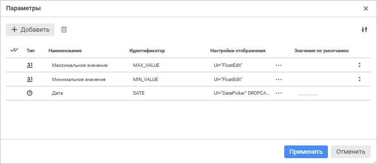
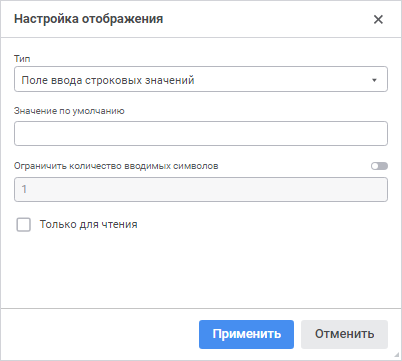
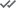

# Настройка параметров отчёта: Регламентный отчёт, веб-приложение

Настройка параметров отчёта: Регламентный отчёт, веб-приложение
-

# Настройка параметров отчёта

Параметры отчёта позволяют динамически
 управлять данными, отображаемыми в отчёте.

Для настройки параметров отчёта выполните шаги:

	- Добавьте параметры отчёта.

	- Настройте [управление параметрами
	 источника](UiReport_Reports_Param2.htm), используя параметры отчёта.

## Добавление параметров отчёта

Для формирования списка параметров используйте окно «Параметры».

[Для открытия
 окна «Параметры»](javascript:TextPopup(this))

	В отчёте, открытом на[
	 редактировани](../organizational_management/Starting.htm#open)е, выполните команду «Параметры»
	 главного меню.

При работе с параметрами отчёта доступны следующие операции:

[Добавление
 параметров](javascript:TextPopup(this))

	Для добавления параметра нажмите кнопку  «Добавить». В конец списка параметров
	 будет добавлена строка, в которой укажите свойства нового параметра:

		- Тип. Выберите из
		 раскрывающегося списка тип данных для значений, которые будут
		 храниться в параметре:

		-

			- строковый;

			- целочисленный;

			- десятичный;

			- вещественный;

			- дата и время;

			- двоичный.

	По умолчанию выбран строковый тип данных;

		- Наименование. Введите
		 наименование параметра. По умолчанию «Параметр <порядковый
		 номер>»;

		- Идентификатор. Введите
		 уникальный идентификатор параметра в рамках отчёта. Идентификатор
		 может состоять только из букв латинского алфавита, цифр и символа
		 подчёркивания. По умолчанию ITEM<порядковый
		 номер>;

		- Настройки отображения.
		 Задайте внешний вид и поведение для редактора значений параметра.
		 Настройки отображения задаются в виде специально сформированной
		 строки, в которой указывается вид редактора, значение по умолчанию
		 и т.д. Строка может быть отредактирована как непосредственно в
		 поле ввода, так и при помощи специального окна «Настройка
		 отображения». Настройки отображения параметров идентичны
		 [настройкам редакторов
		 значений](../Tuning/ValueEditorParameters.htm) элементов управления. Для открытия окна нажмите кнопку
		  «Настройка
		 отображения»:

	

	Доступны следующие типы отображения параметра:

		-

			- иерархический список;

			- переключатель;

			- поле ввода строковых значений;

			- поле ввода строковых значений с маской;

			- раскрывающийся список справочника;

			- редактор времени;

			- редактор даты;

			- редактор даты и времени;

			- редактор десятичных значений;

			- редактор идентификаторов;

			- редактор логических значений;

			- редактор целых значений;

			- список.

	По умолчанию тип отображения устанавливается
	 в соответствии с выбранным типом данных параметра. Вид окна «Настройка отображения» меняется
	 в зависимости от выбранного типа отображения;

		- Значение по умолчанию.
		 Задайте при необходимости значение параметра по умолчанию. Особенности
		 значения по умолчанию для следующих типов данных:

		-

			- Строковый. Может
			 содержать до 2 Гб данных. Текст строки указывается без кавычек;

			- Целый. Допускается
			 целое число в диапазоне [-2147483648; 2147483647];

			- Десятичный.
			 Допускается десятичное число, содержащее не более 28 разрядов
			 после запятой в диапазоне [-179228162514264337593543950335;
			 179228162514264337593543950335];

			- Вещественный.
			 Допускается вещественное число в диапазоне [-5.0 x 10-324; 1.7 x 10308];

			- Дата. Минимальная
			 дата - 1 января 100 года (н.э.) 00:00:00, максимальная дата
			 - 31 декабря 9999 года (н.э.) 23:59:59.

		При использовании раскрывающегося списка справочника становятся
		 доступными [отметка элементов](Visualization.htm#selection)
		 и [изменение отметки
		 по критерию](Visualization.htm#editselection). Работа с отметкой и изменением отметки аналогична
		 работе с ними для измерений.

	Для добавления набора параметров повторите действия и нажмите кнопку
	 «Применить».

[Редактирование
 параметров](javascript:TextPopup(this))

	Для редактирования свойств выбранного параметра измените значение
	 в соответствующем столбце.

[Удаление
 параметров](javascript:TextPopup(this))

	Для удаления параметров выделите требуемые параметры и нажмите кнопку
	  «Удалить».
	 Будет запрошено подтверждение выполняемого действия.

	Для быстрого выделения сразу всех параметров используйте кнопку
	 
	 «Выделить все».

Для изменения количества отображаемых свойств нажмите кнопку  «Настройки»
 и установите/снимите флажок напротив наименования свойств.

См. также:

[Настройка
 отчёта](uireport_reports_param.htm) | [Управление параметрами](UiReport_Reports_Param2.htm)

		Справочная
		 система на версию 10.9
		 от 18/08/2025,
		 © ООО «ФОРСАЙТ»,
