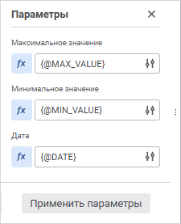
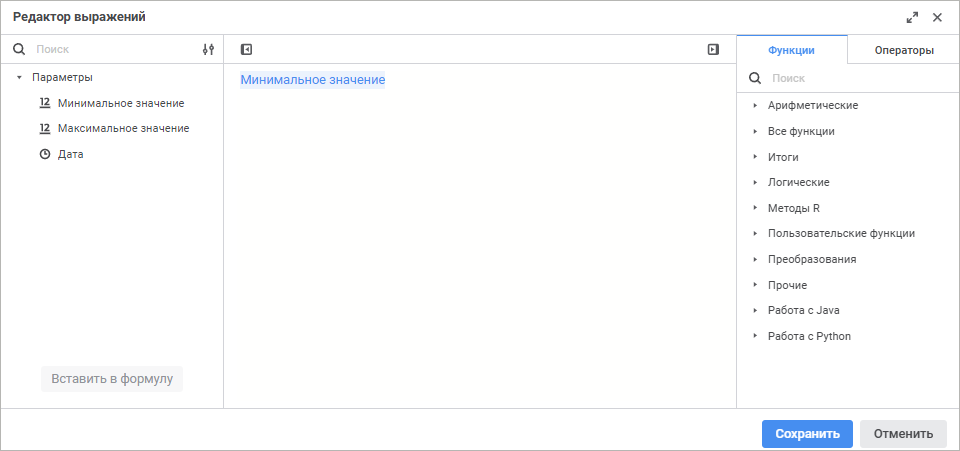

# Управление параметрами: Регламентный отчёт, веб-приложение

Управление параметрами: Регламентный отчёт, веб-приложение
-

# Управление параметрами

Для связывания параметров [источников
 данных](../Source/UiReport_Source.htm) и [параметров отчёта](UiReport_Reports_Param1.htm)
 используйте панель «Параметры».

[Для открытия
 панели «Параметры»](javascript:TextPopup(this))

		- Нажмите кнопку  «Источники», расположенную на
		 панели вкладок. Откроется боковая панель «Источники».

		- Выделите срез.

		- Выполните команду  «Параметры»
		 контекстного меню среза. Команда доступна, если у источника данных,
		 на котором построен срез, есть параметры.

На панели отображается список параметров среза.

[Установка
 связей параметров](javascript:TextPopup(this))

	Для установки значений параметра нажмите кнопку 
	 «Задать формулу».

	Будет открыт [редактор выражений](#expression_editor).

	Задайте формулу для управления параметром.

[Редактирование
 связей параметров](javascript:TextPopup(this))

	Для редактирования существующей связи с параметром нажмите кнопку
	  «Настройка» в поле значения параметра.

	Будет открыт [редактор выражений](#expression_editor).

[Удаление
 связей параметров](javascript:TextPopup(this))

	Для удаления существующей связи с параметром выполните одно из действий:

		- нажмите кнопку  «Формула задана». Будет выдано
		 предупреждение об изменении способа управления параметром и сбросе
		 формулы. Для сброса формулы подтвердите действие;

		- откройте [редактор выражений](#expression_editor)
		 для связи и удалите выражение.

## Редактор выражений для связи

Настройка связи параметров срезов и [параметров
 отчёта](UiReport_Reports_Param1.htm) выполняется с помощью редактора выражений:

Сформируйте формулу расчёта, результат которой будет записываться в
 параметр среза, в области формул. В формуле допускается использование
 операндов, арифметических операций, цифр, знаков сравнения и круглых скобок.

В качестве операндов используются параметры отчёта. Для вставки параметра
 в область формул выполните одно из действий:

	- выделите параметр и нажмите кнопку «Вставить
	 в формулу»;

	- дважды щёлкните по параметру;

	- перенесите параметр в область формул с помощью механизма Drag&Drop.

Для быстрого поиска параметров начните вводить наименование параметра
 частично или целиком в строке поиска. После выполнения действия на панели
 параметров будут отображены параметры, наименования которых удовлетворяют
 условиям поиска.

Цифры, знаки сравнения и круглые скобки вводятся с клавиатуры. Знаки
 сравнения и круглые скобки также можно вставлять через вкладку «Операторы» на боковой панели.

Функции и операторы для работы с параметрами вставляются с помощью вкладок
 «Функции» и «Операторы»
 на боковой панели.

Для скрытия панели параметров используйте кнопку 
 «Скрыть панель параметров».

Для скрытия боковой панели используйте кнопку 
 «Скрыть боковую панель».

См. также:

[Настройка
 отчёта](uireport_reports_param.htm) | [Параметры](UiReport_Reports_Param1.htm)

		Справочная
		 система на версию 10.9
		 от 18/08/2025,
		 © ООО «ФОРСАЙТ»,
