# Визуализация данных на листе отчёта: Регламентный отчёт, веб-приложение

Визуализация данных на листе отчёта: Регламентный отчёт, веб-приложение
-

# Визуализация данных на листе отчёта

Для отображения данных в отчёте выполните следующие действия:

	- Поместите на лист визуализаторы:

		- [таблица](../Table/UiReport_tables_appointment.htm).
		 Строится на основе [среза](../Source/Window/UiReport_Source_Window_AreaSource.htm)
		 данных;

		- [диаграмма](../Diagrams/UiReport_Diagrams_appointment.htm). Строится
		 на данных листа или [среза](../Source/Window/UiReport_Source_Window_AreaSource.htm).

	- Настройте измерения.

## Настройка измерений и отметка элементов

Измерение - это структурная
 единица многомерного [источника
 данных](../Source/UiReport_Source.htm). В качестве измерений выступают [справочники](UiNavObj.chm::/reference_book/Create.htm)
 репозитория.

Если визуализатор использует [несколько
 источников данных](../Source/UiReport_Source.htm#addsource), то все измерения источников разделяются на следующие
 группы:

	- общие измерения. Измерения,
	 содержащиеся во всех источниках данных;

	- частные
	 измерения. Уникальные измерения источника и измерения, содержащиеся
	 не во всех источниках данных.

Для работы с измерениями источника данных предназначена область «Измерения» боковой панели «Источники», [панель
 управления отметкой](../organizational_management/Starting.htm#structure_window) и панель отметки.

[Для отображения
 области «Измерения»](javascript:TextPopup(this))

	Для отображения на боковой панели «Источники»
	 области «Измерения»:

		- Нажмите кнопку  «Источники», расположенную на
		 панели вкладок. Откроется боковая панель «Источники».

		- Выберите срез, таблицу или диаграмму выбранного источника
		 на панели.

[Для отображения
 панели управления отметкой](javascript:TextPopup(this))

		- Выделите ячейку, принадлежащую таблице, или диаграмму.

		- Нажмите кнопку  «Панель управления отметкой»
		 вкладки «Вид» [панели
		 инструментов](../organizational_management/Starting.htm#structure_window).

	 Область
	 «Измерения»

	 Панель
	 управления отметкой

		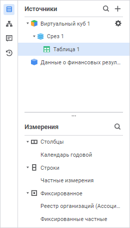

		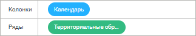

Доступные операции:

[Выбор
 варианта расположения измерения](javascript:TextPopup(this))

	Для выбора варианта расположения выбранного измерения:

		- с помощью механизма Drag&Drop;

		- выполните команду контекстного меню в области «Измерения»;

		- выполните команду в раскрывающемся меню кнопки 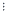 «Действия»
		 в области «Измерения»;

		- выполните команду в раскрывающемся меню кнопки  «Действия»
		 панели управления отметкой. Цвет кнопки зависит от расположения
		 измерения: если измерение находится в строке - кнопка синяя, если
		 в столбце - зеленая.

	Доступные варианты расположения измерения:

		- 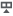 В столбцы.
		 Укажите измерения, которые будут отображаться в столбцах;

		- 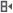 В строки.
		 Укажите измерения, которые будут отображаться в строках;

		- 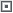 В фиксированные.
		 Укажите измерения, которые будут исключены из строк и столбцов,
		 то есть будут зафиксированы.

	Фиксация измерения предназначена для
	 скрытия измерения из строк и столбцов, на основании которых строятся
	 представления данных;

		- 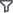
		 Фильтр в источнике. Укажите
		 измерения, которые не будут участвовать при построении представления
		 данных:

	Данный вариант расположения доступен:

			- для всех источников данных, кроме [источников](../Source/UiReport_Source.htm#merging),
			 состоящих из двух и более кубов;

			- для кубов-источников с включенным методом [агрегации фактов](uinavobj.chm::/Cube/Agregation.htm);

			- для всех измерений, кроме [измерений
			 фактов](uinavobj.chm::/Cube/CreateCube/Master_Standart/UiMd_Cube_CreateCube_Master_Standart_1.htm) или измерений с настроенным доступом
			 к элементам [справочников
			 НСИ](admin.chm::/03_Admin/Admin_ElementAccess.htm), [табличных](uinavobj.chm::/reference_book/Master_Table_reference_book/UiMd_reference_book_Master_Table_page1.htm)
			 и [вычисляемых](uinavobj.chm::/reference_book/Master_Calculation_reference_book/UiMd_reference_book_Master_Calculation_Atribute.htm)
			 справочников.

	При добавлении в отчёт кубов-источников
	 с включённым методом агрегации для измерений используется вариант
	 расположения  «Фильтр
	 в источнике», если измерения исключены из строк и столбцов:

	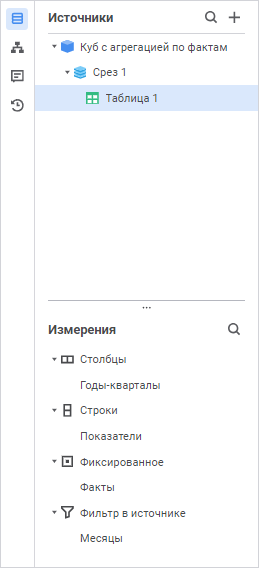

	При отключении агрегации в кубе для данных
	 измерений применится вариант расположения  «Фиксированные».

	Экспериментируя с расположением измерений, найдите оптимальное представление
	 анализируемых данных.

[Перенос измерения
 из общих в частные](javascript:TextPopup(this))

	Возможность доступна, если источники данных содержат несколько общих
	 измерений.

	Частное измерение может быть создано на основе общего измерения.

	Для создания частного измерения на основе общего:

		- Выделите общее измерение.

		- Выполните одно из действий:

			- выполните команду «В частные»
			 контекстного меню;

			- выполните команду  «В
			 частные» в раскрывающемся меню кнопки  «Действия».

[Отметка
 элементов измерения](javascript:TextPopup(this))

	Для настройки отметки выбранного измерения:

		- в области «Измерения»
		 боковой панели «Источники»:

			- выполните команду  «Отметка»
			 контекстного меню;

			- выполните команду  «Отметка»
			 в раскрывающемся меню кнопки  «Действия»;

		- на панели управления отметкой выполните команду  «Отметка»
		 в раскрывающемся меню кнопки  «Действия».
		 Цвет кнопки зависит от расположения измерения: если измерение
		 находится в строке - кнопка синяя, если в столбце - зеленая.

	Откроется панель отметки.

	Для просмотра отметки выбранного измерения наведите курсор на измерение.
	 Отобразится вплывающая подсказка:

		- [Название_измерения] (Все).
		 Полная отметка;

		- [Название_измерения] (Нет
		 отметки). Отметка отсутствует;

		- [Название_измерения] ([Кол-во
		 отмеченных] из [Всего]). Неполная отметка;

		- [Название_измерения] ([Название_элемента]).
		 Единичная отметка.

	Подробное описание приведено в разделе «[Работа
	 с элементами измерения](Visualization.htm#selection_panel)».

[Изменение порядка
 отображения измерений](javascript:TextPopup(this))

	Для изменения порядка отображения измерений используйте механизм
	 Drag&Drop.

[Добавление элемента
 управления](javascript:TextPopup(this))

	Для добавления элемента управления для выбранного измерения в области
	 «Измерения» боковой панели
	 «Источники»:

		- выполните команду «Элемент
		 управления» контекстного меню;

		- выполните команду «Элемент
		 управления» в раскрывающемся меню кнопки  «Действия».

	Для подробной информации о настройке элементов управления обратитесь
	 к разделу «[Добавление интерактивных
	 элементов управления содержимым отчёта](../Source/AddControls.htm)».

	Примечание.
	 Если визуализатор использует [несколько
	 источников данных](../Source/UiReport_Source.htm#addsource), то добавление элемента управления доступно
	 только для общих измерений.

[Поиск измерения](javascript:TextPopup(this))

	Для поиска измерения:

		- Нажмите кнопку 
		 «Поиск», расположенную
		 в верхней части области «Измерения»
		 боковой панели «Источники».

		- Введите искомый текст в строку поиска. Поиск будет выполняться
		 автоматически по мере ввода искомого текста. Измерения, в которых
		 встречается заданная подстрока, будут выведены в области «Измерения» по их расположению.

	Для сброса результатов поиска нажмите кнопку 
	 «Очистить».

[Настройка
 отображения измерений](javascript:TextPopup(this))

	Для использования атрибутов справочника в качестве отдельных измерений
	 настройте отображение измерения. Полученное дополнительное измерение
	 можно использовать в качестве альтернативной иерархии.

	В качестве источника должен быть [куб](uinavobj.chm::/Cube/CreateCube/UiMd_Cube_CreateCube.htm),
	 у которого для одного или нескольких измерений настроена [альтернативная
	 иерархия на основе атрибутов](uinavobj.chm::/reference_book/look-and-feel_Reference_book/Attributes_as_alt_hier.htm). Источник должен состоять
	 из одного куба. Источники, которые состоят из [двух
	 или более кубов](../Source/UiReport_Source.htm#source_setting) настройку не поддерживают. При выполнении условий
	 в области «Измерения» панели
	 «Источники» будет отображена
	 кнопка  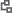 «Настройка отображения измерений»:

	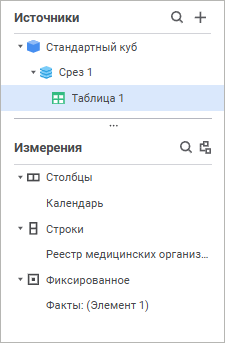

	Для отображения измерения нажмите кнопку  «Настройка отображения измерений»
	 будет открыто окно «Настройка отображения
	 измерений»:

	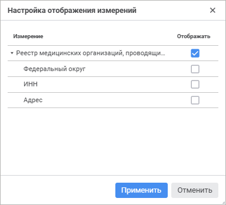

	В окне отображаются все измерения, для которых можно настроить альтернативную
	 иерархию. Для каждого измерения указаны все атрибуты, настроенные
	 для альтернативной иерархии. По умолчанию отмечены только сами измерения.

	Установите флажок у атрибута, по которому требуется альтернативная
	 иерархия, и нажмите кнопку «Применить».

	В результате в области «Измерение»
	 будут добавлены новые измерения с наименованиями по умолчанию «Наименование измерения. Наименование атрибута».

	Первое по списку атрибутов измерение добавляется в тот же вариант
	 расположения, что и основное измерение. Остальные дополнительные измерения
	 располагаются в фиксированных или в [фильтре
	 в источнике](Visualization.htm#position), если для источника доступен такой вариант расположения.

	Если для дополнительного измерения добавляется элемент управления,
	 то после удаления дополнительного измерения необходимо [отредактировать
	 элемент управления](../Source/AddControls.htm#edit).

	Ограничения при работе с дополнительными измерениями на атрибуте:

		- отсутствует возможность использования [альтернативной
		 иерархии](Visualization.htm#property);

		- отсутствует возможность использования [пользовательской
		 иерархии](Visualization.htm#custom);

		- отсутствует возможность использования [группировки](../Table/Attribute/Layout.htm#dimension).

[Изменение размера
 панели](javascript:TextPopup(this))

	Для изменения размера панели:

		- Наведите курсор мыши на границу между областями «Источники»
		 и «Измерения». Указатель
		 мыши примет вид двунаправленной стрелки.

		- Зажмите кнопку мыши и переместите границу в нужное положение.

Индикация измерений:

	- пиктограмма  и всплывающая подсказка отображаются
	 при отсутствии отметки в измерении или при выборе элементов с [различными
	 единицами измерения](OperationReport/Work_with_data.htm#aggr) при использовании в качестве источника куба
	 с установленным флажком «[Не агрегировать разные единицы измерения](uinavobj.chm::/Cube/CreateCube/Master_Standart/UiMd_Cube_CreateCube_Master_Standart_7.htm#no_agr)»;

	- пиктограмма 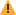 и всплывающая подсказка отображаются
	 при ошибке открытия измерения;

	- пиктограмма  отображается при ошибке открытия
	 и отсутствии отметки в измерении.

### Работа с элементами измерения

Для работы с элементами измерения предназначена панель отметки. Если
 источник содержит частные/фиксированные частные измерения, то для отметки
 используется панель «Частные измерения»/«Фиксированные частные».

[Для открытия
 панели](javascript:TextPopup(this))

		- Нажмите кнопку  «Источники», расположенную на
		 панели вкладок. Откроется боковая панель «Источники».

		- Выделите срез, таблицу или диаграмму у выбранного источника.

		- Для выбранного измерения/частного измерения выполните одно
		 из действий:

			- выполните команду  «Отметка» контекстного меню;

			- выполните команду  «Отметка» в раскрывающемся
			 меню кнопки  «Действия»;

			- выполните команду  «Отметка» в раскрывающемся
			 меню

	 Панель
	 отметки

	 Панель
	 «Частные измерения»

	 Панель
	 «Фиксированные частные»

		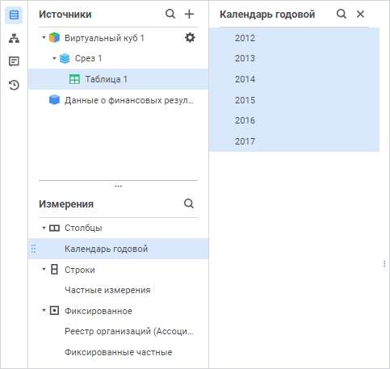

		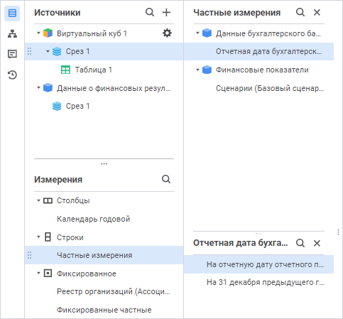

		Панель «Частные измерения»
		 содержит список частных измерений с их принадлежностью к источнику
		 данных.

		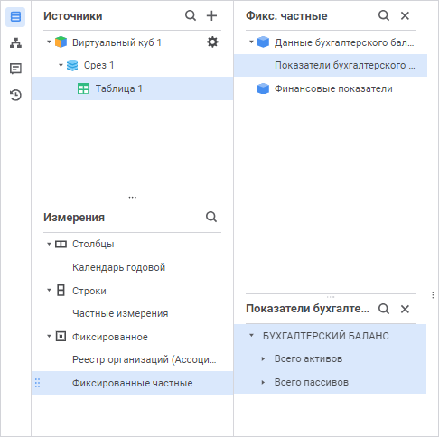

		Панель «Фиксированные частные»
		 содержит список зафиксированных частных измерений с их принадлежностью
		 к источнику данных.

Доступные операции:

[Настройка отметки
 элементов измерения](javascript:TextPopup(this))

	Для задания отметки элементов частного/фиксированного частного измерения
	 предварительно выделите измерение в списке измерений на панели «Частные измерения»/«Фиксированные
	 частные». Отобразится область отметки.

Для настройки отметки измерения выполните одно из действий:

	- с помощью мыши установите/снимите отметку для выбранного элемента;

	- с помощью контекстного меню элемента измерения выберите необходимый
	 вариант отметки:

		- Отметить всё. Устанавливает
		 отметку для всех элементов измерения;

		- Снять отметку со всех.
		 Снимает отметку со всех элементов измерения;

		- Изменить отметку.
		 Устанавливает отметку по критерию;

		- Отметить подчиненные по
		 уровню. Устанавливает отметку для всех элементов расположенных
		 на одном уровне с указанным элементом измерения;

		- Отметить все подчинённые.
		 Устанавливает отметку для всех подчиненных элементов;

		- Снять отметку с подчиненных.
		 Снимает отметку со всех подчиненных элементов;

		- Отметить уровень.
		 Устанавливает отметку для уровня измерения;

		- Снять отметку с уровня.
		 Снимает отметку с уровня измерения;

		- Применить схему отметки.
		 Устанавливает выбранную [схему
		 отметки](UiNavObj.chm::/reference_book/look-and-feel_Reference_book/UiMd_reference_book_look-and-feel_Scheme.htm) из раскрывающегося списка;

		- Отметить группу.
		 Устанавливает отметку для выбранной [группы
		 элементов](UiNavObj.chm::/reference_book/look-and-feel_Reference_book/UiMd_reference_book_look-and-feel_Group.htm) измерения из раскрывающегося списка.

Для измерений, у которых отсутствует иерархия,
 доступны команды «Отметить всё»,
 «Снять отметку со всех», «Изменить отметку», «Применить
 схему отметки» и «Отметить группу».

	Примечание.
	 У измерения без отметки отображается пиктограмма 
	 и всплывающая подсказка об отсутствии отметки.

[Изменение
 отметки по критерию](javascript:TextPopup(this))

Для изменения отметки по критерию выбора выполните команду «Изменить
 отметку» контекстного меню элемента.

Будет открыто окно «Изменить отметку»:

Область выбора для календарного измерения называется «Отметить
 элементы по уровню».

Для изменения отметки по критерию выбора:

	- Выберите атрибут или уровень, для которого будет задан критерий.
	 По умолчанию установлен атрибут, который [назначен
	 наименованием](uinavobj.chm::/reference_book/Master_Table_reference_book/UiMd_reference_book_Master_Table_page1_AttProps.htm). Для календарного измерения по умолчанию
	 установлен [высший
	 уровень](uinavobj.chm::/reference_book/Master_Calendar_reference_book/UiMd_reference_book_Master_Calendar_page2.htm), исключая корень.

	- Установите переключатель для определения типа критерия. Доступный
	 тип зависит от типа выбранного атрибута:

		- По
		 тексту. Доступно для строкового типа атрибута. В поле для
		 поиска введите текст, который содержат значения атрибутов элементов
		 необходимых для отметки. Для поиска доступны подстановки:

			- %. Используйте
			 с любой последовательностью символов;

			- _. Используйте
			 с одним любым символом.

Установите флажок «Учитывать
 регистр» для поиска с учетом регистра.

Установите флажок «Слово
 целиком» для поиска слов с точным совпадением с введённым текстом;

		- По условию. Доступен
		 для уровней календарного справочника и всех типов атрибутов, кроме
		 строкового. Выберите тип условия:

			- Равно;

			- Не равно;

			- Больше.  Доступно
			 для типов: дата и время, целочисленный, вещественный, дата;

			- Больше или равно.
			 Доступно для типов: дата и время, целочисленный, вещественный,
			 дата;

			- Меньше. Доступно
			 для типов: дата и время, целочисленный, вещественный, дата;

			- Меньше или равно.
			 Доступно для типов: дата и время, целочисленный, вещественный,
			 дата;

			- Между. Доступно
			 для типов: дата и время, целочисленный, вещественный, дата.

Введите в поле значение или задайте диапазон
 значений при выборе типа условия «Между»
 . Редактор значения будет зависеть от типа атрибута. Для логического типа
 доступен выбор значений: истина и ложь;

		- По списку. Доступен
		 для строкового и целочисленного типов атрибута. В поле введите
		 список значений атрибута. Список можно копировать из буфера обмена.
		 Поиск идёт с учетом регистра и полного совпадения с введённым
		 текстом.

	- Нажмите кнопку «Отметить»
	 для выделения элементов, соответствующих критерию, в области отображения
	 элементов измерения. Для отображения только отмеченных элементов переведите
	 переключатель «Отображать только
	 отмеченные» в активное состояние, при этом если отмечены только
	 дочерние элементы, то отображаться они будут с родительскими.

	- Нажмите кнопку «Применить»
	 для применения новой отметки.

[Использование
 альтернативной иерархии](javascript:TextPopup(this))

Отметка иерархий доступна, если для текущего [справочника](UiNavObj.chm::/reference_book/UiMd_reference_book_Hierarchy.htm)
 создана хотя бы одна альтернативная иерархия.

При использовании альтернативной иерархии в измерении будут отображены
 элементы альтернативного справочника, сопоставленные по индексам элементов.

Для выбора альтернативной иерархии выполните команду «Альтернативные
 иерархии» контекстного меню элемента измерения. В раскрывающемся
 меню выберите необходимую альтернативную иерархию.

Для установки основной иерархии справочника выполните команду «Альтернативные иерархии > Сбросить» контекстного меню измерения.
 Данная команда присутствует, если для справочника установлена альтернативная
 иерархия.

Примечание.
 Выбор альтернативной иерархии у измерений, для которых настроено [отображение
 дополнительных измерений](Visualization.htm#display), недоступен.

[Настройка
 пользовательской иерархии](javascript:TextPopup(this))

	Пользовательская иерархия -
	 это вид альтернативной иерархии, полученной в результате редактирования
	 списка элементов измерения.

	Для настройки пользовательской иерархии выполните команду «Измерение > Редактировать»
	 контекстного меню элемента измерения на панели отметки.

	Будет открыто окно «Редактирование
	 - <Наименование
	 измерения>»:

	

	Переместите/удалите элементы измерения в области «Итоговое
	 измерение» для формирования иерархии с помощью кнопок  «Переместить вверх»,
	  «Переместить
	 вниз», 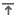 «Переместить
	 на уровень вверх», 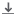 «Переместить на уровень вниз»,  «Удалить». При удалении элемента
	 появится диалог подтверждения.

	При перемещении элемента, имеющего дочерние элементы, по уровням
	 он изменяет своё положение вместе с дочерними элементами.

	При перемещении элемента на уровень вниз элемент становится дочерним
	 элементу, находящемуся выше него:

	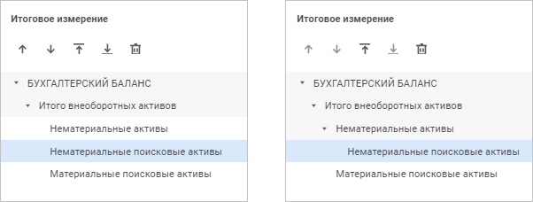

	Для разворачивания/сворачивания иерархии списка элементов измерения
	 выполните команду «Развернуть всё»/«Свернуть всё» контекстного меню
	 элемента.

	Для добавления ранее удаленного элемента выделите его в области
	 «Оригинальное измерение» и
	 нажмите кнопку  «Добавить
	 в измерение».

	Для применения пользовательской иерархии нажмите кнопку «Применить».
	 Диалог будет закрыт и применится пользовательская иерархия.

	Для восстановления исходного измерения выполните команду «Измерение > Восстановить»
	 контекстного меню элемента измерения на панели отметки. Подтвердите
	 действие в диалоге подтверждения, при этом пользовательская иерархия
	 будет удалена.

	Примечание.
	 Выбор пользовательской иерархии у измерений, для которых настроено
	 [отображение дополнительных измерений](Visualization.htm#display),
	 недоступен.

[Перенос частного
 измерения в фиксированные частные/общие](javascript:TextPopup(this))

	Доступно для [источников
	 данных](../Source/UiReport_Source.htm#addsource), состоящих из двух и более кубов.

	Частное измерение может быть перенесено в фиксированные/общие. Для
	 этого:

		- Выделите частное измерение.

		- Выполните одно из действий:

			- выполните команду «В фиксированне
			 частные»/«В общие»
			 контекстного меню;

			- выполните команду «В фиксированне
			 частные»/«В общие»
			 в раскрывающемся меню кнопки  «Действия».

	Примечание.
	 При переносе частного измерения в общие оно размещается в том же положении
	 («Столбцы», «Строки»
	 или «Фиксированное»), в котором
	 размещены частные измерения.

[Разворачивание/сворачивание
 иерархии списка элементов измерения](javascript:TextPopup(this))

Для разворачивания/сворачивания иерархии списка элементов измерения
 выполните команду «Развернуть всё»/«Свернуть всё» контекстного меню
 элемента.

[Поиск элемента
 измерения](javascript:TextPopup(this))

	Для поиска элемента измерения:

		- Нажмите кнопку 
		 «Поиск».

		- Введите искомый текст в строку поиска. Поиск будет выполняться
		 автоматически по мере ввода искомого текста. Элементы, в которых
		 встречается заданная подстрока, будут выведены списком с их родительскими
		 и дочерними элементами.

	Для сброса результатов поиска нажмите кнопку 
	 «Очистить».

[Изменение
 размера панели](javascript:TextPopup(this))

	Для изменения размера панели:

		- Наведите курсор мыши на правую границу панели отметки. Указатель
		 мыши примет вид двунаправленной стрелки.

		- Зажмите кнопку мыши и переместите границу в нужное положение.

См. также:

[Построение
 отчёта](../CreateReport.htm)

		Справочная
		 система на версию 10.9
		 от 18/08/2025,
		 © ООО «ФОРСАЙТ»,
