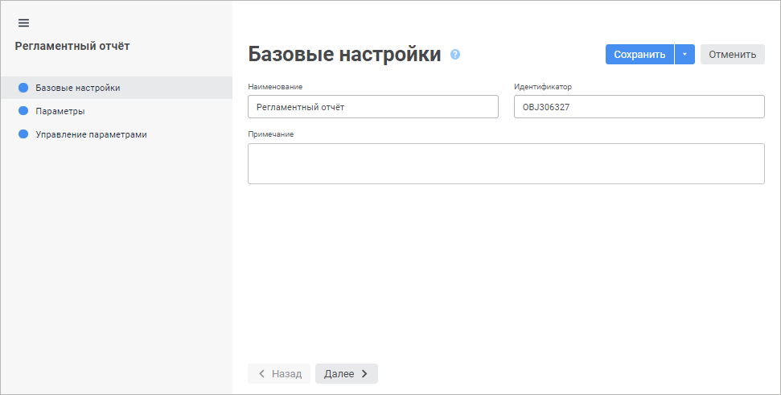

# Настройка отчёта: Регламентный отчёт, веб-приложение

Настройка отчёта: Регламентный отчёт, веб-приложение
-

# Настройка отчёта

Настройка отчёта выполняется с помощью мастера. Для открытия мастера
 и редактирования настроек отчёта, открытого в [режиме
 редактирования](../organizational_management/Starting.htm#open), нажмите кнопку 
 «Настройки» на [панели
 базовых настроек](../organizational_management/Starting.htm#structure_window):

Мастер открывается на странице «Базовые
 настройки». Базовые настройки включают в себя наименование, идентификатор
 и примечание отчёта.

Доступно также определение следующих настроек:

	- [Параметры](UiReport_Reports_Param1.htm).
	 Задаётся список параметров для динамического управления данными, отображаемыми
	 в отчёте;

	- [Управление
	 параметрами](UiReport_Reports_Param2.htm). Задаются настройки управления параметрами
	 источника данных отчёта.

Для сохранения настроек:

	- нажмите кнопку «Сохранить»;

	- выполните команду «Сохранить
	 и закрыть» в раскрывающемся меню кнопки «Сохранить».
	 После этого будут сохранены заданные настройки и закрыт мастер редактирования
	 настроек отчёта.

Примечание.
 Команда «Сохранить и закрыть»
 в мастере редактирования настроек отчёта доступна только при редактировании
 заданных настроек.

См. также:

[Построение
 отчёта](../CreateReport.htm)

		Справочная
		 система на версию 10.9
		 от 18/08/2025,
		 © ООО «ФОРСАЙТ»,
