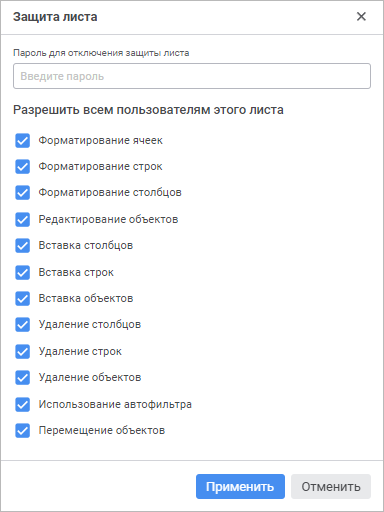
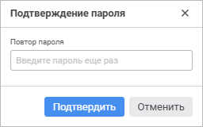

# Защита листа: Регламентный отчёт, веб-приложение

Защита листа: Регламентный отчёт, веб-приложение
-

# Защита листа

Защита используется для ограничения возможных действий пользователя
 в случае необходимости.

Защита листа не предполагает защиту содержимого ячеек. Для защиты содержимого
 ячеек от редактирования установите флажок «Защищаемая
 ячейка» на вкладке «Дополнительно»
 в параметрах «[Прочее](../Table/Attribute/Format.htm#print)»
 панели параметров.

## Установка защиты листа

Для установки защиты листа выполните команду «Установить
 защиту листа» контекстного меню вкладки выбранного листа.

Откроется окно «Защита листа»:

В открывшемся окне установите пароль для отключения защиты листа в поле
 «Пароль для отключения защиты листа»,
 если требуется. Ограничения на длину и используемые символы не накладываются.

Выберите те действия, которые пользователь может производить с листом.
 Установленный флажок соответствует разрешенному действию. По умолчанию
 установлены все флажки. Снятие флажков соответствует запрещению действия.

Возможные действия:

[Форматирование
 ячеек](javascript:TextPopup(this))

	При снятии флажка станут недоступными настройки оформления ячейки
	 группы параметров «[Формат
	 ячеек](../Table/Attribute/Format.htm#cell_format)» и вкладки «[Оформление](../Table/Work/UiReport_Table_WorkStyle.htm#cells_format)»
	 панели инструментов.

[Форматирование
 строк](javascript:TextPopup(this))

	При снятии флажка станут недоступными настройки [изменения
	 высоты строк](../Table/OperationRow/UiReport_Table_Row.htm#changing_row_height), [скрытия
	 строк](../Table/OperationRow/UiReport_Table_Row.htm#hiding_rows), [отображения
	 скрытых строк](../Table/OperationRow/UiReport_Table_Row.htm#showing_hidden_rows).

[Форматирование
 столбцов](javascript:TextPopup(this))

	При снятии флажка станут недоступными настройки [изменения
	 ширины столбцов](../Table/OperationColumn/UiReport_Table_Column.htm#changing_column_width), [скрытия
	 столбцов](../Table/OperationColumn/UiReport_Table_Column.htm#hiding_columns), [отображения
	 скрытых столбцов](../Table/OperationColumn/UiReport_Table_Column.htm#showing_hidden_columns).

[Редактирование
 объектов](javascript:TextPopup(this))

	При снятии флажка станут недоступными выделение, [вставка](../Objects/UiReport_Objects.htm)
	 и [работа с объектами](../Objects/UiReport_Objects_Operation.htm).

[Вставка столбцов](javascript:TextPopup(this))

	При снятии флажка станет недоступным [добавление
	 столбцов](../Table/OperationColumn/UiReport_Table_Column.htm#inserting_columns), а также команда «Вставить
	 > Сдвинуть ячейки вправо» контекстного меню столбца/ячейки.

[Вставка строк](javascript:TextPopup(this))

	При снятии флажка станет недоступным [добавление
	 строк](../Table/OperationRow/UiReport_Table_Row.htm#inserting_rows), а также команда «Вставить
	 > Сдвинуть ячейки вниз» контекстного меню строки/ячейки.

[Вставка объектов](javascript:TextPopup(this))

	При снятии флажка станет недоступной [вставка
	 объектов](../Objects/UiReport_Objects.htm).

[Удаление столбцов](javascript:TextPopup(this))

	При снятии флажка станет недоступным [удаление
	 столбцов](../Table/OperationColumn/UiReport_Table_Column.htm#deleting_columns), а также команда «Удалить
	 > Сдвинуть ячейки влево» контекстного меню столбца/ячейки.

[Удаление строк](javascript:TextPopup(this))

	При снятии флажка станет недоступным [удаление
	 строк](../Table/OperationRow/UiReport_Table_Row.htm#deleting_rows), а также команда «Удалить
	 > Сдвинуть ячейки вверх» контекстного меню строки/ячейки.

[Удаление объектов](javascript:TextPopup(this))

	При снятии флажка станет недоступным [удаление
	 объектов](../Objects/UiReport_Objects_Operation.htm#delete).

[Использование
 автофильтра](javascript:TextPopup(this))

	При снятии флажка станет недоступной [фильтрация](../Reports/OperationReport/Work_with_data.htm#filter).

[Перемещение
 объектов](javascript:TextPopup(this))

	При снятии флажка станут недоступными [поворот](../Objects/UiReport_Objects_Operation.htm#rotate),
	 [размещение
	 объекта в заданном диапазоне ячеек](../Objects/UiReport_Objects_Operation.htm#range) и [настройка
	 размера и положения](../Objects/UiReport_Objects_StandartProperty.htm#size) объекта.

После определения набора действий нажмите кнопку «Применить».
 Если пароль был не задан, то лист сразу будет защищён.

Если был введён пароль, то будет открыто окно «Подтверждение
 пароля»:

Повторно введите пароль в окне и нажмите кнопку «Подтвердить»
 для защиты листа.

У защищённого листа появится надпись «Защищён»
 на вкладке.

## Снятие защиты листа

Для снятия защиты выполните команду «Снять
 защиту листа» контекстного меню вкладки выбранного листа. Если
 пароль был не задан, то защита листа сразу будет снята. При использовании
 пароля будет открыто окно «Снятие защиты
 с листа»:

Введите пароль в окне и нажмите кнопку «Подтвердить».
 При условии, что пароль был введён верно, защита листа будет снята, и
 пользователю будут доступны все действия, производимые с листом.

Если пароль введён неверно, появится сообщение об ошибке, защита листа
 останется включённой.

См. также:

[Добавление
 нового листа и работа с ним](UiReport_Sheets.htm)

		Справочная
		 система на версию 10.9
		 от 18/08/2025,
		 © ООО «ФОРСАЙТ»,
