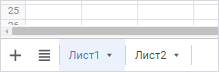
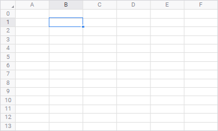

# Добавление нового листа и работа с ним: Регламентный отчёт, веб-приложение

Добавление нового листа и работа с ним: Регламентный отчёт, веб-приложение
-

# Добавление нового листа и работа
 с ним

Регламентный отчет состоит из листов с данными. Каждый лист имеет свою
 вкладку, на которой отображено наименование листа. Количество листов в
 отчете не ограничено.

Для отображения вкладок листов:

	- выполните команду «Вкладки
	 листов отчёта» в раскрывающемся меню кнопки «Показать»
	 вкладки «Вид» панели инструментов;

	- выполните команду «Вид >
	 Показать > Вкладки листов отчёта» главного меню.

Если отчёт предполагает наличие одного листа перейдите к шагу «[Выбор
 источников данных и работа с ними](../Source/UiReport_Source.htm)». Если для отчёта требуется несколько
 листов, то [добавьте](UiReport_Sheets_Create.htm) требуемое
 количество листов.

Лист отчёта содержит множество строк и столбцов, представляя данные
 в виде таблиц.

Текущая ячейка листа всегда выделена:

Вид ячейки (цвет фона и текста, выравнивание текста, формат числа и
 др.) зависит от набора атрибутов, а также от установленных объединений
 ячеек.

[Переход по листам
 отчёта](javascript:TextPopup(this))

	Для перехода к нужному листу выделите его вкладку.

[Работа
 с листами отчёта](javascript:TextPopup(this))

	При работе с листами отчёта возможны операции:

		- [добавление листа отчёта](UiReport_Sheets_Create.htm);

		- [переименование листа](UiReport_Sheets_rename.htm);

		- [перемещение/копирование
		 листа](UiReport_Sheets_Copy.htm);

		- [скрытие листа](UiReport_Sheets_hide.htm);

		- [защита листа](Defence.htm);

		- [удаление листа](UiReport_Sheets_Del.htm).

[Работа с элементами
 листа отчёта](javascript:TextPopup(this))

	Для [работы с элементами листа](../Table/UiReport_Table.htm)
	 возможны операции:

		- [операции
		 с ячейками](../Table/Work/UiReport_Table_Work_Union.htm);

		- [операции
		 со строками](../Table/OperationRow/UiReport_Table_Row.htm);

		- [операции
		 со столбцами](../Table/OperationColumn/UiReport_Table_Column.htm).

[Работа с данными
 на листе отчёта](javascript:TextPopup(this))

	При работе с данными на листах отчёта возможны операции:

		- [ввод
		 данных в ячейку листа](../Table/Work/UiReport_Table_Work_Data.htm);

		- [редактирование
		 содержимого ячеек](../Table/Work/UiReport_Table_Work_Data_Edit.htm);

		- [копирование и вставка
		 данных](../Table/Work/Insert.htm);

		- [фильтрация
		 и сортировка](../Reports/OperationReport/Work_with_data.htm#filter);

		- [добавление
		 примечания](../Table/Work/UiReport_Table_Work_Notice.htm);

		- [использование
		 формул](../organizational_management/Function/UiReport_Function.htm).

См. также:

[Построение
 отчёта](../CreateReport.htm)

		Справочная
		 система на версию 10.9
		 от 18/08/2025,
		 © ООО «ФОРСАЙТ»,
