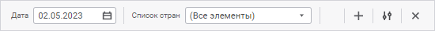
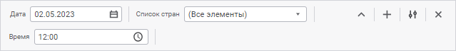
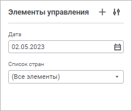

# Добавление интерактивных элементов управления: Регламентный отчёт, веб-приложение

Добавление интерактивных элементов управления: Регламентный отчёт, веб-приложение
-

# Добавление интерактивных элементов
 управления содержимым отчёта

Элемент управления - объект,
 предназначенный для управления данными, отображаемыми объектами отчета,
 позволяет изменить отмеченные элементы измерения или [параметры](../Reports/UiReport_Reports_Param1.htm)
 отчёта.

Для настройки элементов управления предназначена панель «[Элементы
 управления](../organizational_management/Starting.htm#structure_window)».

Операции с панелью:

[Отображение/скрытие
 панели элементов управления](javascript:TextPopup(this))

	Для отображения панели элементов управления нажмите кнопку  «Элементы управления»
	 вкладки «Главная» панели инструментов,
	 переведя её в активное состояние.

	Для скрытия панели элементов управления:

		- переведите кнопку  «Элементы управления» вкладки
		 «Главная» панели инструментов
		 в неактивное состояние;

		- выполните команду «Закрыть»
		 в раскрывающемся меню кнопки  «Расположение панели» на панели
		 «Элементы управления»;

		- нажмите кнопку 
		 «Закрыть» при её расположении
		 сверху под [панелью
		 инструментов](../organizational_management/Starting.htm#structure_window).

	Настройки отображения панели сохраняются при [сохранении
	 отчёта](../CreateReport.htm#save).

[Изменение расположения
 панели](javascript:TextPopup(this))

	Для изменения расположения панели элементов управления в раскрывающемся
	 меню кнопки  «Расположение
	 панели» выберите способ. Доступные способы:

		- Сверху. Панель отображается
		 сверху под [панелью
		 инструментов](../organizational_management/Starting.htm#structure_window):

	

	Если элементы управления полностью не
	 помещаются на панель «Элементы управления»
	 при её расположении сверху, то по умолчанию панель развернется:

	

	Для отображения панели в свёрнутом виде
	 нажмите кнопку  «Свернуть»:

	

	Для возвращения панели в развёрнутый
	 вид нажмите кнопку   «Развернуть».

		- Слева. Панель отображается
		 слева в виде боковой панели:

	

	Выбранное расположение панели сохраняется при [сохранении
	 отчёта](../CreateReport.htm#save).

## Настройка элементов управления

Настройка элементов управления происходит при [редактировании](../organizational_management/Starting.htm#open)
 отчёта и включает операции:

[Добавление
 элемента управления](javascript:TextPopup(this))

	Для добавления элемента управления:

		- нажмите кнопку  «Добавить элемент управления»
		 на [панели](../organizational_management/Starting.htm#structure_window)
		 «Элементы управления».
		 Будет открыто окно [настройки
		 элемента управления](UiReport_Source_ControlProp.htm);

		- выполните команду «Элемент
		 управления» контекстного меню выбранного измерения в области
		 «Измерения» боковой панели
		 «Источники». Будет добавлен
		 элемент управления на панель элементов управления, для которого
		 будут указаны значения:

			- Наименование.
			 Наименование измерения;

			- Идентификатор.
			 ELEMENT <Порядковый номер>;

			- Источник. Срез,
			 для измерения которого добавлен элемент управления;

			- Управляемое измерение.
			 Измерение, для которого добавлен элемент управления;

			- Управляемый параметр.
			 Не указан;

			- Отображать на листе.
			 Пункт «Все листы»;

			- Вычислять при смене
			 значения. Значение «Все
			 листы с этим элементом»;

			- Параметры редактора.
			 Не заданы.

[Редактирование
 элемента управления](javascript:TextPopup(this))

	Для редактирования свойств элемента управления выполните команду
	  «Редактировать»
	 контекстного меню элемента управления на панели «Элементы
	 управления». Будет открыто окно [настройки
	 элемента управления](UiReport_Source_ControlProp.htm).

[Изменение
 порядка элементов управления](javascript:TextPopup(this))

	Для смены порядка в списке элементов управления на панели «Элементы управления» перетащите
	 элемент управления в нужную позицию с помощью механизма Drag&Drop.

[Изменение
 размеров элементов управления](javascript:TextPopup(this))

	Изменение размеров элементов управления доступно только при размещении
	 панели «Элементы управления»
	 сверху.

	Для изменения ширины элемента управления потяните за его правую
	 границу в нужном направлении на панели «Элементы
	 управления».

[Отображение/скрытие
 элементов управления](javascript:TextPopup(this))

	Для отображения скрытых элементов управления установите флажок «Отображать скрытые» в раскрывающемся
	 меню кнопки  «Расположение
	 панели» панели «Элементы управления».

	На панели «Элементы управления»
	 отобразятся скрытые элементы управления, наименования которых будут
	 отображены серым цветом.

	Для скрытия скрытых элементов управления снимите флажок «Отображать
	 скрытые» в раскрывающемся меню кнопки  «Расположение панели» панели «Элементы управления».

	Примечание.
	 Для скрытия элемента управления укажите значение «Не
	 отображать» в его [настройках
	 отображения](UiReport_Source_ControlProp.htm#show).

[Удаление
 элемента управления](javascript:TextPopup(this))

	Для удаления элемента управления выполните команду  «Удалить»
	 контекстного меню элемента управления на панели «Элементы
	 управления». Элемент управления будет удалён с панели.

## Работа с интерактивными элементами управления

Элементы управления позволяют выполнять следующие операции, в том числе
 при открытии отчёта на [просмотр](../organizational_management/Starting.htm#open):

[Настройка
 отметки элементов измерения](javascript:TextPopup(this))

	Для настройки отметки измерения выполните одно из действий:

		- с помощью мыши установите/снимите отметку для выбранного
		 элемента;

		- с помощью контекстного меню элемента измерения выберите
		 необходимый вариант отметки:

			- Отметить все.
			 Устанавливает отметку для всех элементов измерения;

			- Снять отметку со всех.
			 Снимает отметку со всех элементов измерения;

			- Отметить подчиненные
			 по уровню. Устанавливает отметку для всех элементов
			 расположенных на одном уровне с указанным элементом измерения;

			- Отметить все подчиненные.
			 Устанавливает отметку для всех подчиненных элементов;

			- Снять отметку с подчиненных.
			 Снимает отметку со всех подчиненных элементов;

			- Отметить уровень.
			 Устанавливает отметку для уровня измерения;

			- Снять отметку с уровня.
			 Снимает отметку с уровня измерения;

			- Применить схему отметки.
			 Устанавливает выбранную [схему
			 отметки](UiNavObj.chm::/reference_book/look-and-feel_Reference_book/UiMd_reference_book_look-and-feel_Scheme.htm) из раскрывающегося списка;

			- Отметить группу.
			 Устанавливает отметку для выбранной [группы
			 элементов](UiNavObj.chm::/reference_book/look-and-feel_Reference_book/UiMd_reference_book_look-and-feel_Group.htm) измерения из раскрывающегося
			 списка.

[Изменение
 отметки по критерию](javascript:TextPopup(this))

Для изменения отметки по критерию выбора выполните команду «Изменить
 отметку» контекстного меню элемента.

Будет открыто окно «Изменить отметку»:

Область выбора для календарного измерения называется «Отметить
 элементы по уровню».

Для изменения отметки по критерию выбора:

	- Выберите атрибут или уровень, для которого будет задан критерий.
	 По умолчанию установлен атрибут, который [назначен
	 наименованием](uinavobj.chm::/reference_book/Master_Table_reference_book/UiMd_reference_book_Master_Table_page1_AttProps.htm). Для календарного измерения по умолчанию
	 установлен [высший
	 уровень](uinavobj.chm::/reference_book/Master_Calendar_reference_book/UiMd_reference_book_Master_Calendar_page2.htm), исключая корень.

	- Установите переключатель для определения типа критерия. Доступный
	 тип зависит от типа выбранного атрибута:

		- По
		 тексту. Доступно для строкового типа атрибута. В поле для
		 поиска введите текст, который содержат значения атрибутов элементов
		 необходимых для отметки. Для поиска доступны подстановки:

			- %. Используйте
			 с любой последовательностью символов;

			- _. Используйте
			 с одним любым символом.

Установите флажок «Учитывать
 регистр» для поиска с учетом регистра.

Установите флажок «Слово
 целиком» для поиска слов с точным совпадением с введённым текстом;

		- По условию. Доступен
		 для уровней календарного справочника и всех типов атрибутов, кроме
		 строкового. Выберите тип условия:

			- Равно;

			- Не равно;

			- Больше.  Доступно
			 для типов: дата и время, целочисленный, вещественный, дата;

			- Больше или равно.
			 Доступно для типов: дата и время, целочисленный, вещественный,
			 дата;

			- Меньше. Доступно
			 для типов: дата и время, целочисленный, вещественный, дата;

			- Меньше или равно.
			 Доступно для типов: дата и время, целочисленный, вещественный,
			 дата;

			- Между. Доступно
			 для типов: дата и время, целочисленный, вещественный, дата.

Введите в поле значение или задайте диапазон
 значений при выборе типа условия «Между»
 . Редактор значения будет зависеть от типа атрибута. Для логического типа
 доступен выбор значений: истина и ложь;

		- По списку. Доступен
		 для строкового и целочисленного типов атрибута. В поле введите
		 список значений атрибута. Список можно копировать из буфера обмена.
		 Поиск идёт с учетом регистра и полного совпадения с введённым
		 текстом.

	- Нажмите кнопку «Отметить»
	 для выделения элементов, соответствующих критерию, в области отображения
	 элементов измерения. Для отображения только отмеченных элементов переведите
	 переключатель «Отображать только
	 отмеченные» в активное состояние, при этом если отмечены только
	 дочерние элементы, то отображаться они будут с родительскими.

	- Нажмите кнопку «Применить»
	 для применения новой отметки.

[Использование
 альтернативной иерархии](javascript:TextPopup(this))

Отметка иерархий доступна, если для текущего [справочника](UiNavObj.chm::/reference_book/UiMd_reference_book_Hierarchy.htm)
 создана хотя бы одна альтернативная иерархия.

При использовании альтернативной иерархии в измерении будут отображены
 элементы альтернативного справочника, сопоставленные по индексам элементов.

Для выбора альтернативной иерархии выполните команду «Альтернативные
 иерархии» контекстного меню элемента измерения. В раскрывающемся
 меню выберите необходимую альтернативную иерархию.

Для установки основной иерархии справочника выполните команду «Альтернативные иерархии > Сбросить» контекстного меню измерения.
 Данная команда присутствует, если для справочника установлена альтернативная
 иерархия.

Примечание.
 Выбор альтернативной иерархии у измерений, для которых настроено [отображение
 дополнительных измерений](../Reports/Visualization.htm#display), недоступен.

[Разворачивание/сворачивание
 иерархии списка элементов измерения](javascript:TextPopup(this))

Для разворачивания/сворачивания иерархии списка элементов измерения
 выполните команду «Развернуть всё»/«Свернуть всё» контекстного меню
 элемента.

[Поиск элемента
 измерения](javascript:TextPopup(this))

	Для поиска элемента измерения введите искомый текст в строку  «Поиск». Поиск
	 будет выполняться автоматически по мере ввода искомого текста. Элементы,
	 в которых встречается заданная подстрока, будут выведены списком с
	 их родительскими элементами.

	Для сброса результатов поиска нажмите кнопку 
	 «Очистить».

См. также:

[Построение
 отчёта](../CreateReport.htm) | [Работа
 с интерактивными элементами управления](../Reports/OperationReport/Controls.htm)

		Справочная
		 система на версию 10.9
		 от 18/08/2025,
		 © ООО «ФОРСАЙТ»,
