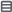
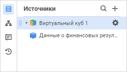
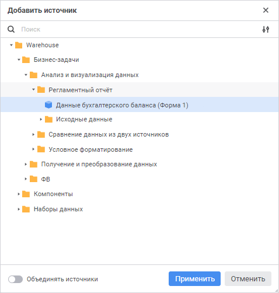
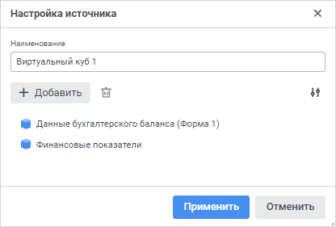

# Выбор источников данных и работа с ними: Регламентный отчёт, веб-приложение

Выбор источников данных и работа с ними: Регламентный отчёт, веб-приложение
-

# Выбор источников данных и работа с ними

Регламентный отчёт может оперировать одним или несколькими источниками
 данных, для построения на их основе [срезов](Window/UiReport_Source_Window_AreaSource.htm),
 которые используются для визуализации данных в виде [таблиц](../Table/UiReport_tables_appointment.htm)
 и [диаграмм](../Diagrams/UiReport_Diagrams_appointment.htm).

В качестве источников данных можно использовать:

	- все [виды
	 кубов](UiNavObj.chm::/Cube/UiMd_Cube_Type.htm),
	 включая дочерние кубы контейнера моделирования.

	- [базы
	 данных временных рядов](uidw.chm::/UiDw_Title.htm).

Для управления источниками данных регламентного отчёта используйте боковую
 панель «Источники».

[Для открытия
 панели](javascript:TextPopup(this))

	Нажмите кнопку  «Источники»,
	 расположенную на панели вкладок.

	Примечание.
	 Кнопка  «Источники»
	 на панели вкладок доступна только при редактировании регламентного
	 отчёта.

Доступные операции:

	- [добавление источника
	 данных](UiReport_Source.htm#addsource);

	- [настройка источника
	 данных, состоящих из двух и более кубов](UiReport_Source.htm#source_setting);

	- [поиск источника
	 данных из списка выбранных источников](UiReport_Source.htm#search_sourse);

	- [добавление
	 среза](Window/UiReport_Source_Window_AreaSource.htm);

	- [добавление
	 таблицы](../Table/UiReport_tables_appointment.htm);

	- [добавление
	 диаграммы](../Diagrams/UiReport_Diagrams_appointment.htm);

	- [настройка вида отображения
	 в списке](#configure_the_displaying_in_list);

	- [выбор варианта отображения](#display);

	- [удаление источника данных](UiReport_Source.htm#delete).

Для скрытия боковой панели «Источники»
 нажмите кнопку  «Источники»
 на панели вкладок.

## Добавление источника данных

Для добавления источника данных используйте окно «Добавить
 источник».

[Для открытия
 окна](javascript:TextPopup(this))

	Нажмите кнопку  «Добавить
	 источник» в верхней или центральной части панели «Источники».

	Примечание.
	 Кнопка  «Добавить
	 источник» в центральной части панели «Источники»
	 доступна, если ещё не добавлен ни один источник.

Доступные операции:

[Добавление
 источника данных](javascript:TextPopup(this))

	Выполните следующие действия:

		- Выберите необходимый объект репозитория в дереве объектов
		 репозитория. Доступна множественная отметка.

Для быстрого выбора объекта в поле для поиска введите его название/идентификатор/ключ,
 в зависимости от настроек отображения. Поиск будет выполняться автоматически
 по мере ввода текста. Список будет содержать объекты, наименования/идентификаторы/ключи
 которых содержат вводимый текст.

Для настройки отображения объектов репозитория в списке нажмите кнопку
  «Отображение объекта» и выберите
 в раскрывающемся меню вариант отображения:

	- Наименование. Объекты
	 отображаются под своими наименованиями. Вариант по умолчанию;

	- Идентификатор. Объекты
	 отображаются под своими идентификаторами;

	- Ключ. Объекты отображаются
	 под своими ключами.

Выбрать можно несколько вариантов. Идентификатор
 и ключ будут указаны в скобках.

		Для сброса результатов поиска нажмите кнопку   «Очистить».

		- Нажмите кнопку «Применить».

[Добавление
 источника данных, состоящего из двух и более кубов](javascript:TextPopup(this))

	Для создания и добавления источника данных, состоящего из двух и
	 более кубов:

		- Переведите переключатель «Объединять
		 источники» в активное состоянии.

		- Выберите два и более кубов в дереве объектов репозитория.

		- Нажмите кнопку «Применить».

	В результате выполненных действий будет создан [виртуальный
	 куб](uinavobj.chm::/Cube/CreateCube/Master_Virtual_Cube/UiMd_Cube_CreateCube_Master_Virtual.htm).

	Примечание.
	 По умолчанию переключатель «Объединять
	 источники» неактивен.

## Настройка источника данных, состоящего
 из двух и более кубов

Для создания и редактирования источника данных, состоящего из двух и
 более кубов, используйте окно «Настройка
 источника».

[Для открытия
 окна](javascript:TextPopup(this))

		- Наведите указатель мыши на куб на панели «Источники».
		 Отобразится кнопка  «Настройка
		 источника».

	Примечание.
	 Кнопка  «Настройка
	 источника» доступна для кубов с одним срезом данных.

		- Нажмите кнопку  «Настройка
		 источника».

	Примечание.
	 Для [объединенных источников](UiReport_Source.htm#merging)
	 кнопка  «Настройка
	 источника» отображается постоянно.

Примечание.
 Настройка доступна для источников с одним срезом данных.

Доступные операции:

[Добавление куба
 в источник](javascript:TextPopup(this))

	Для добавления кубов в объединённый источник данных:

		- Нажмите кнопку 
		 «Добавить». Откроется
		 окно «[Добавить
		 источник](UiReport_Source.htm#addsource)».

		- Выберите необходимый объект репозитория в дереве объектов
		 репозитория. Доступна множественная отметка.

	Примечание.
	 Источник данных должен состоять из двух и более кубов.

		- Нажмите кнопку «Применить».

	В результате выбранные кубы отобразятся в списке кубов, из которых
	 состоит источник данных, в окне «Настройка
	 источника».

	В списке кубы располагаются в порядке их добавления. Если кубы были
	 добавлены одновременно, то кубы располагаются в порядке из навигатора
	 объектов.

[Удаление куба
 из источника](javascript:TextPopup(this))

	Для удаления куба из источника данных:

		- Выберите куб в списке кубов, из которых состоит источник
		 данных. Доступна множественная отметка.

		- Нажмите кнопку 
		 «Удалить».

	Примечание.
	 Источник данных должен состоять из двух и более кубов.

[Настройка
 отображения списка добавленных кубов](javascript:TextPopup(this))

	Для настройки отображения списка кубов, из которых состоит источник
	 данных:

		- Нажмите на кнопку 
		 «Отображение объекта».

		- В раскрывающемся меню выберите один из вариантов отображения:

			- Наименование.
			 Кубы отображаются под своими наименованиями. Вариант по умолчанию;

			- Идентификатор.
			 Кубы отображаются под своими идентификаторами;

			- Наименование и идентификатор.
			 Кубы отображаются под своими именами, в скобках указываются
			 их идентификаторы.

[Переименование
 источника](javascript:TextPopup(this))

	Для переименования [источника данных](UiReport_Source.htm)
	 задайте новое наименование источника в поле «Наименование».
	 Наименование источника по умолчанию: «Виртуальный
	 куб N», где N - порядковый номер создаваемого источника данных
	 в пределах одного регламентного отчёта.

Нажмите кнопку «Применить» для
 сохранения изменений и закрытия окна.

Примечание.
 Кнопка «Применить» доступна, если
 источник данных состоит из двух и более кубов.

## Поиск источника данных из списка выбранных
 источников

Для быстрого поиска нужного источника по названию из списка выбранных
 источников воспользуйтесь поиском:

	- Нажмите кнопку 
	 «Поиск» на боковой панели
	 «Источники».

	- Введите искомый текст в поле для поиска. Поиск будет выполняться
	 автоматически по мере ввода искомого текста. В списке будут только
	 те источники, наименования которых содержат вводимый текст.

Для сброса результатов поиска нажмите кнопку  «Очистить».

## Настройка вида отображения
 в списке

На панели «Источники» доступны
 следующие варианты отображения объектов ([источников
 данных](UiReport_Source.htm), срезов и [визуализаторов](../Reports/Visualization.htm)):

	- отображение наименований.
	 Используется по умолчанию;

	- отображение адресов и идентификаторов.

Для отображения адресов и идентификаторов выполните команду «Отобразить
 адреса и идентификаторы» в контекстном меню любого из источников
 на панели «Источники». После выполнения
 команда будет помечена флажком.

Примечание.
 Выполнение команды приводит к отображению адресов и идентификаторов всех
 источников и их срезов с визуализаторами, независимо от того, для какого
 источника она была выполнена.

Для повторного отображения наименований объектов выполните команду ещё
 раз, сняв с неё флажок.

## Выбор варианта отображения

Настройка доступна:

	- если у куба, который является источником, настроено несколько
	 [вариантов
	 отображения](uinavobj.chm::/cube/createcube/master_standart/display_version_options.htm);

	- источником является один куб и не более.

По умолчанию используется вариант отображения, который был установлен
 по умолчанию при настройке [куба](uinavobj.chm::/cube/createcube/master_standart/display_version_options.htm).

Для изменения варианта отображения источника выберите наименование варианта
 в раскрывающемся списке команды «Варианты
 отображения» контекстного меню источника и подтвердите действие
 в диалоге подтверждения.

В результате обновится список измерений в соответствиями с настройками
 варианта отображения куба для всех срезов, которые построены на данном
 источнике.

Выбранный вариант отображения сохраняется с отчётом.

Доступные варианты зависят от типа источника данных:

	- Стандартный куб. Доступны
	 варианты отображения, настроенные при создании [куба](uinavobj.chm::/cube/createcube/master_standart/display_version_options.htm);

	- Вычисляемый куб. Доступны
	 варианты:

		- <Наименование вычисляемого
		 куба>. Данные куба;

		- Формулы <наименование
		 вычисляемого куба>. Данные куба, вычисленные по формулам,
		 заданным в [редакторе
		 формул для вычисляемого куба](UiNavObj.chm::/equation_editor/UiMd_Equation_editor_CalculationCube.htm);

## Удаление источника

Для удаления [источника данных](UiReport_Source.htm) выполните
 команду «Удалить» в контекстном
 меню выбранного источника. После выполнения команды появится окно подтверждения
 действия. При нажатии на кнопку «Да»
 выбранный источник будет удалён.

При удалении источников удаляются все дочерние объекты. Для источника
 удаляются все срезы, а также все таблицы и диаграммы, построенные на основе
 этих срезов.

См. также:

[Построение
 отчёта](../CreateReport.htm)

		Справочная
		 система на версию 10.9
		 от 18/08/2025,
		 © ООО «ФОРСАЙТ»,
