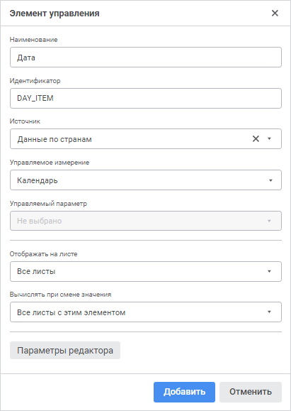

# Настройки элементов управления: Регламентный отчёт, веб-приложение

Настройки элементов управления: Регламентный отчёт, веб-приложение
-

# Настройки элементов управления

При добавлении или редактировании элементов управления будет открыто
 окно настройки элемента управления:

[Для открытия
 окна](javascript:TextPopup(this))

	Нажмите кнопку  «Добавить
	 элемент управления» на панели «[Элементы управления](AddControls.htm)».

Определите настройки элемента управления:

	- Наименование. Задайте
	 наименование элементу управления. По умолчанию «Элемент
	 управления <Порядковый
	 номер>»;

	- Идентификатор. Задайте
	 уникальный идентификатор элемента управления. Идентификатор может
	 состоять только из букв латинского алфавита, цифр и символа подчеркивания.
	 По умолчанию ELEMENT <Порядковый
	 номер>;

	- Источник. Выберите источник,
	 измерением которого будет управлять элемент. Необязательная настройка.
	 При выборе источника становится доступным поле «Управляемое
	 измерение», при этом редактор значений элемента управления
	 автоматически переключится на [тип](../Tuning/ValueEditorParameters.htm)
	 «Раскрывающийся список справочника»;

	- Управляемое измерение.
	 Из раскрывающегося списка выберите измерение, которым будет управлять
	 элемент управления. Поле доступно после выбора источника;

	- Управляемый параметр.
	 По умолчанию в раскрывающемся списке отображается вариант «Не
	 выбрано» и [параметры
	 отчёта](../Reports/uireport_reports_param.htm), если они для него заданы. Если добавляемый параметр отчёта
	 [связан с параметром
	 источника](../Reports/UiReport_Reports_Param2.htm), то добавление такого параметра даёт возможность управлять
	 параметрами источников данных;

Примечание.
 При выборе управляемого параметра управляемое измерение можно не указывать.

	- Отображать
	 на листе. Определите, на каких листах отчёта будет отображаться
	 данный элемент управления. Раскрывающийся список содержит наименования
	 всех листов текущего отчёта, а также пункты «Все
	 листы» и «Не отображать».
	 Выбор пункта «Не отображать»
	 скрывает элемент управления из списка элементов на [боковой
	 панели и панели](AddControls.htm) «Элементы управления».
	 В списке возможна множественная отметка листов;

Примечание.
 Скрытые элементы управления можно [отобразить](AddControls.htm#hide).

	- Вычислять при смене значения.
	 По умолчанию установлено значение «Все
	 листы с этим элементом». Из раскрывающегося списка выберите
	 ту часть отчёта, которую требуется вычислять при смене значения:

		- Только связанный срез;

		- Весь отчет;

		- Все листы с этим элементом.
		 При выборе данной настройки для скрытых элементов управления в
		 случае смены отметки элемента вычисление листов будет происходить
		 только после [обновления](../Reports/OperationReport/UiReport_Reports_Operation_Execute.htm)
		 всего отчёта;

		- Конкретный лист текущего
		 отчёта;

		- Не вычислять. Выбор
		 этого варианта отменяет пересчёт среза/отчёта/листов/листа (в
		 режиме просмотра) при смене значения элемента управления.

Для настройки редактора элемента управления нажмите кнопку «Параметры
 редактора». Откроется окно «[Параметры
 редактора](../Tuning/ValueEditorParameters.htm)».

См. также:

[Добавление
 интерактивных элементов управления содержимым отчёта](AddControls.htm)

		Справочная
		 система на версию 10.9
		 от 18/08/2025,
		 © ООО «ФОРСАЙТ»,
