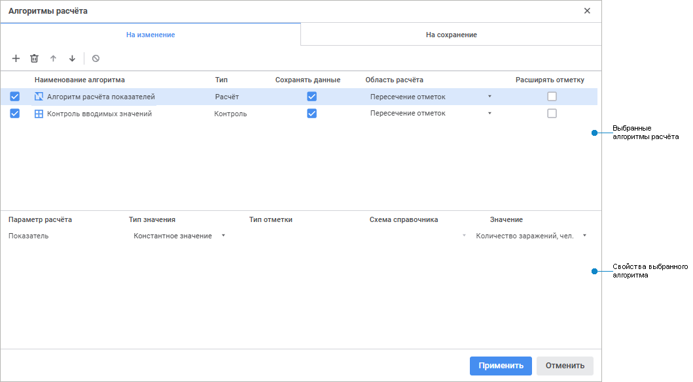
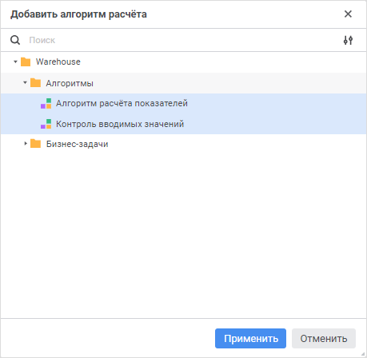

# Настройка алгоритмов расчёта: Регламентный отчёт, веб-приложение

Настройка алгоритмов расчёта: Регламентный отчёт, веб-приложение
-

# Настройка алгоритмов расчёта

	Для расчёта и контроля данных из среза данных используйте готовые
	 [алгоритмы
	 расчёта](CalculationAlgorithm.chm::/Purpose.htm).

	Примечание.
	 Выбор алгоритма расчёта доступен только при наличии установленного
	 расширения «[Алгоритмы расчёта](CalculationAlgorithm.chm::/Purpose.htm)».

	Для выбора алгоритмов расчёта используйте окно «Алгоритмы
	 расчёта»:

	[Для открытия
	 окна](javascript:TextPopup(this))

			- Наведите указатель мыши на выбранный срез данных на
			 панели «Источники».
			 Отобразится кнопка  «Алгоритмы
			 расчёта».

			- Нажмите кнопку  «Алгоритмы
			 расчёта».

	

	[Элементы
	 окна «Алгоритмы расчёта»](javascript:TextPopup(this))

			- Выбранные алгоритмы
			 расчета. Содержит вкладки «На
			 изменение» и «На сохранение»,
			 отображающие списки добавленных алгоритмов с доступными настройками
			 на панели инструментов;

			- Свойства выбранного
			 алгоритма. Предназначен для настройки связи параметров
			 алгоритма и отчёта. Доступен для выбранного алгоритма расчёта,
			 с настроенными [параметрами](calculationalgorithm.chm::/Web/Work/Parameters_of_the_calculation_algorithm.htm).

## Добавление, перемещение и удаление алгоритма
	 расчёта

	Для добавления алгоритмов:

		- Нажмите кнопку  «Добавить
		 алгоритм» на панели инструментов вкладки. Откроется окно
		 «Добавить алгоритм расчёта»:

	

Для быстрого выбора объекта в поле для поиска введите его название/идентификатор/ключ,
 в зависимости от настроек отображения. Поиск будет выполняться автоматически
 по мере ввода текста. Список будет содержать объекты, наименования/идентификаторы/ключи
 которых содержат вводимый текст.

Для настройки отображения объектов репозитория в списке нажмите кнопку
  «Отображение объекта» и выберите
 в раскрывающемся меню вариант отображения:

	- Наименование. Объекты
	 отображаются под своими наименованиями. Вариант по умолчанию;

	- Идентификатор. Объекты
	 отображаются под своими идентификаторами;

	- Ключ. Объекты отображаются
	 под своими ключами.

Выбрать можно несколько вариантов. Идентификатор
 и ключ будут указаны в скобках.

		- Выберите необходимый объект репозитория в дереве объектов
		 репозитория. Доступна множественная отметка.

	Для быстрого поиска нужного алгоритма
	 расчёта по названию воспользуйтесь поиском. Введите искомый текст
	 в поле для поиска. Поиск будет выполняться автоматически по мере ввода
	 искомого текста. В списке будут только те алгоритмы расчёта, наименования
	 которых содержат вводимый текст.

	Для сброса результатов поиска нажмите
	 кнопку  «Очистить».

		- Нажмите кнопку «Применить».

	В зависимости от варианта выполнения расчёта добавьте алгоритм на
	 вкладку:

		- На изменение. Алгоритмы,
		 добавленные на эту вкладку, будут выполнены непосредственно при
		 изменении данных в отчёте. Расчёт производится в ячейках, использующих
		 в формулах изменённые данные. Значения в ячейках, рассчитанные
		 при помощи подключенного алгоритма расчета, отображаются как изменённые
		 данные;

		- На сохранение. Алгоритмы,
		 добавленные на эту вкладку, будут выполнены только при сохранении
		 данных в отчёте, при изменении данных расчёт не производится.
		 Расчёт производится в источниках по всем данным.

	Для настройки очередности выполнения алгоритмов расчёта переместите
	 алгоритмы на вкладке с помощью кнопок «Переместить
	 вверх» / 
	 «Переместить вниз».

	Для удаления выбранного алгоритма расчёта нажмите кнопку  «Удалить»
	 на панели инструментов вкладки.

## Настройка выбранного алгоритма расчёта

	Для настройки выбранного алгоритма расчёта выделите его в списке
	 алгоритмов расчёта. В зависимости от типа алгоритма будут доступны
	 различные настройки. Тип алгоритма определяется автоматически. В таблице
	 области «Выбранные алгоритмы расчёта»
	 в столбце «Тип» указан тип
	 алгоритма расчёта:

		- Расчёт. Алгоритм
		 содержит только блоки расчёта. Можно добавить на вкладки «На изменение» и «На
		 сохранение»;

		- Контроль. Алгоритм
		 содержит только блоки контроля. Можно добавить только на вкладку
		 «На изменение»;

		- Расчёт/Контроль.
		 Алгоритм содержит как расчетные блоки, так и блоки контроля. Можно
		 добавить на вкладки «На изменение»
		 и «На сохранение».

	Выполните настройки алгоритма расчёта:

		- при необходимости снимите флажок напротив алгоритма для
		 проведения отладки работы алгоритмов расчёта в отчёте. По умолчанию
		 флажки установлены у всех алгоритмов;

		- установите флажок напротив алгоритма
		 в столбце «Сохранять данные»
		 для сохранения данных в источник. Доступно на вкладке «На
		 изменение». При установке флажка данные в ячейках, рассчитанные
		 алгоритмом, сохраняются в источник при [сохранении
		 данных](../../Reports/OperationReport/Work_with_data.htm#edit) или [сохранении
		 отчёта](../../CreateReport.htm#save). Если данные в ячейках рассчитываются несколькими алгоритмами,
		 то сохраняются данные, рассчитанные последним алгоритмом с включенной
		 настройкой. Если флажок снят, то данные в ячейках, рассчитанные
		 алгоритмом, не сохраняются в источник, но сохраняются в самом
		 отчёте. Для отображения последних сохраненных данных источника
		 в ячейках, рассчитанных алгоритмом без сохранения данных, отключите
		 выполнение алгоритма или удалите его;

		- выберите из раскрывающегося списка «Область
		 расчёта» тип формирования области расчёта, который будет
		 использоваться при расчёте алгоритма:

			- пересечение отметок.
			 Для расчёта будет использовано пересечение отметки из алгоритма
			 по всем измерениям с отметкой в табличной области. Выбрано
			 по умолчанию;

			- период расчёта из алгоритма.
			 Для расчёта будет использовано пересечение отметки из алгоритма
			 по всем измерениям, кроме календарного, с отметкой в табличной
			 области;

			- вся отметка из алгоритма.
			 Для расчёта будет использована вся отметка из алгоритма без
			 учёта отметки в табличной области.

	Доступно на вкладке «На
	 изменение»;

		- установите флажок напротив алгоритма
		 в столбце «Расширять отметку»
		 для увеличения диапазона загружаемых данных, на основании отметки
		 указанной в алгоритме. Доступно на вкладке «На
		 изменение». При установке флажка в расчёте будут учитываться
		 все значения указанные при настройке алгоритма, а не только выводимые
		 в табличной области;

		- настройте обновление табличной области при сохранении данных.
		 Для этого нажмите кнопку  «Обновлять табличную область после сохранения
		 данных» панели инструментов. Доступно для алгоритмов добавленных
		 на вкладку «На сохранение»;

		- настройте блокировку сохранения изменённых
		 данных в табличной области при сработавшем контроле. Для этого
		 нажмите кнопку  «Блокировать
		 сохранение измененных данных в табличной области при сработавшем
		 контроле». При [сохранении
		 измененных данных](../../Reports/OperationReport/Work_with_data.htm#edit) если хотя бы для одной табличной области
		 сработал контроль, будет выведено информационное сообщение, что
		 требуется корректировка введенных данных. При выполнении действий,
		 приводящих к обновлению табличной области: [сохранение](../../CreateReport.htm#save),
		 [обновление](../../Reports/OperationReport/UiReport_Reports_Operation_Execute.htm),
		 [смена значений параметров](../AddControls.htm), закрытие
		 отчёта; [редактирование](../../Table/UiReport_tables_appointment.htm)
		 табличной области - будет выведено предупреждение, что измененные
		 данные не будут сохранены, так как не удовлетворяют настройкам
		 контролей. При отказе продолжить действие измененные данные останутся
		 в табличной области. Доступно при типе расчёта «Контроль»
		 на вкладке «На изменение».

## Настройка свойств выбранного алгоритма
	 расчёта

	Примечание.
	 Настройка доступна для выбранного алгоритма расчёта, с настроенными
	 [параметрами](calculationalgorithm.chm::/Web/Work/Parameters_of_the_calculation_algorithm.htm).

	Для настройки свойств выбранного алгоритма расчёта задайте связи
	 [параметров
	 алгоритмов расчёта](CalculationAlgorithm.chm::/web/Work/Set_up_calculation_parameters.htm) и [параметров
	 отчёта](../../Reports/UiReport_Reports_Param1.htm), установив:

		- Тип значения. Укажите
		 значения, которые используются при расчёте алгоритма:

			- Параметр объекта.
			 В расчёте используется значение [параметра](../../Reports/UiReport_Reports_Param1.htm)
			 отчёта;

			- Константное значение. В расчёте используется постоянное
			 значение;

		- Тип отметки. В зависимости
		 от выбранного типа значения:

			- если установлен тип «Параметр
			 объекта», укажите тип отметки, выбрав его из раскрывающегося
			 списка. Допустимые значения: исходная, первый элемент, последний
			 элемент, исходная+дочерние, исходная+дочерние (рекурсивно),
			 дочерние, дочерние (рекурсивно);

			- если установлен тип «Константное
			 значение», тип отметки недоступен;

		- Схема справочника.
		 Выберите из раскрывающегося списка [схему
		 отметки](UiNavObj.chm::/reference_book/look-and-feel_Reference_book/UiMd_reference_book_look-and-feel_Scheme.htm) справочника, используемого в качестве
		 параметра алгоритма. Если у справочника не настроена схема отметки,
		 то список будет недоступен;

	Примечание.
	 Схема отметки справочника имеет больший приоритет, чем тип отметки.

		- Значение. В зависимости
		 от выбранного типа значения:

			- если установлен тип «Параметр
			 объекта», укажите параметр или атрибут параметра отчёта,
			 выбрав его из раскрывающегося списка;

			- если установлен тип «Константное
			 значение», задайте значение константы.

См. также:

[Добавление
 срезов данных и работа с ними](UiReport_Source_Window_AreaSource.htm) | [Построение
 отчёта](../../CreateReport.htm)

		Справочная
		 система на версию 10.9
		 от 18/08/2025,
		 © ООО «ФОРСАЙТ»,
