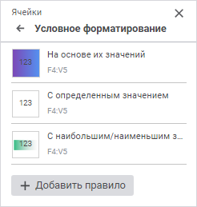
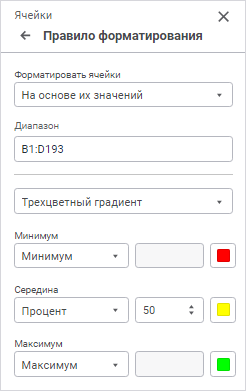

# Настройка условного форматирования

Настройка условного форматирования
-

# Настройка условного форматирования

Для настройки форматирования, которое применяется только при выполнении
 определённого условия, используйте группу параметров «Условное
 форматирование» [панели
 параметров](../../organizational_management/Starting.htm#structure_window):

[Для открытия
 группы параметров «Условное форматирование»](javascript:TextPopup(this))

	Для открытия на панели параметров группы параметров «Условное
	 форматирование»:

		- Выделите ячейку или диапазон ячеек.

		- Нажмите кнопку  «Параметры»
		 на панели инструментов. Будет открыта панель параметров.

		- Выберите тип области «Данные»
		 или «Ячейки» в раскрывающемся
		 меню заголовка панели параметров.

Для добавления правила нажмите кнопку «Добавить
 правило» в результате откроется панель «Правило
 форматирования»:

Доступны правила форматирования ячеек:

	- [на
	 основе их значений](UiAnalyticalArea.chm::/analysis/format/uireport_table_attribute_format_condition_1.htm);

	- [с
	 определенным значением](UiAnalyticalArea.chm::/analysis/format/uireport_table_attribute_format_condition_2.htm);

	- [с
	 наибольшими/наименьшими значениями](UiAnalyticalArea.chm::/analysis/format/uireport_table_attribute_format_condition_3.htm);

	- [со
	 значениями больше/меньше среднего](UiAnalyticalArea.chm::/analysis/format/uireport_table_attribute_format_condition_4.htm);

	- [с
	 уникальными/повторяющимися значениями](UiAnalyticalArea.chm::/analysis/format/uireport_table_attribute_format_condition_5.htm);

	- [удовлетворяющие
	 формуле](UiAnalyticalArea.chm::/analysis/format/uireport_table_attribute_format_condition_6.htm).

См. также:

[Оформление
 отчёта](../Work/UiReport_Table_WorkStyle.htm)

		Справочная
		 система на версию 10.9
		 от 18/08/2025,
		 © ООО «ФОРСАЙТ»,
