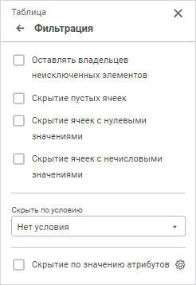
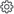
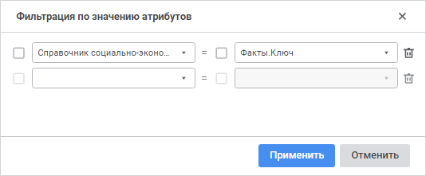

# Настройка фильтрации

Настройка фильтрации
-

# Настройка фильтрации

Для отображения данных соответствующих заданным условиям таблицы используйте
 группу параметров «Фильтрация»
 [панели
 параметров](../../organizational_management/Starting.htm#structure_window):

[Для открытия
 группы параметров «Фильтрация»](javascript:TextPopup(this))

	Для открытия на панели параметров группы параметров «Фильтрация»:

		- Выделите ячейку или диапазон ячеек, принадлежащих таблице.

		- Нажмите кнопку  «Параметры»
		 панели инструментов.

		- Выберите тип области «Таблица»
		 в раскрывающемся меню заголовка панели параметров.

Задайте параметры:

[Оставлять владельцев
 неисключенных элементов](javascript:TextPopup(this))

	При установке флажка родительские элементы неисключенных фильтрацией
	 строк/столбцов не будут скрыты.

[Скрытие пустых
 ячеек](javascript:TextPopup(this))

	При установке флажка будут скрыты строки/столбцы, не содержащие
	 никакой информации.

[Скрытие ячеек
 с нулевыми значениями](javascript:TextPopup(this))

	При установке флажка будут скрыты строки/столбцы, содержащие нулевые
	 значения.

[Скрытие ячеек
 с нечисловыми значениями](javascript:TextPopup(this))

	При установке флажка будут скрыты строки/столбцы, содержащие только
	 нечисловые значения.

[Скрыть по условию](javascript:TextPopup(this))

	При установке флажка будут скрыты строки/столбцы, все данные ячеек
	 которых соответствуют заданному в раскрывающемся списке условию. Большинство
	 условий использует одно или два числа для сравнения с результатом
	 ячейки:

		- равные А;

		- не равные А;

		- большие А;

		- меньшие А;

		- большие или равные А;

		- меньшие или равные А;

		- между А и В включительно;

		- меньшие А или большие В;

		- выражение.

	Для задания сложной формулы используйте вариант «Выражение».

[Скрытие по
 значению атрибутов](javascript:TextPopup(this))

	При установке флажка будут скрыты элементы, для которых настроена
	 фильтрация по значению атрибутов.

	Настройка фильтрации доступна только для тех измерений, которые
	 содержат [связанные
	 атрибуты](UiNavObj.chm::/reference_book/Master_RDS_reference_book/Link.htm). Правила, заданные для несвязанных атрибутов,
	 будут игнорироваться.

	Для настройки фильтрации по значению атрибутов:

		- Нажмите кнопку  «Настройка
		 фильтрации». Будет открыто окно «Фильтрация
		 по значению атрибутов»:

	

	В окне отображается список добавленных
	 связей атрибутов, для которых выполняется фильтрация.

		- Добавьте связь атрибутов:

			- Выберите в левом раскрывающемся списке атрибут из измерения,
			 на основе отметки которого будет выполняться фильтрация.

			- Выберите в правом раскрывающемся списке атрибут из связываемого
			 измерения. В этом измерении будет выполняться фильтрация.

			- При необходимости установите флажок «Не
			 учитывать связь при пустом значении атрибута» около
			 соответствующего атрибута для исключения из расчёта связей
			 с пустыми значениями атрибутов.

	В результате выполнения действий будет настроена фильтрация по значениям
	 атрибутов. Для добавления новых связей атрибутов повторите действия.

	Для удаления связи атрибутов нажмите кнопку 
	 «Удалить», расположенную около
	 неё.

См. также:

[Оформление
 отчёта](../Work/UiReport_Table_WorkStyle.htm)

		Справочная
		 система на версию 10.9
		 от 18/08/2025,
		 © ООО «ФОРСАЙТ»,
