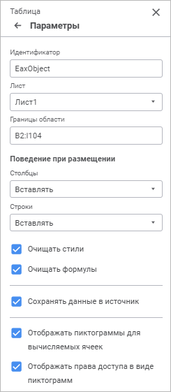

# Настройка параметров: Регламентный отчёт, веб-приложение

Настройка параметров: Регламентный отчёт, веб-приложение
-

# Настройка параметров

Для настройки общих параметров таблицы используйте группу параметров
 «Параметры» [панели
 параметров](../../organizational_management/Starting.htm#structure_window):

[Для открытия
 группы параметров «Параметры»](javascript:TextPopup(this))

	Для открытия на панели параметров группы параметров «Параметры»:

		- Выделите ячейку или диапазон ячеек, принадлежащих таблице.

		- Нажмите кнопку  «Параметры»
		 панели инструментов.

		- Выберите тип области «Таблица»
		 в раскрывающемся меню заголовка панели параметров.

Задайте параметры:

[Идентификатор](javascript:TextPopup(this))

	В поле указан идентификатор таблицы данных, как объекта на листе
	 отчёта.

	Для изменения идентификатора таблицы введите в поле последовательность
	 букв латинского алфавита и цифр. Идентификатор должен быть уникальным
	 в пределах отчёта.

[Лист](javascript:TextPopup(this))

	Для перемещения таблицы на другой лист отчёта из раскрывающегося
	 списка «Лист» выберите необходимый
	 лист.

	Примечание.
	 При перемещении таблицы с листа на лист сохраняются форматирование
	 и все применённые к таблице настройки.

	По умолчанию отображается наименование листа, на котором расположена
	 таблица.

[Границы области](javascript:TextPopup(this))

	Для перемещения таблицы по листу отчёта измените координату левого
	 верхнего угла таблицы.

	Примечание.
	 Границы таблицы не могут быть установлены больше или меньше их фактического
	 размера.

	По умолчанию отображается фактический диапазон ячеек таблицы данных.

[Поведение при
 размещении](javascript:TextPopup(this))

	Для определения поведения столбцов/строк таблицы при размещении
	 на листе выберите один режим из раскрывающегося списка параметров:

		- Столбцы. Параметр
		 определяет, как будут вести себя столбцы таблицы при изменении
		 её размеров, а также столбцы, расположенные справа от таблицы.
		 Возможны следующие варианты:

			- Захват смежных столбцов.
			 При увеличении количества столбцов таблицы информация, расположенная
			 в столбцах правее, будет перекрываться данными из таблицы.
			 При уменьшении количества столбцов таблицы информация, расположенная
			 в столбцах правее, не изменит своё положение;

			- Вставлять. При
			 увеличении/уменьшении количества столбцов таблицы на лист
			 отчёта будет добавлено/удалено необходимое количество столбцов.
			 При этом информация, расположенная в столбцах правее таблицы,
			 будет смещена вправо/влево. Количество столбцов при смещении
			 будет равно количеству столбцов добавляемой табличной области;

		- Строки. Параметр
		 определяет, как будут вести себя строки таблицы при изменении
		 её размеров, а также строки, расположенные ниже таблицы. Возможны
		 следующие варианты:

			- Захват смежных строк.
			 При увеличении количества строк таблицы информация, расположенная
			 в строках ниже, будет перекрываться данными из таблицы. При
			 уменьшении количества строк таблицы информация, расположенная
			 в строках ниже, не изменит своё положение;

			- Вставлять. При
			 увеличении/уменьшении количества строк таблицы на лист отчёта
			 будет добавлено/удалено необходимое количество строк. При
			 этом информация, расположенная в строках ниже, будет смещена
			 вниз/вверх. Количество строк при смещении будет равно количеству
			 строк добавляемой табличной области.

[Очищать
 стили](javascript:TextPopup(this))

	Для очистки оформления, применённого на листе, в таблице установите
	 флажок «Очищать стили». Очищение
	 оформления в таблице будет происходить только при [обновлении
	 отчёта](../../Reports/OperationReport/UiReport_Reports_Operation_Execute.htm).

	Для использования оформления, применённого на листе, к таблице снимите
	 флажок «Очищать стили».

	К оформлению листа относятся настройки [оформления](Format.htm),
	 [условного форматирования](Conditional_Formatting.htm),
	 [стиля таблицы и предопределённые
	 стили](UiReport_Table_Styles.htm), заданные для типа области «Ячейка»
	 на [панели параметров](../Work/UiReport_Table_WorkStyle.htm#format)
	 независимо от принадлежности ячейки.

	Снимите флажок «Очищать стили»,
	 только если табличная область не будет динамически перестраиваться,
	 при этом меняя свой размер.

	По умолчанию флажок установлен.

[Очищать формулы](javascript:TextPopup(this))

	Для использования только вычисленного значения формулы в ячейке
	 таблицы установите флажок «Очищать
	 формулы».

	Для использования самой формулы в ячейке таблицы снимите флажок
	 «Очищать формулы».

	Изменение поведения будет применено при [обновлении](../../Reports/OperationReport/UiReport_Reports_Operation_Execute.htm)
	 или сохранении отчёта.

	Если флажок при открытии отчёта был снят, а в процессе работы с
	 отчётом установлен, то уже введенные формулы в таблице будут рассчитаны,
	 и расчётные значения будут подставлены в ячейки.

[Сохранять
 данные в источник](javascript:TextPopup(this))

	Установка флажка позволяет сохранять измененные данные таблицы в
	 источник данных. Если флажок снят, то сохранить измененные данные
	 в источник невозможно. По умолчанию флажок установлен.

[Отображать
 пиктограммы для вычисляемых ячеек](javascript:TextPopup(this))

	Установка флажка позволяет отображать пиктограммы  для ячеек вычисляемых элементов.
	 По умолчанию флажок установлен.

	Для получения подробной информации
	 обратитесь к статье «[Отображение
	 пиктограмм в ячейках](UiAnalyticalArea.chm::/TableView/Formatting/Cells_icons.htm)».

[Отображать
 права доступа в виде пиктограмм](javascript:TextPopup(this))

	Установка флажка позволяет отображать пиктограммы  для ячеек, на которые у
	 пользователя нет прав. По умолчанию флажок установлен.

	Для получения подробной информации
	 обратитесь к статье «[Отображение
	 пиктограмм в ячейках](UiAnalyticalArea.chm::/TableView/Formatting/Cells_icons.htm)».

См. также:

[Оформление
 отчёта](../Work/UiReport_Table_WorkStyle.htm)

		Справочная
		 система на версию 10.9
		 от 18/08/2025,
		 © ООО «ФОРСАЙТ»,
