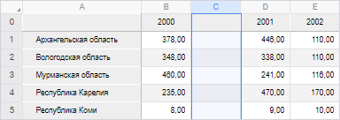
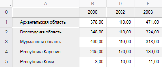

# Операции со столбцами: Регламентный отчёт, веб-приложение

Операции со столбцами: Регламентный отчёт, веб-приложение
-

# Операции со столбцами

В регламентном отчёте предусмотрены следующие операции со столбцами
 листа отчёта:

[Добавление
 столбцов](javascript:TextPopup(this))

	Существует два варианта добавления столбцов:

		- Добавление слева.
		 Новый столбец будет добавлен слева от текущего. Ширина добавляемого
		 столбца будет совпадать с шириной столбца, расположенного слева
		 от текущего;

		- Добавление справа.
		 Новый столбец будет добавлен справа от текущего. Ширина добавляемого
		 столбца будет совпадать с шириной текущего столбца.

	Примечание.
	 Добавление столбцов недоступно, если новый столбец попадает в диапазон
	 таблицы источника данных.

	Для добавления нового столбца выделите существующий столбец (или
	 любую ячейку, содержащуюся в столбце) и выполните одно из действий:

		- выполните команду контекстного меню 
		 «Вставить столбец слева»
		 или  «Вставить столбец справа» заголовка
		 столбца;

		- выполните команду контекстного меню 
		 «Вставить > 
		 Вставить столбец слева» или  «Вставить
		 >  Вставить столбец справа» ячейки,
		 содержащейся в столбце;

		- нажмите сочетание клавиш ALT+T для добавления столбца слева.

	Примечание.
	 Если перед добавлением столбца для диапазона было настроено [условное
	 форматирование](UiAnalyticalArea.chm::/Analysis/format/uireport_table_attribute_format_conditionparams.htm), оно будет применяться и для нового
	 столбца.

	Столбцы, которые после выполнения вставки должны оказаться правее
	 нового столбца, сдвигаются вправо на одну позицию. При вставке столбца
	 слева сдвигаются все столбцы, начиная с выделенного. При вставке столбца
	 справа, выделенный столбец остается на месте, а все столбцы правее
	 него сдвигаются.

	Пример вставки столбца слева при выделении столбца C:

	

	Операцию добавления столбцов можно производить сразу с несколькими
	 столбцами. В таком случае количество добавленных столбцов будет совпадать
	 с количеством изначально отмеченных столбцов.

[Изменение
 ширины столбцов](javascript:TextPopup(this))

	Изменение ширины столбцов производить несколькими способами:

		- Ручное изменение ширины.
		 Для ручного изменения ширины столбца подведите указатель мыши
		 к правой границе столбца в области заголовка, щёлкните по границе
		 и, удерживая её, перетащите на требуемое расстояние. Актуальная
		 ширина столбца отобразится во всплывающей подсказке.

		- Точное изменение ширины.
		 Для точного задания значения ширины столбца выполните команду
		 контекстного меню  «Изменить
		 размер столбца» выделенного столбца или заголовка столбца.
		 В появившемся окне «Ширина столбца»
		 измените значение ширины столбца в пикселях или миллиметрах:

	

		- Быстрая
		 подгонка ширины столбца. Для быстрой подгонки ширины столбца
		 выполните одно из действий:

			- выполните команду  «Подогнать ширину столбца»
			 контекстного меню выделенной ячейки или заголовка столбца;

			- нажмите кнопку  «Подогнать ширину столбца»
			 вкладки «Вид» панели
			 инструментов;

			- выполните команду «Вид
			 > Подогнать ширину
			 столбца» главного меню для выделенной ячейки или
			 заголовка столбца;

			- дважды щёлкните по правой границе заголовка столбца.

	Каждый из вышеперечисленных способов может быть применен как к одному
	 столбцу, так и к группе столбцов. Изменённый размер применится для
	 каждого столбца из группы.

[Скрытие
 столбцов](javascript:TextPopup(this))

	Скрытие столбцов применяется, когда в столбцах содержатся промежуточные
	 вычисления. Данные, содержащиеся в скрытых столбцах, не будут отображаться
	 на экране и при печати.

	Для скрытия столбца отметьте столбец (или любую ячейку, содержащуюся
	 в столбце) и выполните команду контекстного меню 
	 «Скрыть» заголовка столбца.

	После выполнения команды отмеченный столбец будет скрыт. Столбец,
	 расположенный правее, займет его место.

	Пример скрытия столбца C:

	

	Операцию скрытия можно производить сразу с несколькими столбцами.

[Отображение
 скрытых столбцов](javascript:TextPopup(this))

	Для отображения скрытого столбца выделите два столбца: столбец левее
	 и правее скрытого, а затем выполните команду контекстного меню  «Показать» заголовка
	 отмеченных столбцов.

	После выполнения команды отобразятся скрытые столбцы, находящиеся
	 между отмеченными столбцами.

	Если между отмеченными столбцами находятся несколько скрытых столбцов,
	 то после выполнения команды 
	 «Показать» будут отображены
	 все скрытые столбцы.

	 весь лист.

	Примечание.
	 Задание минимальной ширины столбца и его скрытие - это разные операции.

[Удаление
 столбцов](javascript:TextPopup(this))

	Для удаления столбца выделите существующий столбец (или любую ячейку,
	 содержащуюся в столбце) и выполните одно из действий:

		- выполните команду контекстного меню 
		 «Удалить столбец» заголовка
		 столбца;

		- выполните команду контекстного меню 
		 «Удалить > 
		 Удалить столбец» ячейки, содержащейся в столбце.

	Примечание.
	 Столбец будет удален даже в том случае, когда отмечена всего одна
	 ячейка столбца.

	После выполнения команды отмеченный столбец будет удален, а все
	 столбцы, расположенные правее, сдвинутся на одну позицию влево.

	Примечание.
	 Удаление столбцов недоступно, если в удаляемый диапазон входит таблица
	 источника данных.

	Операцию удаления можно производить сразу с несколькими столбцами.
	 Для этого перед выполнением операции [выделите](uinav.chm::/GUI/Cells_Select.htm#select_list)
	 диапазон, включающий в себя хотя бы по одной ячейке каждого из удаляемых
	 столбцов.

	Механизм замены переменных в формулах следующий:

		- при удалении столбца все значения, которые в своем названии
		 содержат наименование этого столбца, заменяются в формуле на «#ССЫЛКА!». Значения ячеек, формулы
		 которых содержат ссылки на удаленный столбец, изменяются на «#ССЫЛКА!»;

		- все значения, которые в своем названии содержат букву, находящуюся
		 ближе к началу алфавита, чем буква удаленного столбца, остаются
		 без изменений;

		- все значения, которые в своем названии содержат букву, находящуюся
		 ближе к концу алфавита, чем буква удаленного столбца, сдвигаются
		 на одну букву ближе к началу алфавита (F1
		 заменяется на E1, а E1 на D1
		 и т.д.).

	При удалении столбцов производится корректировка формул, содержащих
	 удаленные (перемещенные в результате добавления) ячейки, находящиеся
	 на других листах регламентного отчёта.

[Закрепление
 столбца](javascript:TextPopup(this))

	Для постоянного отображения крайнего левого столбца на экране областей
	 отчёта при прокрутке [закрепите
	 столбец](../Work/UiReport_Table_WorkStyle.htm#freeze).

См. также:

[Работа
 с элементами листа отчёта](../UiReport_Table.htm)

		Справочная
		 система на версию 10.9
		 от 18/08/2025,
		 © ООО «ФОРСАЙТ»,
