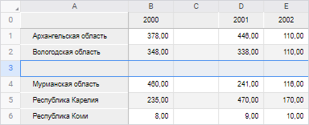

# Операции со строками: Регламентный отчёт, веб-приложение

Операции со строками: Регламентный отчёт, веб-приложение
-

# Операции со строками

В регламентном отчёте предусмотрены следующие операции над строками:

[Добавление
 строк](javascript:TextPopup(this))

	Существует два варианта добавления строк:

		- Добавление снизу.
		 Новая строка будет добавлена под текущей. Высота добавляемой строки
		 будет совпадать с высотой текущей строки;

		- Добавление сверху.
		 Новая строка будет добавлена над текущей. Высота добавляемой строки
		 будет совпадать с высотой строки, расположенной выше текущей.

	Примечание.
	 Добавление строк недоступно, если новая строка попадает в диапазон
	 таблицы источника данных.

	Для добавления новой строки отметьте существующую строку (или любую
	 ячейку, содержащуюся в строке) и выполните одно из действий:

		- выполните команду контекстного меню 
		 «Вставить строку выше»
		 или  «Вставить строку ниже» заголовка
		 строки;

		- выполните команду контекстного меню 
		 «Вставить > 
		 Вставить строку выше» или  «Вставить
		 >  Вставить строку ниже» ячейки,
		 содержащейся в строке;

		- нажмите сочетание клавиш ALT+Y для добавления строки сверху.

	Примечание.
	 Если перед добавлением строки для диапазона было настроено [условное
	 форматирование](UiAnalyticalArea.chm::/Analysis/format/uireport_table_attribute_format_conditionparams.htm), оно будет применяться и для новой
	 строки.

	После выполнения команды новая строка добавится в указанное положение,
	 а существующая сдвинется в противоположном направлении.

	Пример вставки строки выше при выделении строки 3:

	

	Операцию добавления строк можно производить сразу с несколькими
	 строками. В таком случае количество добавленных строк будет совпадать
	 с количеством изначально отмеченных строк.

[Изменение
 высоты строк](javascript:TextPopup(this))

	Изменение высоты строк можно производить несколькими способами:

		- Ручное изменение высоты.
		 Для ручного изменения высоты строки подведите указатель мыши к
		 нижней границе строки в области заголовка, щёлкните по границе
		 и, удерживая её, перетащите на требуемое расстояние. Актуальная
		 высота строки отобразится во всплывающей подсказке.

		- Точное изменение высоты.
		 Для точного задания значения высоты строки выполните команду контекстного
		 меню  «Изменить
		 размер строки» выделенной строки или заголовка строки.
		 В появившемся окне «Высота строки»
		 измените значение высоты строки в пикселях или миллиметрах:

	

		- Быстрая подгонка высоты
		 строки. Для быстрой подгонки высоты строки выполните одно
		 из действий:

			- выполните команду  «Подогнать
			 высоту строки» контекстного меню выделенной ячейки
			 или заголовка строки;

			- нажмите кнопку  «Подогнать
			 высоту строки» вкладки «Вид»
			 панели инструментов;

			- выполните команду «Вид > Подогнать
			 высоту строки»  главного меню для выделенной ячейки
			 или заголовка строки;

			- дважды щёлкните по нижней
			 границе заголовка строки.

	Каждый из вышеперечисленных способов изменения размеров строк может
	 быть применён как к одной строке, так и к группе строк. Изменённый
	 размер применится для каждой строки из группы.

[Скрытие
 строк](javascript:TextPopup(this))

	Скрытие строк применяется, когда в строках содержатся промежуточные
	 вычисления. Данные, содержащиеся в скрытых строках, не будут отображаться
	 на экране и при печати.

	Для скрытия строки отметьте строку (или любую ячейку, содержащуюся
	 в строке) и выполните команду контекстного меню 
	 «Скрыть» заголовка строки.

	После выполнения команды отмеченная строка будет скрыта. Строка,
	 расположенная ниже, займет ее место.

	Операцию скрытия можно производить сразу с несколькими строками.

[Отображение
 скрытых строк](javascript:TextPopup(this))

	Для отображения скрытой строки выделите две строки: выше и ниже
	 скрытой, затем выполните команду контекстного меню 
	 «Показать» заголовка
	 отмеченных строк.

	После выполнения команды отобразится скрытая строка, находящаяся
	 между отмеченными строками.

	Если между отмеченными строками находятся несколько скрытых строк,
	 то после выполнения команды 
	 «Показать» будут отображены
	 все скрытые строки.

[Удаление
 строк](javascript:TextPopup(this))

	Для удаления строки отметьте строку (или любую ячейку, содержащуюся
	 в строке) и выполните одно из действий:

		- выполните команду контекстного меню 
		 «Удалить строку» заголовка
		 строки;

		- выполните команду контекстного меню 
		 «Удалить > 
		 Удалить строку» ячейки, содержащейся в строке.

	Примечание.
	 Строка будет удалена даже в том случае, когда отмечена всего одна
	 ячейка строки.

	После выполнения команды отмеченная строка будет удалена. При этом
	 строка, расположенная ниже, займет ее место.

	Примечание.
	 Удаление строки недоступно, если в удаляемый диапазон входит таблица
	 источника данных.

	Операцию удаления можно производить сразу с несколькими строками.
	 Для этого перед выполнением операции выделите диапазон, включающий
	 в себя хотя бы по одной ячейке каждой удаляемой строки.

	Механизм замены переменных в формулах следующий:

		- при удалении строки все значения, которые в своем названии
		 содержат номер этой строки, заменяются в формуле на «#ССЫЛКА!».
		 Значение ячеек, формулы которых содержат ссылки на удаленную строку,
		 изменяется на «#ССЫЛКА!»;

		- все значения, которые в своем названии содержат номер, меньший
		 порядкового номера удаленной строки, остаются без изменений;

		- все значения, которые в своем названии содержат номер, больший
		 порядкового номера удаленной строки, уменьшаются на единицу (A10 заменяется на A9,
		 B10 на B9
		 и т.д).

	При удалении строк производится корректировка формул, содержащих
	 удаленные (перемещенные в результате добавления) ячейки, находящиеся
	 на других листах регламентного отчета.

[Закрепление
 строки](javascript:TextPopup(this))

	Для постоянного отображения первой строки на экране областей отчёта
	 при прокрутке [закрепите
	 строку](../Work/UiReport_Table_WorkStyle.htm#freeze).

См. также:

[Работа
 с элементами листа отчёта](../UiReport_Table.htm)

		Справочная
		 система на версию 10.9
		 от 18/08/2025,
		 © ООО «ФОРСАЙТ»,
