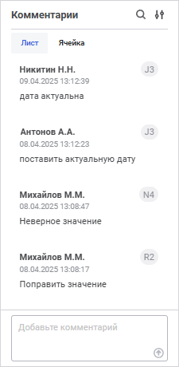
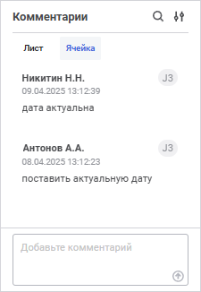

# Добавление комментариев к ячейкам: Регламентный отчёт, веб-приложение

Добавление комментариев к ячейкам: Регламентный отчёт, веб-приложение
-

# Добавление комментариев к ячейкам

Для пояснения данных в ячейке таблицы доступно добавление комментариев.

Для добавления комментариев:

	- Убедитесь, что:

		- источником является куб, у которого установлен флажок «[Хранить
		 комментарии к данным](uinavobj.chm::/Cube/CreateCube/Master_Standart/Additional_Settings.htm#comments)»;

		- у пользователя есть [права](Admin.chm::/03_Admin/Admin_AdminObjects.htm)
		 на чтение и редактирование.

	- Выберите ячейку в области данных таблицы, не отображающую значения
	 [вычисляемых
	 элементов](../../Source/Window/Calculation_Practices.htm) или [итоговых
	 значений](../../Reports/OperationReport/totals.htm), и:

		- выполните команду «Добавить
		 комментарий» контекстного меню ячейки;

		- нажмите сочетание клавиш SHIFT+F2;

		- используйте панель «Комментарии».

	- Добавьте комментарий в поле добавления
	 комментария:

Максимальный размер комментария 4000 символов.

	- Сохраните комментарий, для этого нажмите кнопку  «Отправить».

Добавление комментариев доступно для ячеек таблиц, построенных на одном
 кубе. Добавленные комментарии будут доступны для всех таблиц, в которых
 выводятся ячейки с комментариями.

Если в отчете для таблиц качестве источников  использованы несколько
 кубов, которые поддерживают добавление комментариев, то добавление комментариев
 к ячейкам будет доступно для таблиц, которые построены на первом добавленном
 кубе.

[Для открытия
 панели](javascript:TextPopup(this))

	Для открытия панели нажмите кнопку  «Комментарии» боковой панели.

	При просмотре отчёта кнопка  «Комментарии» доступна если в качестве
	 источника использован [стандартный
	 куб](uinavobj.chm::/Cube/CreateCube/Master_Standart/Additional_Settings.htm#comments), настроенный для хранения комментариев.

	 Вкладка
	 «Лист»

	 Вкладка
	 «Ячейка»

		

		На вкладке указаны все комментарии, добавленные к ячейкам таблиц
		 на листе.

		

		На вкладке указаны все комментарии, добавленные к данной ячейке.

Для каждого комментария указаны:

	- Пользователь. [Полное
	 наименование пользователя](Admin.chm::/03_Admin/Users/Admin_UserProp_Common.htm#discription), который создал комментарий.
	 Если полное наименование не задано, отображается [имя
	 пользователя](Admin.chm::/03_Admin/Users/Admin_UserProp_Common.htm#discription);

	- Адрес ячейки;

	- Дата и время создания комментария;

	- Текст
	 комментария.

Добавить можно любое количество комментариев.

После добавления комментария в ячейке будет отображаться цветной треугольник
 в правом верхнем углу. При наведении курсора на треугольник раскрывается
 список добавленных комментариев.

Для удаления комментариев:

	- выберите ячейку с комментариями, выделите комментарий и нажмите
	 кнопку  «Удалить»;

	- выделите комментарий на панели «Комментарий»
	 и нажмите кнопку  «Удалить»;

На панели комментариев доступны операции:

[Поиск комментария](javascript:TextPopup(this))

	Для поиска комментария нажмите кнопку  «Поиск».

	В строке поиска введите искомый текст.

[Настройка отображения](javascript:TextPopup(this))

	Для сортировки и фильтрации комментариев по времени создания нажите
	 кнопку  «Настройки
	 отображения».

	Выберите способ сортировки:

		- сначала новые;

		- сначала старые.

	Выберите способ фильтрации:

		- все;

		- последний час;

		- последний день;

		- последняя неделя;

		- последний месяц.

Операции с комментариями не влияют на активность кнопки  «Сохранить
 данные».

См. также:

[Работа
 с данными в таблице](../../Reports/OperationReport/Work_with_data.htm)

		Справочная
		 система на версию 10.9
		 от 18/08/2025,
		 © ООО «ФОРСАЙТ»,
