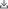
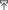
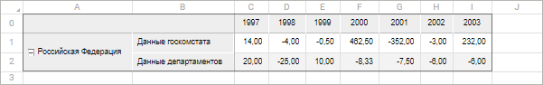
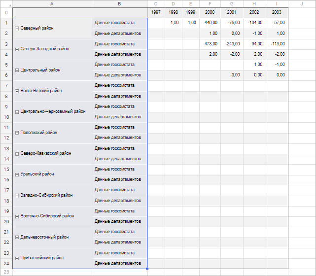
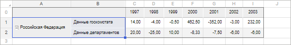

# Детализация и обобщение

Детализация и обобщение
-

# Детализация и обобщение данных

Для получения более подробной или общей информации по данным используйте
 детализацию или обобщение данных.

Детализация/обобщение данных - операция, позволяющая переходить по уровням
 данных: от общих к частным и наоборот. Доступная глубина детализации определяется
 иерархией измерений источника данных. При детализации [агрегации фиксированных
 измерений](uinavobj.chm::/Cube/Agregation.htm) можно просмотреть элементы, из которых были
 агрегированы данные.

## Детализация

При детализации происходит переход на более глубокий уровень иерархии
 справочника. Отметка перестраивается: выделяются все дочерние элементы
 более глубокого уровня измерения.

Доступны следующие способы детализации:

[Детализация
 по элементам измерения](javascript:TextPopup(this))

	Детализация данных доступна только для тех элементов измерения,
	 которые имеют дочерние элементы.

	Для детализации данных по элементам измерения:

		- Выделите один или несколько элементов боковика или шапки
		 таблицы.

		- Выполните команду  «Детализировать»
		 контекстного меню.

	В результате выполнения действий произойдёт детализация по всем
	 выделенным элементам измерения при наличии у них дочерних элементов.

[Детализация
 по ячейкам с данными](javascript:TextPopup(this))

	Детализация данных доступна только для тех ячеек, на пересечении
	 которых элементы измерений имеют дочерние элементы.

	Для детализации данных по ячейкам:

		- Выделите одну или несколько ячеек с данными таблицы.

		- Выполните команду  «Детализировать»
		 контекстного меню.

	В результате выполнения действий произойдёт детализация по всем
	 выделенным ячейкам с данными при наличии дочерних элементов у пересекающихся
	 в этих ячейках элементов измерений.

[Детализация
 по агрегированным элементам](javascript:TextPopup(this))

	Детализация по агрегированным элементам доступна только при настроенной
	 [агрегации
	 фиксированных измерений](uinavobj.chm::/Cube/Agregation.htm).

	Для детализации данных по агрегированным элементам:

		- Выделите ячейку или диапазон ячеек, данные которых получены
		 в результате агрегации фиксированных измерений.

		- Выберите фиксированное измерение, элементы которого требуется
		 детализировать, в раскрывающемся списке команды  «Детализировать»
		 контекстного меню.

	В результате выполнения действий выбранное измерение перейдёт в
	 боковик и будет содержать элементы, используемые для агрегации диапазона
	 ячеек.

Примечание.
 Детализация недоступна, если в выделенный диапазон области данных попадают
 ячейки из разных [источников](../../Source/UiReport_Source.htm)
 и/или элементы разных измерений.

## Обобщение

При обобщении происходит переход на более высокий уровень иерархии справочника.
 Отметка перестраивается: выделяются все элементы родительского уровня
 измерения.

Доступны следующие способы обобщения:

[Обобщение
 по элементам измерения](javascript:TextPopup(this))

	Обобщение данных доступно только для тех элементов измерения, которые
	 имеют родительские элементы.

	Для обобщения данных по элементам измерения:

		- Выделите один или несколько элементов боковика или шапки
		 таблицы.

		- Выполните команду  «Обобщить»
		 контекстного меню.

	В результате выполнения действий произойдёт обобщение по всем выделенным
	 элементам измерения при наличии у них родительских элементов.

[Обобщение
 по ячейкам с данными](javascript:TextPopup(this))

	Обобщение данных доступно только для тех ячеек, на пересечении которых
	 элементы измерений имеют родительские элементы.

	Для обобщения данных по ячейкам:

		- Выделите одну или несколько ячеек с данными таблицы.

		- Выполните команду  «Обобщить»
		 контекстного меню.

	В результате выполнения действий произойдёт обобщение по всем выделенным
	 ячейкам с данными при наличии родительских элементов у пересекающихся
	 в этих ячейках элементов измерений.

[Обобщение
 по агрегированным элементам](javascript:TextPopup(this))

	Обобщение по агрегированным элементам доступно только при настроенной
	 [агрегации
	 фиксированных измерений](uinavobj.chm::/Cube/Agregation.htm).

	Для обобщения данных по агрегированным элементам:

		- Выделите ячейку или диапазон ячеек, данные которых получены
		 в результате агрегации фиксированных измерений.

		- Выберите измерение боковика, элементы которого требуется
		 обобщить, в раскрывающемся списке команды 
		 «Обобщить» контекстного
		 меню.

	В результате выполнения действий выбранное измерение станет фиксированным
	 и будут отмечены все элементы этого измерения. В других измерениях
	 в строках и столбцах отметка изменится в соответствии с выделенной
	 ячейкой/диапазоном ячеек, для которых происходило обобщение.

Примечание.
 Обобщение недоступно, если в выделенный диапазон области данных попадают
 ячейки из разных [источников](../../Source/UiReport_Source.htm)
 и/или элементы разных измерений.

## Пример детализации и обобщения данных

Рассмотрим таблицу, содержащую некоторые абстрактные данные:

Элемент «Российская Федерация»
 имеет дочерние элементы. Выделим данный элемент и выполним команду 
 «Детализировать» контекстного
 меню. В результате произойдёт детализация и мы перейдём на более глубокий
 уровень измерения:

Чтобы вернуться на уровень вверх, выделим любой из элементов полученного
 уровня и выполним команду  «Обобщить»
 контекстного меню. В результате произойдёт обобщение и таблица приобретёт
 изначальный вид:

См. также:

[Работа
 с данными в таблице](../../Reports/OperationReport/Work_with_data.htm)

		Справочная
		 система на версию 10.9
		 от 18/08/2025,
		 © ООО «ФОРСАЙТ»,
