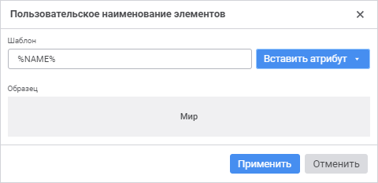
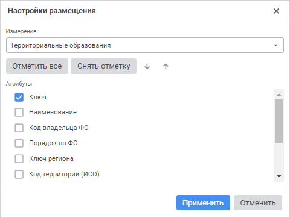

# Наименование элементов: Регламентный отчёт, веб-приложение

Наименование элементов: Регламентный отчёт, веб-приложение
-

# Наименование элементов

Для измерения можно определить один или несколько [атрибутов](uinavobj.chm::/reference_book/Master_RDS_reference_book/Attributes.htm),
 значения которых будут использоваться в качестве наименования элементов
 в шапке или боковике таблицы.

Примечание.
 Настройка отображения наименования элементов в инструментах «Аналитические
 запросы (OLAP)», «Аналитические
 панели» в веб-приложении, в инструментах «Отчёты»,
 «Аналитические запросы (OLAP)»,
 «Аналитические панели» в настольном
 приложении отличается. Для получения подробной информации обратитесь к
 разделу «[Наименование
 элементов](uiselection.chm::/Selection/Element_Names.htm)».

Для изменения отображения наименования элементов установите флажки напротив
 атрибутов в раскрывающемся списке команды «Наименования»,
 расположенной в контекстном меню элемента измерения в шапке или боковике
 таблицы.

По умолчанию используется атрибут «Наименование».

## Настройка пользовательского наименования

Для настройки пользовательского наименования элементов измерения:

	- Установите флажок «Пользовательское
	 наименование» в раскрывающемся меню команды «Наименования».
	 После чего будет открыто окно «Пользовательское
	 наименование элементов»:

	- Задайте шаблон отображения наименования с помощью кнопки «Вставить атрибут». В раскрывающемся
	 меню кнопки «Вставить атрибут»
	 содержатся атрибуты измерения.

После выполнения действий будет отображаться заданное пользовательское
 наименование элементов измерения.

Для отключения пользовательского наименования установите флажок «Атрибуты справочника» в раскрывающемся
 меню команды «Наименования».

## Настройка размещения атрибутов

Для настройки размещения атрибутов измерения в наименовании элементов:

	- Установите флажок «Атрибуты
	 справочника» в раскрывающемся меню команды «Наименования».

	- Выполните команду «Настроить
	 размещение» в раскрывающемся меню команды «Наименования».
	 После чего будет открыто окно «Настройки
	 размещения»:

	- Выберите отображаемые атрибуты измерения и задайте их порядок.

Примечание.
 [Скрытые
 атрибуты](uinavobj.chm::/reference_book/Master_RDS_reference_book/Attributes/Attribute.htm) недоступны для использования.

После выполнения действий в наименовании элементов измерения будут отображаться
 отмеченные атрибуты в заданном порядке.

См. также:

[Визуализация
 данных в виде таблицы](../UiReport_tables_appointment.htm)

		Справочная
		 система на версию 10.9
		 от 18/08/2025,
		 © ООО «ФОРСАЙТ»,
