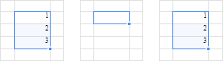
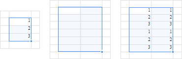
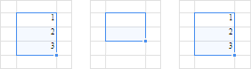

# Копирование и вставка данных: Регламентный отчёт, веб-приложение

Копирование и вставка данных: Регламентный отчёт, веб-приложение
-

# Копирование и вставка данных

Для копирования данных отчёта из выделенной ячейки или области:

	- выполните команду контекстного меню  «Копировать» выделенного диапазона
	 ячеек;

	- нажмите кнопку  
	 «Копировать» вкладки «Главная» панели инструментов;

	- выполните команду «Правка >
	  Копировать» главного меню;

	- нажмите сочетание клавиш CTRL+С.

Для перемещения данных из выделенной ячейки или области в буфер обмена:

	- выполните команду контекстного меню  «Вырезать» выделенного диапазона
	 ячеек;

	- нажмите кнопку 
	 «Вырезать» вкладки «Главная» панели инструментов;

	- выполните команду «Правка >
	  Вырезать» главного меню;

	- нажмите сочетание клавиш CTRL+X.

Для вставки данных в выбранную ячейку из буфера
 обмена нажмите сочетание клавиш CTRL+V.

При использовании для вставки:

	- команды контекстного меню  «Вставить»
	 ячейки;

	- кнопки  
	 «Вставить» вкладки «Главная» панели инструментов;

	- команды «Правка >  Вставить» главного
	 меню

будет выведено информационное сообщение о необходимости использования
 сочетания клавиш.

Примечание.
 Для корректировки вставляемых данных воспользуйтесь [специальной
 вставкой](UiReport_Table_Work_Insert_spec.htm).

[Копирование
 и вставка данных из внешних приложений](javascript:TextPopup(this))

	Поддерживается вставка данных при копировании из следующих продуктов:

		- Microsoft Office;

		- LibreOffice;

		- МойОфис;

		- Google Sheets.

	Вставка содержимого из буфера на лист регламентного отчёта выполняется
	 с сохранением исходного форматирования.

	Примечание.
	 При вставке данных, скопированных из продуктов «МойОфис» и «Google
	 Sheets», исходное форматирование не сохраняется.

	Поддерживается копирование таблиц Microsoft Excel. При копировании
	 таблиц не копируются следующие настройки:

		- ориентация текста;

		- штриховка;

		- рисунки, диаграммы;

		- объекты WordArt и SmartArt;

		- автофигуры;

		- текстовые блоки;

		- гиперссылки;

		- формулы и функции, содержащиеся в ячейках. Копируется только
		 результат вычисления.

	Вставка рисунков, диаграмм, автофигур, текстовых блоков, а также
	 объектов WordArt и SmartArt, скопированных из Microsoft Excel, выполняется
	 в виде [рисунков](../../Objects/Picture/UiReport_Objects_Picture.htm).

При использовании [автофильтра](../../Reports/OperationReport/Work_with_data.htm#filter)
 диапазона данных на листе отчёта или [табличного
 визуализатора](../UiReport_tables_appointment.htm) копирование диапазона значений в буфер обмена применяется
 только к видимым строкам/столбцам.

## Особенности перемещения данных

Вставка перемещённых в буфер обмена данных выполняется с сохранением
 всех исходных [настроек оформления ячеек](../Attribute/Format.htm)
 и [примечаний](UiReport_Table_Work_Notice.htm) при их наличии.

При перемещении данных:

	- в отчёте, открытом в режиме просмотра, очищается только содержимое
	 ячеек;

	- в отчёте, открытом в режиме редактирования:

		- для ячеек [табличного
		 визуализатора](../UiReport_tables_appointment.htm) очищается только содержимое ячеек;

		- для остальных ячеек листа очищаются содержимое ячеек, форматы
		 данных в ячейках и примечания к ячейкам.

При использовании [автофильтра](../../Reports/OperationReport/Work_with_data.htm#filter)
 диапазона данных на листе отчёта или [табличного
 визуализатора](../UiReport_tables_appointment.htm) перемещение диапазона значений в буфер обмена применяется
 ко всем строкам/столбцам независимо от их видимости при фильтрации. Поведение
 будет одинаковым для всего диапазона данных независимо от расположения
 фильтра.

## Особенности вставки данных

Если используется [автофильтра](../../Reports/OperationReport/Work_with_data.htm#filter)
 диапазона данных на листе отчёта или т[абличного
 визуализатора](../UiReport_tables_appointment.htm):

	- вставка значения из одной ячейки в диапазон ячеек применяется
	 только к видимым строкам/столбцам;

	- вставка диапазона значений применяется ко всем видимым строкам/столбцам.
	 Вставляемый диапазон значений расширяется с учётом размера области
	 копирования, в том числе на скрытые строки/столбцы.

Поведение будет одинаковым для всего диапазона
 данных независимо от расположения фильтра.

В зависимости от выделенного диапазона ячеек для вставки данных можно
 выделить следующие особенности:

	- Для вставки данных выделяется
	 только одна ячейка. Ячейка для вставки будет расширена вправо
	 и вниз до диапазона, равного размеру скопированной области. На примере
	 изображены копируемые данные (слева), выделенная ячейка (по центру),
	 вставленные данные (справа):

	- Для вставки данных выделяется
	 несколько ячеек. Если копируемая область по размерам меньше,
	 чем область, выделенная для вставки, то произойдет заполнение области
	 для вставки копируемой областью. На примере ниже изображены копируемые
	 данные (слева), выделенная область (по центру), вставленные данные
	 (справа). Копируемая область размещается в области для вставки несколько
	 раз целиком, но могут остаться незаполненные ячейки так как их не
	 достаточно для вставки копируемой области целиком:

Если копируемая область по размерам больше,
 чем область, выделенная для вставки, то копируемая область займет всю
 область для вставки и соседние ячейки, необходимые для полного размещения
 копируемой области.

См. также:

[Специальная вставка](UiReport_Table_Work_Insert_spec.htm)
 | Параметры форматирования
 при вставке из буфера обмена

		Справочная
		 система на версию 10.9
		 от 18/08/2025,
		 © ООО «ФОРСАЙТ»,
