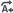
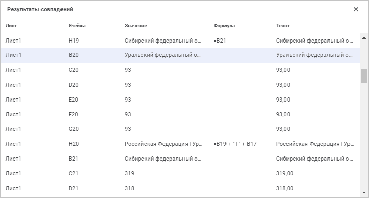

# Поиск и замена данных

Поиск и замена данных
-

# Поиск и замена данных

	Поиск и замена данных выполняется с помощью [панели
	 поиска](../../organizational_management/Starting.htm#structure_window).

	[Для отображения
	 панели поиска](javascript:TextPopup(this))

		Выполните одно из действий:

			- нажмите кнопку 
			 «Поиск и замена» вкладки
			 «Главная» [панели
			 инструментов](../../organizational_management/Starting.htm#structure_window);

			- нажмите сочетание клавиш CTRL+F для открытия строки
			 поиска;

			- нажмите сочетание клавиш CTRL+H для открытия строки
			 замены.

	Доступны следующие режимы панели поиска:

		Строка поиска Строка поиска и замены

			

			

	Для переключения между режимами используйте кнопку  «Замена».

	Для скрытия панели поиска нажмите кнопку  «Закрыть».

## Поиск данных

	Поиск данных доступен в любом режиме панели поиска.

	Для поиска данных:

		- Введите в поле «Найти»
		 искомое значение, формулу или текст.

		- Задайте при необходимости [дополнительные
		 параметры поиска](#settings).

		- Передвигайтесь между результатами поиска:

			- для перехода к следующему результату поиска используйте
			 кнопку  «Найти
			 далее» или клавишу ENTER;

			- для перехода к предыдущему результату поиска используйте
			 кнопку  «Найти
			 предыдущее».

	В результате выполнения действий будет осуществлён поиск данных.
	 В случае отсутствия искомых данных будет выведено соответствующее
	 сообщение.

	Для просмотра всех результатов поиска и быстрой навигации по ним
	 используйте панель «[Результаты
	 совпадений](#results)».

## Замена данных

	Замена данных доступна только в строке поиска и замены.

	Для замены данных:

		- Введите в поле «Найти»
		 искомое значение, формулу или текст.

		- Введите в поле «Заменить»
		 строку, на которую требуется заменить найденные данные.

		- Выполните [поиск данных](#search).

		- Осуществите замену найденных данных:

			- нажмите кнопку  «Заменить»
			 для замены только выделенного результата поиска;

			- нажмите кнопку  «Заменить
			 все» для замены сразу всех результатов поиска.

	В результате выполнения действий будут осуществлены поиск и замена
	 данных.

## Дополнительные параметры поиска

	Для задания дополнительных параметров [поиска](#search)
	 нажмите кнопку  «Больше
	 параметров» в панели поиска. Будет открыта всплывающая панель:

	

	Задайте настройки:

		- Учитывать регистр.
		 Установите флажок для различия заглавных и строчных букв;

		- Ячейка целиком.
		 Установите флажок для выполнения поиска только по тем ячейкам,
		 которые полностью содержат искомую строку;

		- Область поиска.
		 Выберите из раскрывающегося списка область поиска:

			- На листе. По
			 умолчанию. Поиск будет осуществляться только на активном листе
			 отчёта;

			- В отчёте. Поиск
			 будет осуществляться на всех листах отчёта;

		- Порядок поиска.
		 Выберите из раскрывающегося списка приоритетный порядок поиска:

			- По строкам.
			 По умолчанию. Поиск будет осуществляться сначала по строкам,
			 затем по столбцам;

			- По столбцам.
			 Поиск будет осуществляться сначала по столбцам, затем по строкам;

		- Предмет поиска.
		 Установите флажки около требуемых типов искомых данных:

			- Значение. По
			 умолчанию флажок установлен. Поиск будет осуществляться по
			 значениям в ячейках;

			- Текст. По умолчанию
			 флажок установлен. Поиск будет осуществляться по тексту, отображаемому
			 в ячейках;

	Примечание.
	 Отображаемый в ячейке текст может отличаться от хранящегося в ячейке
	 значения из-за настроенного [формата
	 данных в ячейке](../Attribute/Format.htm). Например, в ячейке может содержаться значение
	 «2,5879», а отображаться текст «2,59».

			- Формула. Поиск
			 будет осуществляться по формулам, на основе которых выполняется
			 расчёт значений в ячейках;

			- Метаданные.
			 Поиск будет осуществляться по метаданным ячеек таблицы. Для
			 вычисляемых элементов поиск выполняется по их формуле.

	Метаданные состоят из наименования источника
	 данных и наименований элементов измерения, соответствующих данной
	 ячейке.

## Результаты совпадений

	Для просмотра всех результатов [поиска](#search) нажмите
	 кнопку  «Результаты
	 поиска». Будет открыта панель «Результаты
	 совпадений»:

	

	На панели отображается информация обо всех результатах поиска:

		- Лист. Лист, на котором
		 содержится найденная ячейка;

		- Ячейка. Ячейка,
		 удовлетворяющая условиям поиска;

		- Значение. Значение
		 ячейки;

		- Формула. Формула,
		 по которой высчитывается значение в ячейке;

		- Текст. Текст, отображаемый
		 в ячейке.

	При выделении строки с найденным значением фокус перейдёт в искомую
	 ячейку отчёта на рабочей области.

См.
 также:

[Работа
 с данными в таблице](../../Reports/OperationReport/Work_with_data.htm) | [Работа
 с готовым отчётом](../../Reports/OperationReport/Work_witn_report.htm)

		Справочная
		 система на версию 10.9
		 от 18/08/2025,
		 © ООО «ФОРСАЙТ»,
