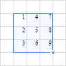
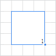

# Операции с ячейками: Регламентный отчёт, веб-приложение

Операции с ячейками: Регламентный отчёт, веб-приложение
-

# Операции с ячейками

При работе с листом регламентного отчёта доступны различные операции
 с ячейками.

## Добавление ячеек

Для добавления ячейки в диапазон выполните команду контекстного меню
  «Вставить >
 Сдвинуть ячейки вниз» или 
 «Вставить > Сдвинуть ячейки вправо»
 ячейки.

После выполнения данного действия на лист будет добавлена ячейка. При
 этом ячейки, расположенные ниже/правее сдвинутся вниз/вправо. Если был
 выделен диапазон ячеек, то будет добавлено столько же ячеек, сколько в
 выделенном диапазоне.

## Выделение ячеек

Способы выделения ячеек:

[Единичная ячейка](javascript:TextPopup(this))

	Для выделения произвольной ячейки:

		- щёлкните по ней мышью;

		- перейдите к ней с помощью клавиш/сочетания клавиш UP, DOWN,
		 RIGHT/TAB, LEFT/SHIFT+TAB.

	Для выделения крайней ячейки:

		- крайней левой ячейки текущей строки. Используйте сочетание
		 клавиш CTRL+LEFT;

		- крайней правой ячейки текущей строки. Используйте сочетание
		 клавиш CTRL+RIGHT;

		- крайней верхней ячейки текущего столбца. Используйте сочетание
		 клавиш CTRL+UP;

		- крайней нижней ячейки текущего столбца. Используйте сочетание
		 клавиш CTRL+DOWN.

[Диапазон ячеек](javascript:TextPopup(this))

	Для выделения диапазона ячеек:

		- щёлкните по требуемой ячейке в начале диапазона и, удерживая
		 зажатой кнопку мыши, переместите курсор мыши к желаемой ячейке
		 в конце диапазона;

		- выделите требуемую ячейку в начале диапазона и, удерживая
		 зажатой клавишу SHIFT, щёлкните по желаемой ячейке в конце диапазона;

		- выделите требуемую ячейку в начале диапазона и, удерживая
		 зажатой клавишу SHIFT, перейдите к желаемой ячейке в конце диапазона
		 с помощью клавиш UP, DOWN, LEFT, RIGHT.

	Для выделения диапазона от текущей ячейки до крайней ячейки:

		- до крайней левой ячейки текущей строки. Используйте сочетание
		 клавиш CTRL+SHIFT+LEFT;

		- до крайней правой ячейки текущей строки. Используйте сочетание
		 клавиш CTRL+SHIFT+RIGHT;

		- до крайней верхней ячейки текущего столбца. Используйте
		 сочетание клавиш CTRL+SHIFT+UP;

		- до крайней нижней ячейки текущего столбца. Используйте сочетание
		 клавиш CTRL+SHIFT+DOWN.

	Для выделения всех ячеек на листе отчёта используйте сочетание клавиш
	 CTRL+A.

## Удаление ячеек

Для удаления выделенных ячеек из диапазона выполните команду контекстного
 меню  «Удалить >
 Сдвинуть ячейки вверх» или 
 «Удалить > Сдвинуть ячейки влево»
 ячейки.

После выполнения одного из действий выделенный диапазон ячеек будет
 удален. При этом ячейки, расположенные ниже/правее диапазона сдвинутся
 вверх/влево.

## Объединение и разъединение ячеек

Несколько подряд выделенных ячеек можно объединить в одну. После объединения
 такая ячейка получает адрес ячейки, которая расположена в верхнем левом
 углу объединяемого диапазона.

Для объединения выделенного диапазона ячеек:

	- выполните команду 
	 «Объединить ячейки» контекстного
	 меню;

	- нажмите кнопку 
	 «Объединить/разъединить» вкладки
	 «Оформление» [панели
	 ](UiReport_Table_WorkStyle.htm#cells_format)инструментов.

Например, вид диапазона выделенных ячеек до объединения:

После объединения ячеек:

Для разъединения объединённых ячеек:

	- Выделите ячейку.

	- Выполните одно из действий:

		- выполните команду 
		 «Разъединить ячейки» в
		 контекстном меню ячейки;

		- нажмите кнопку 
		 «Объединить/разъединить»
		 вкладки «Оформление» [панели ](UiReport_Table_WorkStyle.htm#cells_format)инструментов.

Объединённая ячейка будет содержать те данные, которые содержала первая
 ячейка выделяемого диапазона. После объединения данные остальных ячеек
 не пропадают, а просто скрываются. Таким образом, после разъединения данные
 всех ячеек диапазона будут восстановлены.

См. также:

[Работа
 с элементами листа отчёта](../UiReport_Table.htm)

		Справочная
		 система на версию 10.9
		 от 18/08/2025,
		 © ООО «ФОРСАЙТ»,
