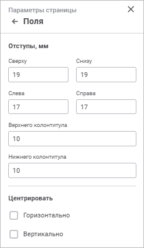

# Поля на странице: Регламентный отчёт, веб-приложение

Поля на странице: Регламентный отчёт, веб-приложение
-

# Поля на странице

Для полей на странице отчёта доступна [быстрая](UiReport_Tuning_ParamPage.htm#quick_setup)
 и расширенная настройка.

Примечание.
 Набор параметров быстрой и расширенной настройки отличается.

Для расширенной настройки полей страницы используйте группу параметров
 «Поля» [панели
 параметров](../../organizational_management/Starting.htm#structure_window):

[Для открытия
 группы параметров](javascript:TextPopup(this))

	- Откройте отчёт на [предварительный
	 просмотр](UiReport_Tuning_ParamPage.htm#preview):

		- выполните команду «Файл > Печать >
		 Предварительный просмотр» главного меню;

		- нажмите кнопку  «Печать» вкладки «Главная»
		 панели инструментов;

		- нажмите сочетание клавиш CTRL+P.

	- Нажмите кнопку 
	 «Параметры страницы» в правом
	 верхнем углу.

		- Перейдите в группу параметров «Поля».

Задайте параметры:

	- Отступы, мм. Укажите
	 в числовых полях отступы:

		- Сверху, Снизу, Слева, Справа.
		 Установите интервал между соответствующим полем и краем печатной
		 страницы;

		- Верхнего колонтитула/Нижнего
		 колонтитула. Установите расстояние между верхним колонтитулом
		 и верхом страницы, между нижним колонтитулом и низом страницы
		 в миллиметрах. Это расстояние должно быть меньше размера верхнего
		 и нижнего полей соответственно;

	- Центрировать. Выберите
	 способ, по которому будут отцентрированы объекты листа:

		- Горизонтально. Установите
		 флажок для центрирования объектов на листе отчёта по горизонтали;

		- Вертикально. Установите
		 флажок для центрирования объектов на листе отчёта по вертикали.

После выполнения действий будут настроены поля
 страницы для [печати](UiReport_Tuning_ParamPage.htm#print).

См. также:

[Настройка
 отчёта под печать](UiReport_Tuning_ParamPage.htm)

		Справочная
		 система на версию 10.9
		 от 18/08/2025,
		 © ООО «ФОРСАЙТ»,
