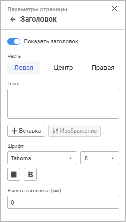

# Заголовок отчёта: Регламентный отчёт, веб-приложение

Заголовок отчёта: Регламентный отчёт, веб-приложение
-

# Заголовок отчёта

Для настройки заголовка отчёта используйте группу параметров «Заголовок»[
 панели параметров](../../organizational_management/Starting.htm#structure_window):

[Для открытия
 группы параметров](javascript:TextPopup(this))

	- Откройте отчёт на [предварительный
	 просмотр](UiReport_Tuning_ParamPage.htm#preview):

		- выполните команду «Файл > Печать >
		 Предварительный просмотр» главного меню;

		- нажмите кнопку  «Печать» вкладки «Главная»
		 панели инструментов;

		- нажмите сочетание клавиш CTRL+P.

	- Нажмите кнопку 
	 «Параметры страницы» в правом
	 верхнем углу.

		- Перейдите в группу параметров «Заголовок».

Примечание.
 Заголовок отображается только на первой странице каждого листа отчёта,
 в отличие от [колонтитулов](Footers_params.htm), отображаемых
 на каждой странице листа отчёта.

Задайте параметры:

	- Показать заголовок.
	 По умолчанию переключатель переведён в активное состояние. Доступна
	 настройка заголовка и его отображение на листах отчёта;

	- Часть. Область колонтитула
	 условно разделена на три части, отличающиеся способом выравнивания
	 содержимого: по левому краю, по центру или по правому краю. Каждая
	 часть имеет свои собственные параметры;

	- Текст.
	 Текст колонтитула формируется с использованием специальных подстановок
	 или ввода статичного текста.

Для использования подстановки выберите соответствующие
 варианты подстановок в раскрывающемся меню кнопки 
 «Вставка»:

		 Вариант подстановки
		 Подстановка/тег
		 Описание

		 Номер страницы
		 &[Page]
		 Будет выведен номер текущей страницы.

		 Количество страниц
		 &[Pages]
		 Будет выведено количество страниц текущего отчёта.

		 Текущая дата
		 &[Date]
		 Будет выведена текущая дата.

		 Текущее время
		 &[Time]
		 Будет выведено текущее время.

		 Название отчёта
		 &[Name]
		 Будет выведено наименование отчёта.

		 Номер страницы на листе
		 &[Sheet.Page]
		 Будет выведен номер страницы на текущем листе.

		 Количество страниц на листе
		 &[Sheet.Pages]
		 Будет выведено количество страниц текущего листа отчёта.

	- Шрифт. Задайте настройки
	 шрифта:

		- Тип шрифта. Выберите
		 в раскрывающемся списке шрифт, установленный в операционной системе;

		- Размер. Выберите
		 в раскрывающемся списке размер шрифта;

		- Цвет. Выберите в
		 раскрывающейся палитре цвет шрифта. Для выбора доступны стандартные
		 и пользовательские цвета. По умолчанию палитра содержит только
		 стандартные цвета.

Для создания пользовательского цвета:

			- Нажмите кнопку  «Добавить
			 цвет». Откроется расширенная палитра цветов.

			- Выберите цвет в расширенной палитре цветов, на странице
			 браузера с помощью пипетки или задайте код цвета в формате
			 RGB/HEX.

После выполнения действий пользовательский
 цвет будет создан и добавлен в палитру.

Примечание.
 Максимально возможное количество пользовательских цветов в палитре равно
 23.

Для удаления пользовательского цвета из палитры
 выполните команду «Удалить» контекстного
 меню выбранного цвета.

		- Начертание. Выберите
		 один или несколько типов начертания шрифта в раскрывающемся меню
		 кнопки B «Начертание»:

			- B. Полужирное
			 начертание;

			- I. Курсивное
			 начертание;

			- U.
			 Подчёркивание текста;

			- S.
			 Зачёркивание текста линией.

	- Высота заголовка (мм).
	 Задайте высоту заголовка в миллиметрах.

После выполнения действий будет настроен заголовок отчёта для [печати](UiReport_Tuning_ParamPage.htm#print).

См. также:

[Начало
 работы с инструментом «Отчёты» в веб-приложении](../../organizational_management/Starting.htm) | [Настройка
 отчёта под печать](UiReport_Tuning_ParamPage.htm) | [Построение
 отчёта](../../CreateReport.htm) | [Работа
 с готовым отчётом](../../Reports/OperationReport/Work_witn_report.htm)

		Справочная
		 система на версию 10.9
		 от 18/08/2025,
		 © ООО «ФОРСАЙТ»,
