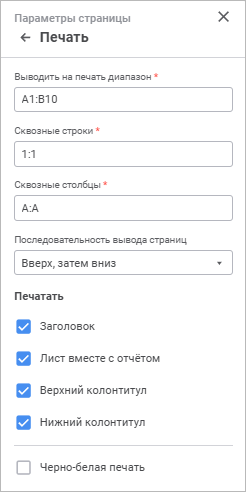

# Параметры печати: Регламентный отчёт, веб-приложение

Параметры печати: Регламентный отчёт, веб-приложение
-

# Параметры печати

Для настройки параметров печати используйте группу параметров «Печать» [панели
 параметров](../../organizational_management/Starting.htm#structure_window):

[Для открытия
 группы параметров](javascript:TextPopup(this))

	- Выполните одно из действий:

		- выполните команду «Параметры
		 страницы» группы команд «Разметка
		 страницы» главного меню;

		- откройте отчёт на [предварительный
		 просмотр](UiReport_Tuning_ParamPage.htm#preview):

			- выполните команду «Файл > Печать >
			 Предварительный просмотр» главного меню;

			- нажмите кнопку  «Печать» вкладки «Главная»
			 панели инструментов;

			- нажмите сочетание клавиш CTRL+P.

Нажмите кнопку  «Параметры страницы» в правом верхнем
 углу.

		- Перейдите в группу параметров «Печать».

Задайте параметры:

[Выводить
 на печать диапазон](javascript:TextPopup(this))

	В поле «Выводить
	 на печать диапазон» задайте диапазон ячеек с помощью клавиатуры,
	 который необходимо напечатать.

[Сквозные
 строки и сквозные столбцы](javascript:TextPopup(this))

	В полях «Сквозные
	 строки» и «Сквозные столбцы»
	 задайте диапазоны строк и/или столбцов, которые необходимо вывести
	 на каждый печатный лист.

	При задании диапазонов строк/столбцов
	 учитывайте следующие особенности:

		- диапазоны для сквозных строк/столбцов должны быть полными
		 строками/столбцами;

		- при вводе составного диапазона непрерывные диапазоны разделяются
		 знаком «;»;

		- если введенный с помощью клавиатуры диапазон не является
		 полными строками/столбцами, он будет заменён на диапазоны полных
		 строк/столбцов, в которые попадают выделенные ячейки. Например,
		 если были введены сквозные строки: A1:F1; A10:A12, то
		 они будут заменены на 1:1; 10:12;

		- если заданы пересекающиеся или находящиеся рядом диапазоны
		 (например, 0:0 и 1:1), то они будут объединены в один диапазон;

		- при задании нескольких диапазонов они будут упорядочены
		 в полях «Сквозные строки»
		 и «Сквозные столбцы» в
		 порядке сверху вниз для строк и слева направо - для столбцов.

	Примечание.
	 С помощью макроса на Fore, используя свойства [TitleRowsScope](TabSheet.chm::/Interface/ITabPageSettings/ITabPageSettings.TitleRowsScope.htm)/[TitleColumnsScope](TabSheet.chm::/Interface/ITabPageSettings/ITabPageSettings.TitleColumnsScope.htm),
	 можно ограничить область действия сквозных строк/столбцов.

[Последовательность
 вывода страниц](javascript:TextPopup(this))

	Для настройки последовательности вывода
	 страниц на печать выберите в раскрывающемся списке:

		- Налево, затем направо.
		 Страницы отчёта выводятся на печать в порядке налево, затем направо;

		- Вверх, затем вниз.
		 Страницы отчёта выводятся на печать в порядке вверх, затем вниз.

	При задании составного диапазона [сквозных
	 строк/столбцов](#through_rows_columns) учитывайте следующие особенности последовательности
	 вывода:

		- если было задано два и более диапазонов сквозных строк,
		 то сначала выводятся данные, находящиеся между первым и вторым
		 диапазоном сквозных строк, потом между вторым и третьим и т.д.
		 Если при этом был задан диапазон сквозных столбцов, то он будет
		 прерываться диапазонами сквозных строк;

		- если в отчёте содержится несколько таблиц, по ширине полностью
		 помещающихся на один лист, для таблиц заданы сквозные строки и
		 при выводе таблицы на странице остается свободное место, то следующая
		 за ней таблица будет выведена на той же странице с учётом заданной
		 для нее сквозной строки и с хотя бы одной строкой данных;

		- при задании сквозной строки для нескольких таблиц, находящихся
		 друг за другом, необходимо учитывать, что диапазон сквозных строк
		 задается для всей строки, а не для диапазона ячеек;

		- если было задано два и более диапазонов сквозных столбцов,
		 то сначала выводятся данные, находящиеся между первым и вторым
		 диапазоном сквозных столбцов, потом между вторым и третьим и т.д.
		 Если при этом был задан диапазон сквозных строк, то он будет прерываться
		 диапазонами сквозных столбцов;

		- если в отчёте содержится несколько таблиц, по высоте полностью
		 помещающихся на один лист, для таблиц заданы сквозные столбцы
		 и при выводе таблицы на странице остается свободное место, то
		 следующая за ней таблица будет выведена на той же странице с учётом
		 заданного для нее сквозного столбца и с хотя бы одним столбцом
		 данных;

		- при задании сквозного столбца для нескольких таблиц, находящихся
		 друг под другом, необходимо учитывать, что диапазон сквозных столбцов
		 задается для всего столбца, а не для диапазона ячеек.

[Печатать
 заголовок](javascript:TextPopup(this))

	Для вывода на печать заголовка отчёта
	 установите флажок «Печатать заголовок».

	Примечание.
	 Заголовок отображается только на первой странице каждого листа отчёта.

	Настройка заголовка отчёта выполняется
	 в группе параметров «[Заголовок](Heading_params.htm)».

[Печатать
 лист вместе с отчётом](javascript:TextPopup(this))

	Для вывода на печать текущего листа отчёта
	 установите флажок «Печатать лист
	 вместе с отчётом». По умолчанию флажок установлен.

	При снятом флажке лист отчёта не будет
	 выводиться на печать. При этом:

		- при печати отчёта целиком данный лист не печатается;

		- при [экспорте
		 отчёта](../../Reports/OperationReport/UiReport_Reports_Operation_Export.htm) в форматы PDF, RTF данный лист недоступен для экспорта.

[Печать
 верхнего и нижнего колонтитулов](javascript:TextPopup(this))

	При снятом флажке «Печатать
	 верхний колонтитул» или «Печатать
	 нижний колонтитул» верхний или нижний колонтитул будет скрыт.

[Черно-белая
 печать](javascript:TextPopup(this))

	При установленном флажке «Черно-белая
	 печать» все цветовое оформление при печати и предварительном
	 просмотре сбрасывается: весь текст и колонтитулы печатаются в оттенках
	 серого независимо от настроенных цветов, фон будет белого цвета. По
	 умолчанию флажок снят.

	Примечание.
	 Если используется черно-белая печать, то при предварительном просмотре
	 возможно ухудшение качества изображения. На качество печати данная
	 особенность не влияет.

После выполнения действий будут настроены параметры
 для [печати](UiReport_Tuning_ParamPage.htm#print).

См. также:

[Настройка
 отчёта под печать](UiReport_Tuning_ParamPage.htm)

		Справочная
		 система на версию 10.9
		 от 18/08/2025,
		 © ООО «ФОРСАЙТ»,
