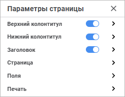
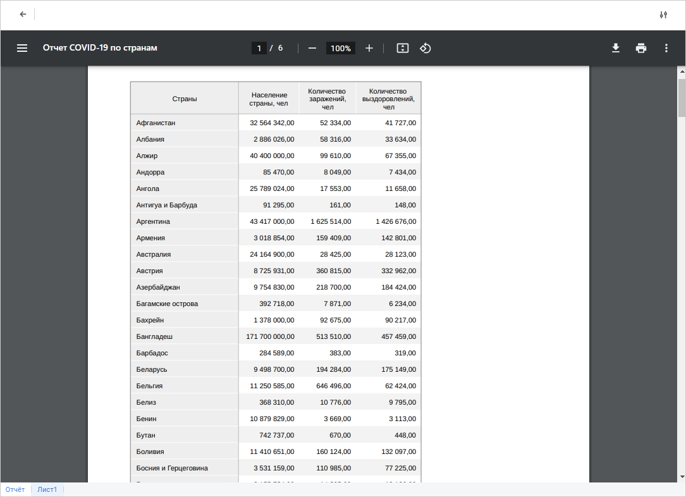

# Настройка отчёта под печать: Регламентный отчёт, веб-приложение

Настройка отчёта под печать: Регламентный отчёт, веб-приложение
-

# Настройка отчёта под печать

Для настройки отчёта под печать:

	- Выберите лист отчёта. Параметры страницы настраиваются при [открытии](../../organizational_management/Starting.htm#open)
	 регламентного отчёта для каждого листа отдельно, кроме параметров
	 [заголовка отчёта](Heading_params.htm).

	- Выполните [быструю](#quick_setup) или [расширенную](#advanced_setup)
	 настройку параметров страницы.

После выполнения действий выполните [печать](UiReport_Tuning_ParamPage.htm#print)
 отчёта.

## Быстрая настройка

Для быстрой настройки параметров страницы активного листа отчёта используйте:

	- кнопки на вкладке «Вид»
	 панели инструментов;

	- группу команд «Разметка страницы»
	 главного меню.

Доступны настройки:

	-  Показать
	 границы. Нажмите кнопку 
	 «Показать границы» или выполните
	 одноимённую команду для отображения границ страниц, выводимых при
	 печати и/или экспорте, в виде пунктирной линии на активном листе отчёта.
	 Границы страницы устанавливаются в зависимости от ориентации, ширины
	 полей, размеров страницы и разрывов;

	- 
	 Поля. Нажмите кнопку  «Поля» или выполните одноимённую
	 команду для изменения размеров полей в раскрывающемся меню:

		- Обычные. По умолчанию;

		- Широкие.

		- Узкие;

	- 
	 Ориентация. Нажмите кнопку
	 
	 «Ориентация» или выполните
	 одноимённую команду для изменения ориентации страницы в раскрывающемся
	 меню:

		- Книжная. По умолчанию;

		- Альбомная;

	- 
	 Размер. Нажмите кнопку  «Размер» или выполните одноимённую
	 команду для изменения размера страницы в раскрывающемся меню. Список
	 содержит предустановленные варианты размеров бумаги, такие как A4,
	 A5 и другие. По умолчанию установлен размер A4;

	-  Разрывы.
	 Выделите ячейку, которая будет являться левой верхней ячейкой новой
	 границы страницы, и выполните команду «Добавить
	 разрыв» в раскрывающемся меню кнопки 
	 «Разрывы» для отображения
	 определённых данных листа на одной странице. После выполнения действия
	 будут отображены разрывы страницы в виде сплошной линии и автоматически
	 включено отображение границ страниц.

Для получения подробной информации о настройке границ и разрывов страниц
 обратитесь к разделу «[Настройка
 разрывов и границ страниц](../../Reports/OperationReport/Page_Borders_Breaks.htm)».

## Расширенная настройка

Для расширенной настройки параметров страницы активного листа регламентного
 отчёта откройте панель параметров «Параметры
 страницы»:

[Для открытия
 панели параметров «Параметры страницы»](javascript:TextPopup(this))

	Для открытия панели параметров «Параметры
	 страницы»:

		- выполните команду «Параметры
		 страницы» группы команд «Разметка
		 страницы» главного меню;

		- нажмите кнопку 
		 «Параметры страницы» в
		 правом верхнем углу при выполнении [предварительного
		 просмотра](UiReport_Tuning_ParamPage.htm#preview) отчёта.

	 Вызов
	 командой главного меню

	 Вызов
	 из предварительного просмотра

		

		Для настройки печати используйте группы параметров:

			- [Страница](Common_ParamsPage.htm).
			 Предназначена для настройки общих параметров страницы;

			- [Печать](Print_params.htm).
			 Предназначена для настройки параметров печати.

		

		Для настройки печати используйте группы параметров:

			- [Верхний/нижний
			 колонтитул](Footers_params.htm). Предназначены для настройки верхнего/нижнего
			 колонтитула;

			- [Заголовок](Heading_params.htm).
			 Предназначена для настройки заголовка отчёта;

			- [Страница](Common_ParamsPage.htm).
			 Предназначена для настройки общих параметров страницы;

			- [Поля](Fields_OnPage.htm).
			 Предназначена для настройки отступов на странице;

			- [Печать](Print_params.htm).
			 Предназначена для настройки параметров печати.

## Предварительный просмотр

Перед печатью отчёта выполните предварительный просмотр и убедитесь,
 что отчёт имеет требуемый вид. Особенности предварительного просмотра:

	- при просмотре отчёта, содержащего на листах [объединённые
	 ячейки](../../Table/Work/UiReport_Table_Work_Union.htm#merging_unmerging_cells), необходимо помнить, что в окне предварительного просмотра
	 может отобразиться больше строк текста, чем содержится в отчёте, [открытом
	 на просмотр](../../organizational_management/Starting.htm#open), также возможно появление пустых строк;

	- ячейки листа со снятым флажком «Выводить
	 на печать» будут отсутствовать на просматриваемом листе.

Для предварительного просмотра:

	- выполните команду «Файл > Печать > Предварительный просмотр»
	 главного меню;

	- нажмите кнопку 
	 «Печать» вкладки «Главная»
	 панели инструментов;

	- нажмите сочетание клавиш CTRL+P.

Примечание.
 Сочетание клавиш CTRL+P, как правило, зарезервировано в браузере для печати
 текущей страницы. Чтобы использовать указанное сочетание клавиш для печати
 отчёта, переопределите его в настройках используемого браузера.

После выполнения одного из действий будет открыто окно предварительного
 просмотра регламентного отчёта:

## Печать отчёта

Для печати отчёта в режиме [предварительного
 просмотра](UiReport_Tuning_ParamPage.htm#preview):

	- Выберите нужную вкладку с наименованием листа для печати отдельного
	 листа отчёта. Для печати всего отчёта перейдите на вкладку «Отчёт».

	- Выполните команду «Печать»
	 в главном меню. Будет открыт диалог для настройки параметров печати.
	 Порядок работы с диалогом зависит от используемого браузера.

См. также:

[Работа
 с готовым отчётом](../../Reports/OperationReport/Work_witn_report.htm)

		Справочная
		 система на версию 10.9
		 от 18/08/2025,
		 © ООО «ФОРСАЙТ»,
