# Настройка редактора значений: Регламентный отчёт, веб-приложение

Настройка редактора значений: Регламентный отчёт, веб-приложение
-

# Настройка редактора значений

Редакторы значений элементов управления используются для удобного ввода/выбора
 значений.

Для настройки редактора элемента управления используйте окно «Параметры редактора»:

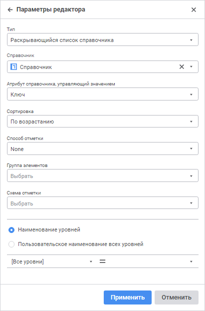

Примечание.
 Набор отображаемых параметров зависит от выбранного типа редактора.

Типы редакторов, которые поддерживаются в «Форсайт. Аналитическая платформа»:

[Иерархический
 список](javascript:TextPopup(this))

	Редактор отображает набор возможных значений в виде иерархического
	 списка:

	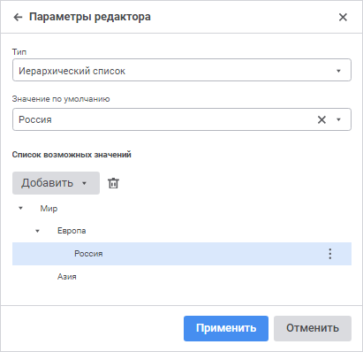

Задайте параметры редактора:

	- Значение по умолчанию.
	 Задайте значение по умолчанию. Данное значение должно входить в множество
	 значений, указанных в списке возможных значений;

	- Список возможных значений.
	 В данном поле формируется дерево возможных значений.

		- для добавления вершины выполните команду «Добавить
		 вершину» раскрывающегося меню кнопки «Добавить».
		 В добавленном поле введите имя вершины. Вершина добавляется на
		 первый уровень, если это первый добавленный элемент, или на один
		 уровень с выделенным элементом;

		- для добавления дочернего элемента к выбранному элементу
		 выполните команду «Добавить подэлемент»
		 раскрывающегося меню кнопки «Добавить».
		 В добавленном поле введите имя элемента;

		- для переименования элемента выполните команду «Переименовать»
		 раскрывающегося меню кнопки 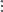 «Настройка»;

		- для удаления выбранного элемента нажмите кнопку  «Удалить»
		 или выполните команду «Удалить»
		 раскрывающегося меню кнопки  «Настройка».

[Переключатель](javascript:TextPopup(this))

	Переключатель или флажок задаёт логическое значение:

	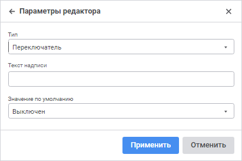

Если переключатель включен, то значение – «ИСТИНА» (True);
 если выключен, то значение – «ЛОЖЬ» (False).

Задайте параметры редактора:

	- Текст надписи. Определите
	 подпись флажка;

	- Значение по умолчанию.
	 Определите состояние флажка по умолчанию: включен или выключен.

[Поле
 ввода строковых значений](javascript:TextPopup(this))

	Поле ввода строковых значений позволяет отображать и задавать текстовое
	 значение в однострочном поле ввода:

	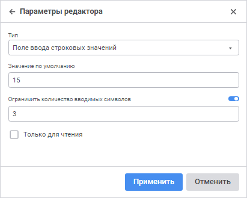

Задайте параметры редактора:

	- Значение по умолчанию.
	 Определите значение, которое будет отображаться в редакторе по умолчанию.
	 Строка может содержать до 2 Гб данных. Текст строки указывается без
	 кавычек;

	- Ограничить количество вводимых
	 символов. Активируйте поле, используя переключатель, и задайте
	 максимальное количество символов, которое можно ввести в поле редактора;

	- Только для чтения. При
	 установленном флажке будет запрещено редактировать значения.

[Поле
 ввода строковых значений с маской](javascript:TextPopup(this))

	Поле ввода строковых значений с маской позволяет ограничить набор
	 доступных для ввода символов и задать формат вводимого значения (или
	 шаблон):

	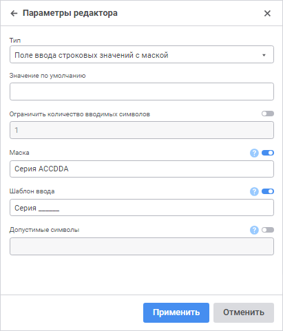

Данный тип редактора может использоваться для ввода номеров телефонов,
 почтовых и других индексов, идентификаторов и др.

Маска ввода обеспечивает возможность ввода только цифр и/или букв, остальные
 символы (например, скобки вокруг кода города, дефис между цифрами номера)
 будут добавляться автоматически.

Задайте параметры редактора:

	- Значение по умолчанию.
	 Задайте значение по умолчанию. Строка может содержать до 2 Гб данных,
	 соответствующих маске. Текст строки указывается без кавычек;

	- Ограничить количество вводимых
	 символов. Активируйте поле, используя переключатель, и задайте
	 количество символов, которое можно ввести в поле редактора;

	- Маска. Активируйте поле,
	 используя переключатель, и задайте маску поля ввода. Маска должна
	 содержать символы, определяющие ввод символа в заданную позицию, а
	 также может содержать текст, выводимый автоматически. Для включения
	 в маску текстовых констант, в том числе знаков и пробелов, введите
	 их в нужную позицию:

		 Символ маски
		 Описание

		 a/A
		 В данную позицию возможен ввод букв и цифр.

		 d/D
		 В данную позицию возможен ввод только цифр.

		 c/C
		 В данную позицию возможен ввод только букв.

Например, маска «Серия
 AACCDD» позволяет, но не требует от пользователя введения шести
 символов. Первой парой символов могут быть любые буквы или цифры, второй
 парой символов – только буквы, третьей парой символов – только цифры.
 Также автоматически будет выводиться текст «Серия»;

	- Шаблон ввода. Активируйте
	 поле, используя переключатель, и задайте шаблон, в соответствии с
	 которым будут вводиться данные в редактор. Шаблон должен содержать
	 знаки подчеркивания («_») на позициях ввода символов и текстовые константы,
	 в случае их наличия в маске;

	- Допустимые символы.
	 Активируйте поле, используя переключатель, и задайте набор символов,
	 которые можно вводить в поле ввода. Например, если задано «АК23»,
	 то:

		- в позиции, допускающие ввод цифр, можно вводить только цифры
		 2 или 3;

		- в позиции, допускающие ввод букв, можно вводить только буквы
		 А или К;

		- в позиции, допускающие ввод цифр и букв, можно вводить буквы
		 А или К и цифры 2 или 3.

[Раскрывающийся
 список справочника](javascript:TextPopup(this))

	Раскрывающийся список справочника позволяет отображать и задавать
	 значения при помощи раскрывающегося списка с элементами справочника:

	

Задайте параметры редактора:

	- Справочник. В раскрывающемся
	 списке выберите справочник, элементы которого будут отображаться в
	 редакторе. Для быстрого выбора объекта в поле для поиска введите его
	 название/идентификатор/ключ в зависимости от настроек отображения.
	 Поиск будет выполняться автоматически по мере ввода текста. Список
	 будет содержать объекты, наименования/идентификаторы/ключи которых
	 содержат вводимый текст.

	Для настройки отображения объектов репозитория в списке нажмите кнопку
	  «Отображение объекта» и выберите
	 в раскрывающемся меню вариант отображения:

		- Наименование. Объекты
		 отображаются под своими наименованиями. Вариант по умолчанию;

		- Идентификатор. Объекты
		 отображаются под своими идентификаторами;

		- Ключ. Объекты отображаются
		 под своими ключами.

Выбрать можно несколько вариантов. Идентификатор
 и ключ будут указаны в скобках;

	- Атрибут справочника, управляющий
	 значением. В раскрывающемся списке выберите атрибут справочника,
	 который будет использован для передачи значения параметру. Например,
	 в справочнике отображаются наименования элементов, а параметр принимает
	 целочисленные значения. В этом случае параметру необходимо передавать
	 значения атрибута «Ключ».
	 По умолчанию используется атрибут «Ключ».

Выбранный атрибут должен иметь уникальный
 индекс. Это необходимо для восстановления отметки;

	- Сортировка.
	 В раскрывающемся списке выберите вариант сортировки элементов
	 справочника по наименованию:

		- <Нет>.
		 Сортировка элементов справочника не производится;

		- По возрастанию.
		 Сортировка элементов справочника производится в порядке возрастания
		 по алфавиту или текстовым значениям чисел;

		- По убыванию. Сортировка
		 элементов справочника производится в порядке убывания по алфавиту
		 или текстовым значениям чисел;

	- Способ отметки. В раскрывающемся
	 списке выберите способ отметки элементов справочника:

		- SingleSelect. Единичная
		 отметка: возможна отметка только одного элемента;

		- SingleSelectNullable.
		 Единичная отметка с возможностью установки пустого значения;

		- MultiSelect. Множественная
		 отметка.

		Для инвертирования отметки элемента щелкните по нему.

		Щелчок с удержанием клавиши SHIFT снимает отметку со всех элементов
		 и отмечает элементы (кроме свернутых), находящиеся между сфокусированным
		 элементом и элементом, на котором производится щелчок.

		Щелчок с удержанием клавиши CTRL приводит к установке/снятию отметки
		 элемента и всех подчиненных ему элементов. При вызове контекстного
		 меню в области элемента, элемент фокусируется, но не выделяется;

		- MultiSelectStandart.
		 Множественная отметка. При щелчке по элементу будет выделен только
		 выбранный элемент.

		Для отметки нескольких элементов при щелчке удерживайте зажатой
		 клавишу SHIFT или CTRL.

		Щелчок с удержанием клавиши SHIFT снимает отметку со всех элементов
		 и отмечает элементы (кроме свернутых), находящиеся между сфокусированным
		 элементом и элементом, на котором производится щелчок.

		Щелчок с удержанием клавиши CTRL приводит к установке/снятию отметки
		 элемента;

		- None. Тип
		 отметки не задан, по умолчанию используется способ отметки «MultiSelect»;

	- Наименование уровней.
	 Задайте наименования для уровней в раскрывающемся списке. Установите
	 переключатель для отображения атрибутов справочника или пользовательского
	 наименования:

		- для отображения атрибутов справочника, которые будут использоваться
		 при формировании наименований уровней укажите:

			- Уровень. В раскрывающемся
			 списке выберите уровень, для которого настраивается наименование;

			- Наименование.
			 В раскрывающемся списке выберите атрибут, который определит
			 наименование.

Заданное наименование для элемента «[все]» поля «Уровень»
 применяется ко всем уровням, кроме тех, для которых наименование было
 указано явно;

Примечание.
 По умолчанию для всех уровней используется атрибут «Наименование».

		- для
		 отображения пользовательского наименования уровней укажите:

			- Пользовательское наименование.
			 В поле укажите наименование, которое будет отображаться для
			 всех уровней в раскрывающемся списке;

			- Вставить атрибут.
			 В раскрывающемся кнопки 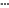 «Настройка» списке выберите
			 атрибут, который будет добавлен в наименование.

Примечание.
 При отображении пользовательского наименования уровней поиск по элементам
 списка недоступен.

[Редактор
 времени](javascript:TextPopup(this))

	Редактор времени позволяет отображать и задавать значения времени:

	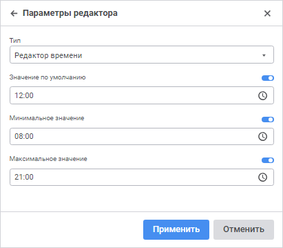

Задайте параметры редактора:

	- Значение по умолчанию.
	 Активируйте поле, используя переключатель, и определите значение времени,
	 которое будет отображаться в редакторе по умолчанию. Значение должно
	 быть в диапазоне допустимых значений, заданных для редактора. Если
	 диапазон допустимых значений для редактора не задан, то значение
	 должно быть в диапазоне от 0:00 до 23:59;

	- Минимальное значение.
	 Активируйте поле, используя переключатель, и определите минимально
	 допустимое значение времени;

	- Максимальное значение.
	 Активируйте поле, используя переключатель, и определите максимально
	 допустимое значение времени.

[Редактор
 даты](javascript:TextPopup(this))

	Редактор даты позволяет отображать и задавать значения даты:

	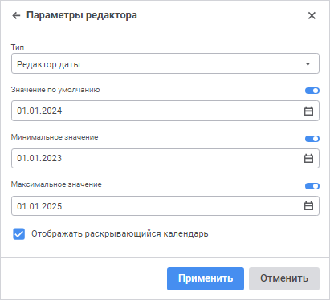

Задайте параметры редактора:

	- Значение по умолчанию.
	 Активируйте поле, используя переключатель, и определите дату, которая
	 будет отображаться в редакторе по умолчанию. Значение должно быть
	 в диапазоне допустимых значений, заданных для редактора. Если диапазон
	 допустимых значений для редактора не задан, то значение должно быть
	 в диапазоне от 01.01.1600 до 31.12.3000;

	- Минимальное значение.
	 Активируйте поле, используя переключатель, и определите минимально
	 допустимую дату;

	- Максимальное значение.
	 Активируйте поле, используя переключатель, и определите максимально
	 допустимую дату;

	- Отображать раскрывающийся календарь.
	 Установите флажок для отображения кнопки открытия календаря для визуального
	 выбора даты в редакторе.

[Редактор
 даты и времени](javascript:TextPopup(this))

	Редактор даты и времени объединяет в себе редактор даты и редактор
	 времени со всеми присущими им параметрами:

	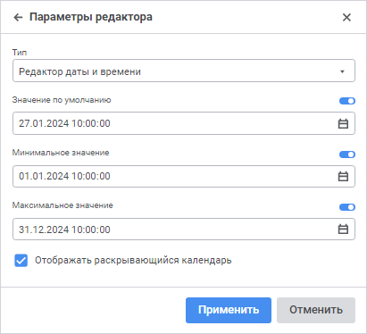

Задайте параметры редактора:

	- Значение по умолчанию.
	 Активируйте поле, используя переключатель, и определите значение даты
	 и времени, которое будет отображаться в редакторе по умолчанию. Значение
	 должно быть в диапазоне допустимых значений, заданных для редактора.
	 Если диапазон допустимых значений для редактора не задан, то значение
	 должно быть в диапазоне от 01.01.1600 00:00 до 31.12.3000 23:59;

	- Минимальное значение.
	 Активируйте поле, используя переключатель, и определите минимально
	 допустимое значение даты и времени;

	- Максимальное значение.
	 Активируйте поле, используя переключатель, и определите максимально
	 допустимое значение даты и времени;

	- Отображать раскрывающийся календарь.
	 Установите флажок для отображения кнопки открытия календаря для визуального
	 выбора даты в редакторе.

[Редактор
 десятичных значений](javascript:TextPopup(this))

	Редактор десятичных значений позволяет задавать значения десятичного
	 типа с помощью поля ввода с кнопками прокрутки:

	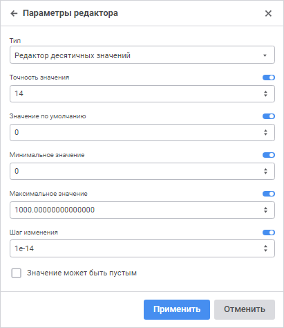

Задайте параметры редактора:

	- Точность значения. Определите
	 количество разрядов числа. Данное значение должно быть в диапазоне
	 допустимых значений [0, 28]. По умолчанию в числе используется 14
	 цифр после запятой;

	- Значение по умолчанию.
	 Определите значение, которое будет отображаться в редакторе по умолчанию.
	 Данное значение должно быть в диапазоне допустимых значений [-179228162514264337593543950335; 179228162514264337593543950335];

	- Минимальное значение.
	 Определите минимально допустимое значение;

	- Максимальное значение.
	 Определите максимально допустимое значение;

	- Шаг изменения. Определите
	 шаг при увеличении или уменьшении числа с помощью кнопок прокрутки
	 в редакторе значений;

	- Значение может быть пустым.
	 Установите флажок для отображения пустого значения в редакторе значений.
	 Если флажок снят, то отображается значение, заданное по умолчанию.

[Редактор
 идентификаторов](javascript:TextPopup(this))

	Редактор позволяет отображать и задавать значения идентификаторов:

	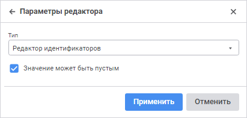

Задайте параметры редактора:

	- Значение может быть пустым.
	 По умолчанию флажок снят. При установленном флажке значение идентификатора
	 может быть пустым.

При построении идентификаторов необходимо учитывать следующие правила:

	- идентификатор может состоять из букв латинского алфавита, цифр
	 и символа подчеркивания;

	- первым символом должна быть буква или символ подчеркивания;

	- строчные и прописные буквы считаются эквивалентными;

	- максимальная длина идентификатора - 255 символов.

[Редактор
 логических значений](javascript:TextPopup(this))

	По аналогии с переключателем редактор логических значений принимает
	 только 2 значения: «Истина»
	 и «Ложь», однако выбор значения
	 производится из раскрывающегося списка:

	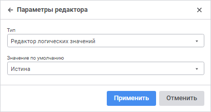

Задайте параметры редактора:

	- Значение по умолчанию.
	 Выберите значение по умолчанию из раскрывающегося списка «Ложь»
	 и «Истина». Если значение
	 не задано, то по умолчанию в поле будет отображаться значение «Ложь».

[Редактор
 целых значений](javascript:TextPopup(this))

	Редактор целых значений позволяет задавать целочисленные значения
	 с помощью поля ввода с кнопками прокрутки:

	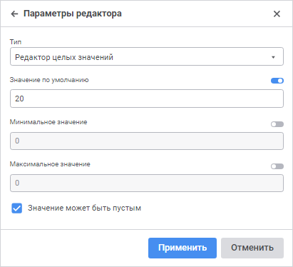

Задайте параметры редактора:

	- Значение по умолчанию.
	 Активируйте поле, используя переключатель, и определите значение,
	 которое будет отображаться в редакторе по умолчанию. Данное значение
	 должно быть в диапазоне допустимых значений, заданных для редактора.
	 Если диапазон допустимых значений для редактора не задан, то значение
	 должно быть в диапазоне [-2147483648; 2147483647];

	- Минимальное значение.
	 Активируйте поле, используя переключатель, и определите минимально
	 допустимое значение;

	- Максимальное значение.
	 Активируйте поле, используя переключатель, и определите максимально
	 допустимое значение;

	- Значение может быть пустым.
	 Установите флажок для возможности оставить поле пустым.

[Список](javascript:TextPopup(this))

	Список позволяет задавать значение из заранее определённого списка
	 значений:

	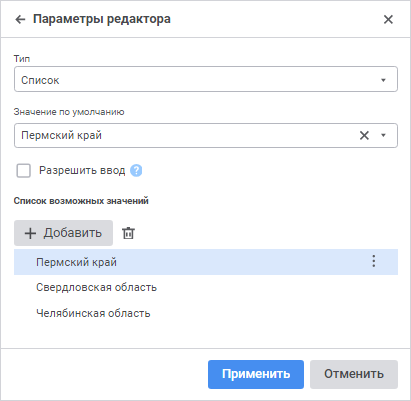

Задайте параметры редактора:

	- Значение по умолчанию.
	 Задайте значение по умолчанию. Данное значение должно входить в множество
	 значений, указанных в списке возможных значений;

	- Разрешить ввод. При
	 установленном флажке в поле редактора можно ввести значение, которое
	 отсутствует в раскрывающемся списке;

	- Список возможных значений.
	 В данном поле формируется список предустановленных значений.

		- для добавления значения нажмите
		 кнопку «Добавить». В открывшемся
		 поле введите значение;

		- для переименования элемента
		 выполните команду «Переименовать»
		 раскрывающегося меню кнопки  «Настройка»;

		- для удаления выбранного элемента
		 нажмите кнопку  «Удалить» или выполните команду
		 «Удалить» раскрывающегося
		 меню кнопки  «Настройка».

## Подключение календаря с настраиваемым диапазоном
 дат

Для удобства работы с календарным справочником в редакторе типа «[Раскрывающийся
 список справочника](ValueEditorParameters.htm#dimension)» используйте календарь с настраиваемым диапазоном
 дат.

Примечание.
 Календарь доступен для [календарных
 справочников](uinavobj.chm::/reference_book/Master_Calendar_reference_book/Master_Calendar.htm), у которых установлен [прямой
 порядок](uinavobj.chm::/reference_book/Master_Calendar_reference_book/UiMd_reference_book_Master_Calendar_page1.htm#order) элементов в справочнике и не используется [сдвиг](uinavobj.chm::/reference_book/Master_Calendar_reference_book/UiMd_reference_book_Master_Calendar_page1.htm#move)
 и/или[
 преобразование наименований](uinavobj.chm::/reference_book/Master_Calendar_reference_book/UiMd_reference_book_Master_Calendar_page1.htm#change) элементов справочника.

Для подключения календаря в строке связи «[Настройки отображения](../Reports/UiReport_Reports_Param1.htm)»
 для параметра [RANGECALENDARMODE](foresys.chm::/interface/ibindingmanager/control/ui_dimcombo.htm)
 укажите значение true.

После выполнения действий будет доступна специально сформированная строка,
 в которой отображаются даты начала и окончания периода:

Для задания диапазона дат:

	- Откройте календарь, нажав кнопку  «Открыть календарь»:

	- Выберите уровень календарного справочника, на котором будет
	 установлена отметка. Например: дни, месяцы, кварталы или годы. Для
	 выбора доступны только те уровни, которые были заданы в настройках
	 [календарного
	 справочника](uinavobj.chm::/reference_book/Master_Calendar_reference_book/UiMd_reference_book_Master_Calendar_page1.htm). При переключении уровней изменяются
	 значения календарной сетки в соответствии с выбранным уровнем календарного
	 справочника.

Примечание.
 Отображение диапазона дат в строке зависит от выбранного уровня, на котором
 установлена отметка.

	- Укажите даты начала и окончания периода.

Для сброса диапазона дат нажмите кнопку  «Очистить».

Примечание.
 Использование календаря с настраиваемым диапазоном дат доступно для параметров
 только целочисленного типа.

См. также:

[Настройки
 элементов управления](../Source/UiReport_Source_ControlProp.htm)

		Справочная
		 система на версию 10.9
		 от 18/08/2025,
		 © ООО «ФОРСАЙТ»,
