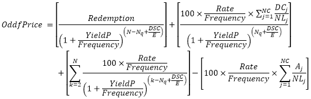

# OddfPrice: Регламентный отчёт, веб-приложение

OddfPrice: Регламентный отчёт, веб-приложение
-

# OddfPrice

## Синтаксис

OddfPrice(Settlement, Maturity, Issue, FirstCouponDate,
 Rate, YieldP, Redemption, Frequency, Basis)

## Параметры

Settlement. Дата расчёта за
 ценные бумаги (дата продажи ценных бумаг покупателю, более поздняя, чем
 дата выпуска);

Maturity. Срок погашения ценных
 бумаг. Эта дата определяет момент, когда истекает срок действия ценных
 бумаг;

Issue. Дата выпуска ценных
 бумаг;

FirstCouponDate. Дата первой
 купонной выплаты для ценных бумаг;

Rate. Процентная ставка для
 ценных бумаг. Значение параметра должно быть больше, либо равно нулю;

YieldP. Годовой доход по ценным
 бумагам. Значение параметра должно быть больше, либо равно нулю;

Redemption. Выкупная стоимость
 ценных бумаг в расчёте на 100 рублей номинальной стоимости;

Frequency. Количество купонных
 выплат в год. Параметр может принимать следующие значения:

	- 1.
	 Ежегодные выплаты;

	- 2.
	 Полугодовые выплаты;

	- 4.
	 Ежеквартальные выплаты;

Basis. Используемый способ
 вычисления дня. Задаётся в интервале от 0 до 4:

	- 0.
	 Способ вычисления дня американский. 360 дней (метод NSAD). Значение
	 по умолчанию;

	- 1.
	 Способ вычисления дня фактический/фактический;

	- 2.
	 Способ вычисления дня фактический/360 дней;

	- 3.
	 Способ вычисления дня фактический/365 дней;

	- 4.
	 Способ вычисления дня европейский 30/360 дней.

Необязательный параметр.

Примечание.
 В качестве параметра можно указывать как непосредственно значение параметра,
 так и адрес ячейки, в которой оно располагается.

## Описание

Возвращает цену за 100 рублей номинальной стоимости ценных бумаг для
 нерегулярного: короткого или длинного, первого периода.

## Комментарии

Значение параметра Settlement должно
 быть меньше значения параметра Maturity.

Значение параметра Maturity
 должно быть больше значения параметра FirstCouponDate.

Значение параметра FirstCouponDate
 должно быть больше значения параметра Settlement.

Функция вычисляется по формулам:

[Нерегулярный
 короткий первый купон](javascript:TextPopup(this))

	,

	где:

		- A. Количество дней
		 от начала периода купона до даты расчёта (накопленные дни);

		- DSC. Количество
		 дней от даты расчёта до даты следующего купона;

		- DFC. Количество
		 дней от начала нерегулярного купона до даты первого купона;

		- E. Количество дней
		 в периоде купона;

		- N. Количество оплачиваемых
		 купонов между датой расчёта и датой погашения. Если это число
		 является дробным, то оно округляется с избытком до ближайшего
		 целого.

[Нерегулярный
 длинный первый купон](javascript:TextPopup(this))

	,

	где:

		- Aj. Количество дней от начала i-го или последнего квазикупонного
		 периода в нерегулярном периоде;

		- DCj. Количество дней от указанной даты
		 (или даты выпуска) до первого квазикупона (j
		 = 1) или количество дней в квазикупоне (j
		 = 2,…, j = NC);

		- DSC. Количество
		 дней от даты расчёта до даты следующего купона;

		- E. Количество дней
		 в периоде купона;

		- N. Количество оплачиваемых
		 купонов от даты первого фактического купона до даты погашения.
		 (Если это число является дробным, то оно округляется с избытком
		 до ближайшего целого;

		- NC. Количество
		 периодов квазикупонов, укладывающихся в нерегулярный период. Если
		 это число является дробным, то оно округляется с избытком до ближайшего
		 целого;

		- NLj. Нормальная продолжительность в
		 днях полного j-го или
		 последнего квазикупонного периода в нерегулярном периоде;

		- Nq. Количество полных периодов квазикупонов
		 от даты расчёта до первого купона.

## Пример

		 Формула
		 Результат
		 Описание

		 =OddfPrice("11.11.2008", "01.03.2021",
		 "15.10.2008", "01.03.2009", 0.1275, 0.1025,
		 200, 4, 3)
		 146,11р.
		 Цена за 100 рублей номинальной стоимости ценных бумаг для
		 нерегулярного первого периода на следующих условиях:

			- дата расчёта за ценные бумаги 11.11.2008;

			- срок погашения ценных бумаг 01.03.2021;

			- дата выпуска ценных бумаг 15.10.2008;

			- дата первой купонной выплаты для ценных бумаг 01.03.2009;

			- процентная ставка 12,75 %;

			- годовой доход 10,25 %;

			- выкупная стоимость ценных бумаг 200;

			- количество выплат по купонам с год 4, ежеквартальные
			 выплаты;

			- способ вычисления дня «фактический».

		 =OddfPrice(A1, A2, A3, A4, 0.0785, 0.0625, 100,
		 2, 1)
		 113,60р.
		 Цена за 100 рублей номинальной стоимости ценных бумаг для
		 нерегулярного первого периода на следующих условиях:

			- дата расчёта за ценные бумаги указана в ячейке A1, значение
			 11.11.2008;

			- срок погашения ценных бумаг указана в ячейке A2, значение
			 01.03.2021;

			- дата выпуска ценных бумаг указана в ячейке A3, значение
			 15.10.2008;

			- дата первой купонной выплаты для ценных бумаг указана
			 в ячейке A4, значение 01.03.2009;

			- процентная ставка 7,85 %;

			- годовой доход 6,25 %;

			- выкупная стоимость ценных бумаг 100;

			- количество выплат по купонам с год 2, полугодовые выплаты;

			- способ вычисления дня «американский».

См. также:

[Мастер функций](../../UiReport_Organizational_master_function.htm)
 │ [Финансовые
 функции](UiReport_Func_Finance.htm)

		Справочная
		 система на версию 10.9
		 от 18/08/2025,
		 © ООО «ФОРСАЙТ»,
