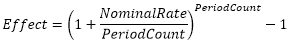

# Effect: Регламентный отчёт, веб-приложение

Effect: Регламентный отчёт, веб-приложение
-

# Effect

## Синтаксис

Effect(NominalRate, PeriodCount)

## Параметры

NominalRate. Номинальная годовая
 процентная ставка. Значение параметра должно быть больше нуля;

PeriodCount. Количество периодов
 в году, за которое начисляются сложные проценты. Значение параметра должно
 быть больше, либо равно единице.

Примечание.
 В качестве параметра можно указывать как непосредственно значение параметра,
 так и адрес ячейки, в которой оно располагается.

## Описание

Возвращает эффективную, фактическую, годовую процентную ставку, если
 заданы номинальная годовая процентная ставка и количество периодов в году,
 за которые начисляются сложные проценты.

## Комментарии

Функция вычисляется по формуле:

.

## Пример

		 Формула
		 Результат
		 Описание

		 =Effect(0.25, 4)
		 0,27
		 Фактическая процентная ставка при годовой ставке 0,25 и четырех
		 периодах в год, за которые начисляются сложные проценты.

		 =Effect(B6, 12)
		 0,16
		 Фактическая процентная ставка при годовой ставке, указанной
		 в ячейке В6, и двенадцати периодах в год, за которые начисляются
		 сложные проценты. Ячейка B6 содержит значение 0,15.

См. также:

[Мастер функций](../../UiReport_Organizational_master_function.htm)
 │ [Финансовые
 функции](UiReport_Func_Finance.htm) │ [Nominal](UiReport_Func_Finance_Nominal.htm)

		Справочная
		 система на версию 10.9
		 от 18/08/2025,
		 © ООО «ФОРСАЙТ»,
