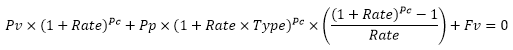
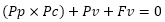

# Pv: Регламентный отчёт, веб-приложение

Pv: Регламентный отчёт, веб-приложение
-

# Pv

## Синтаксис

Pv(Rate, PeriodCount, PeriodPayment, FutureValue,
 Type)

## Параметры

Rate. Процентная ставка за
 период;

PeriodCount. Общее число периодов
 платежей по аннуитету;

PeriodPayment. Выплата, производимая
 в каждый период и не меняющаяся за все время выплаты ренты. Обычно выплаты
 включают основные платежи и платежи по процентам, но не включают других
 сборов или налогов;

FutureValue. Требуемое значение
 будущей стоимости или остатка средств после последней выплаты;

Type. Выбор времени платежа.
 Параметр может принимать следующие значения:

	- 0.
	 Платеж в конце периода;

	- 1.
	 Платеж в начале периода.

Примечание.
 В качестве параметра можно указывать как непосредственно значение параметра,
 так и адрес ячейки, в которой оно располагается.

## Описание

Возвращает приведённую (к текущему моменту) стоимость инвестиции.

## Комментарии

Приведённая (нынешняя) стоимость представляет собой общую сумму, которая
 на настоящий момент равноценна ряду будущих выплат. Например, когда вы
 занимаете деньги, сумма займа является приведенной (нынешней) стоимостью
 для заимодавца.

Формула для вычисления функции Pv
 будет иметь вид:

Если ставка не равна 0, то:

,

где:

	- Pc. Общее число периодов
	 платежей по аннуитету, PeriodCount;

	- Pp. Выплата, производимая
	 в каждый период и не меняющаяся за все время выплаты ренты, PeriodPayment;

	- Fv. Требуемое значение
	 будущей стоимости или остатка средств после последней выплаты, FutureValue.

Если ставка равна 0, то:

.

## Пример

		 Формула
		 Результат
		 Описание

		 =Pv(0.15, 12, 122, 12000, 1)
		 -3003,40
		 Приведённая (к текущему моменту) стоимость инвестиции, в
		 соответствии со следующими условиями:

			- процентная ставка 0,15;

			- общее число периодов платежей 12;

			- выплата в каждом периоде 122;

			- будущая стоимость 12000;

			- платеж осуществляется в начале периода.

		 =Pv(0.15, 12, А0, B0, 1)
		 -345,97
		 Приведённая (к текущему моменту) стоимость инвестиции, в
		 соответствии со следующими условиями:

			- процентная ставка 0,15;

			- общее число периодов платежей 12;

			- выплата в каждом периоде указана в ячейке A0, значение
			 55,5;

			- будущая стоимость указана в ячейке В0, значение 07;

			- платеж осуществляется в начале периода.

См. также:

[Мастер функций](../../UiReport_Organizational_master_function.htm)
 │ [Финансовые
 функции](UiReport_Func_Finance.htm) │ [Npv](UiReport_Func_Finance_Npv.htm)
 │ [Xnpv](UiReport_Func_Finance_Xnpv.htm)

		Справочная
		 система на версию 10.9
		 от 18/08/2025,
		 © ООО «ФОРСАЙТ»,
