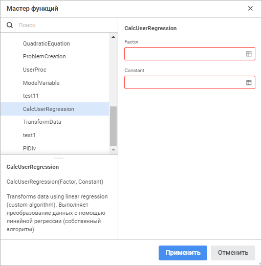

# Пользовательские функции: Регламентный отчёт, веб-приложение

Пользовательские функции: Регламентный отчёт, веб-приложение
-

# Пользовательские функции

Пользовательские функции и методы позволяют расширить возможности регламентного
 отчёта за счёт использования пользовательских методик расчёта.

По умолчанию пользовательские функции не подключены к инструменту «Отчёты». Для подключения пользовательских
 функций обратитесь к статье «[Подключение пользовательских
 функций](UiNav.chm::/gui/expressioneditor_userfunc.htm)».

Подключённые пользовательские функции будут отображаться мастере функций
 в категории «Пользовательские функции»,
 например:

Если пользовательская функция параметрическая, то в правой части мастера
 будет отображён список её параметров.

После выбора пользовательской функции и задания её параметров выбранная
 функция будет рассчитана. Результаты расчёта будут выведены на лист отчёта.
 Если в процессе расчёта возникли ошибки, то они также будут выведены на
 лист отчёта.

См. также:

[Мастер функций](../UiReport_Organizational_master_function.htm)

		Справочная
		 система на версию 10.9
		 от 18/08/2025,
		 © ООО «ФОРСАЙТ»,
