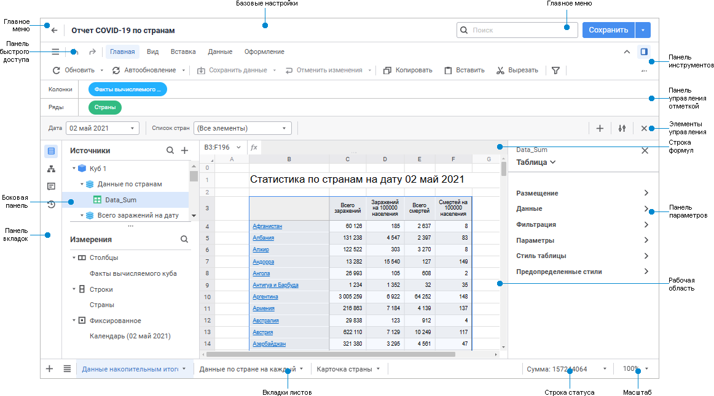

# Начало работы с инструментом «Отчёты» в веб-приложении

Начало работы с инструментом «Отчёты» в веб-приложении
-

# Начало работы с инструментом «Отчёты»
 в веб-приложении

Для начала работы с инструментом создайте новый или откройте готовый
 отчёт.

[Создание нового
 отчёта](javascript:TextPopup(this))

	Для создания нового отчёта в [навигаторе
	 объектов](GetStarted.chm::/Interface/interface_navigator.htm) нажмите кнопку «Создать»
	 главного меню и выберите «Регламентный
	 отчёт» на открывшейся панели «Новый
	 объект».

[Открытие
 готового отчёта](javascript:TextPopup(this))

	Для открытия на редактирование готового отчёта в [навигаторе
	 объектов](GetStarted.chm::/Interface/interface_navigator.htm) выполните одно из действий:

		- выполните команду «Редактировать»
		 контекстного меню отчёта;

		- выполните команду «Редактировать
		 в новой вкладке» в контекстном меню отчёта;

		- выполните команду «Редактировать
		 в новом окне» в контекстном меню отчёта;

		- выделите отчёт и нажмите кнопку F4.

	Для открытия на просмотр готового отчёта в [навигаторе
	 объектов](GetStarted.chm::/Interface/interface_navigator.htm) выполните одно из действий:

		- выполните команду «Открыть»
		 контекстного меню отчёта;

		- выполните команду «Открыть
		 в новой вкладке» в контекстном меню отчёта;

		- выполните команду «Открыть
		 в новом окне» в контекстном меню отчёта;

		- дважды щёлкните по отчёту;

		- выделите отчёт и нажмите кнопку ENTER.

Для построения отчёта смотрите статью
 «[Построение
 отчёта](../CreateReport.htm)».

Для работы с готовым отчётом смотрите
 статью «[Работа
 с готовым отчётом](../Reports/OperationReport/Work_witn_report.htm)».

Пользовательский интерфейс регламентного отчёта:

[Регламентный
 отчёт в режиме просмотра](javascript:TextPopup(this))

	

[Элементы
 пользовательского интерфейса отчёта](javascript:TextPopup(this))

		- Базовые настройки.
		 Предназначены для переименования регламентного отчёта при редактировании.

		- Главное меню. Содержит
		 основные команды для выполнения различных операций над отчётом
		 и кнопку для возвращения в навигатор. Также при редактировании
		 доступно сохранение отчёта, создание копии отчёта и [поиск
		 по командам меню](../Reports/OperationReport/Search.htm).

		- Панель быстрого доступа.
		 Содержит набор часто используемых команд.

		- Панель инструментов.
		 Содержит вкладки с кнопками для [построения](../CreateReport.htm)
		 и [настройки](../Reports/OperationReport/Work_witn_report.htm)
		 отчёта при редактировании и для работы с данными при просмотре.

		- Панель управления отметкой.
		 Предназначена для изменения строк и столбцов [таблицы](../Reports/Visualization.htm)
		 на листе отчета. Панель доступна, если нажата кнопка  «Панель
		 управления отметкой» вкладки «Вид»
		 панели инструментов. При отображении панели управления отметкой
		 панель поиска скрывается.

		- Боковая панель.
		 Предназначена для выбора источника данных и управления измерениями
		 при редактировании отчёта, а также для работы с модулями и обработчиками
		 событий отчёта при редактировании.

		- Панель вкладок.
		 Содержит кнопки для выбора группы
		 настроек, отображаемых на боковой панели.

		- Элементы управления.
		 Предназначены для изменения отметки таблицы на листе отчёта с
		 помощью элементов управления при [работе
		 с готовым отчётом](../Reports/OperationReport/Work_witn_report.htm). Панель доступна, если нажата кнопка  «Элементы
		 управления» вкладки «Главная»
		 на панели инструментов.

		- Панель параметров.
		 Предназначена для настройки отчёта.

		- Панель поиска. Предназначена
		 для [поиска и замены данных](../Table/Work/Search.htm).
		 Панель доступна, если нажата кнопка  «Поиск и замена» вкладки «Главная» на панели инструментов.
		 При поиске и замене также доступна панель «[Результаты совпадений](../Table/Work/Search.htm#results)».
		 При отображении панели поиска панель управления отметкой скрывается.
		 Панель поиска представлена для отчёта открытого на просмотр.

		- Строка формул. Предназначена
		 для ввода данных и формул в ячейки таблицы, отображения адресов
		 выделенных ячеек и [формул
		 алгоритмов](../Source/Window/Calculation_Practices.htm), если значения ячеек по ним рассчитывается.

		- Рабочая область.
		 Предназначена для построения отчёта при редактировании и
		 для ввода данных при просмотре.

		- Вкладки листов.
		 Предназначены для работы с листами[
		 отчёта](../Sheets/UiReport_Sheets.htm) при редактировании и для переключения между ними при
		 просмотре.

		- Строка статуса.
		 Предназначена для отображения результатов [расчёта
		 базовых агрегатов](../Reports/OperationReport/status_string.htm) выделенного диапазона ячеек таблицы.

		- Масштаб. Предназначен
		 для настройки [масштаба
		 отображения листа](../Reports/OperationReport/View.htm#scale) на рабочей области.

См. также:

[Начало
 работы с инструментом «Отчёты» в настольном приложении](../../Desktop/organizational_management/Starting.htm) | [Построение
 отчёта для печати](../../UiReport_purpose.htm) | [Работа
 с готовым отчётом](../Reports/OperationReport/Work_witn_report.htm)

		Справочная
		 система на версию 10.9
		 от 18/08/2025,
		 © ООО «ФОРСАЙТ»,
