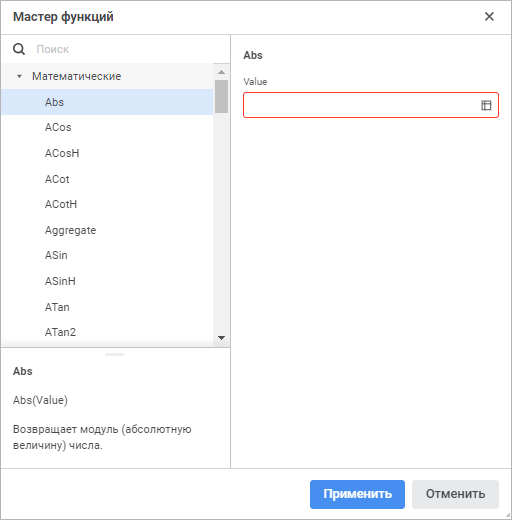
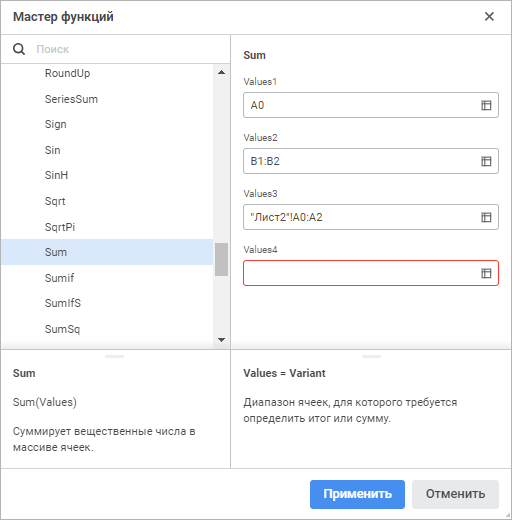

# Мастер функций: Регламентный отчёт, веб-приложение

Мастер функций: Регламентный отчёт, веб-приложение
-

# Мастер функций

Для работы с функциями нажмите кнопку  «Вставить
 функцию» в [строке
 формул](UiReport_Organizational_FormulaLine.htm) или нажмите сочетание клавиш SHIFT+F3.

После выполнения действия будет открыто окно «Мастер
 функций»:

Для работы с мастером функций:

	- Выберите категорию функций из списка в боковом меню:

		- [Математические](Function/Math/UiReport_Func_math.htm).
		 Математические функции;

		- [Ссылки
		 и массивы](Function/Link_Array/UiReport_Func_LinkArray.htm). Функции для работы со ссылками и массивами;

		- [Поиск](Function/Find/Find.htm).
		 Функции поиска;

		- [Дата
		 и время](Function/Date_Time/UiReport_Func_DateTime.htm). Функции для работы с датами и временем;

		- [Текстовые](Function/Text/UiReport_Func_Text.htm).
		 Функции для работы со строками;

		- [Работа
		 с отчетом](Function/Report/UiReport_Func_Report.htm). Функции для работы со срезами отчёта;

		- [Финансовые](Function/Finance/UiReport_Func_Finance.htm).
		 Финансовые функции;

		- [Статистические](Function/Statistic/UiReport_Func_Statistic.htm).
		 Статистические функции;

		- [Логические](Function/Logical/UiReport_Func_Logical.htm).
		 Логические функции;

		- [Python](Function/Python/Python.htm).
		 Вызов функций, написанных на языке Python;

		- [Java](Function/Java/Java.htm).
		 Вызов функций, написанных на языке Java;

		- [Пользовательские](Function/UserFunc.htm).
		 Позволяют расширить возможности регламентного отчёта за счёт использования
		 пользовательских методик расчёта.

Примечание.
 Функции в каждой категории упорядочены по алфавиту.

Для быстрого поиска функции введите её наименование
 частично или полностью в строку «Поиск».

При выделении функции в области под списком
 функций будут отображаться её конструкция и краткое описание.

После выбора функции станет доступна настройка
 её параметров.

	- Задайте значения параметров выбранной функции в правой части
	 окна мастера функций. Учтите [особенности
	 задания параметров функции](UiReport_Organizational_master_function.htm#features_of_setting).

	- Нажмите кнопку «Применить».

После выполнения действий в ячейке регламентного отчёта будет содержаться
 результат расчёта заданной функции.

## Особенности задания параметров функции

Если параметр является числом, то в поле ввода
 параметра можно указывать как число, так и адрес ячейки, в которой оно
 располагается.

Для задания адреса ячейки с данными:

	- введите диапазон ячеек вручную;

	- нажмите кнопку 
	 «Выбрать данные». Будет открыт
	 диалог «Выбрать данные»:

Введите вручную или выделите диапазон ячеек
 на рабочей области и нажмите кнопку «Применить».

Примечание.
 Для выбора нескольких диапазонов ячеек зажмите клавишу CTRL и последовательно
 выделите диапазоны ячеек или введите необходимые диапазоны через точку
 с запятой.

Для изменения размеров диалога наведите курсор
 на правый нижний угол и потяните его, при этом курсор примет вид двунаправленной
 стрелки.

В записи параметра допускается использование
 арифметических символов: +, -, /, *, >, <, =.

Примечание.
 В поле ввода может быть записана только одна операция отношения: =, <>,
 >, <, >=, <=.

При задании параметра в области под полями
 ввода будут отображаться его структура и краткое описание.

Для функций с переменным числом аргументов
 (например, функция Sum, And) первоначально отображается поле ввода только
 для одного аргумента. При переводе фокуса во второе поле добавляется поле
 для третьего аргумента и т.д. Максимальное число аргументов - 255:

См. также:

[Использование
 формул](Function/UiReport_Function.htm) | [Строка
 формул](UiReport_Organizational_FormulaLine.htm)

		Справочная
		 система на версию 10.9
		 от 18/08/2025,
		 © ООО «ФОРСАЙТ»,
