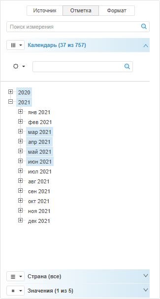
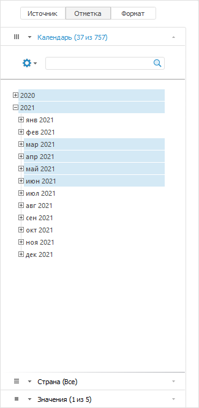
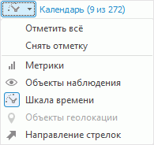
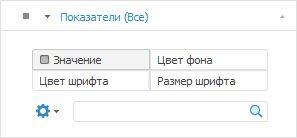
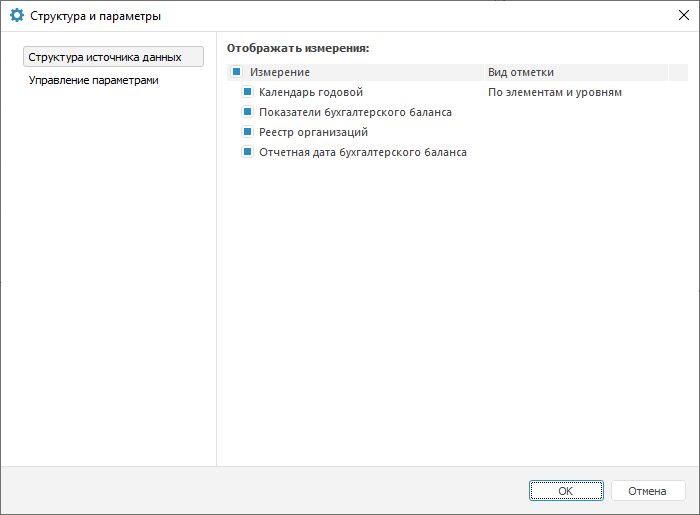

# Настройка измерений и отметка элементов

Настройка измерений и отметка элементов
-

# Настройка измерений и отметка элементов

	Инструменты «Отчеты», «Аналитические запросы (OLAP)» и
	 «Аналитические панели» оперируют
	 данными одного или нескольких многомерных источников.

	Измерение - это структурная
	 единица многомерного источника данных. В качестве измерений выступают
	 [справочники](UiNavObj.chm::/reference_book/Create.htm)
	 репозитория.

	Для работы с измерениями источника данных предназначена группа вкладок
	 «Отметка» боковой панели.

	[Для отображения
	 группы вкладок](javascript:TextPopup(this))

			- Убедитесь, что [боковая
			 панель](GetStarted.chm::/Interface/Interface_Description.htm#side_panel) отображается.

			- Активируйте таблицу, диаграмму, карту или другой объект
			 отчета, для которого задан источник данных.

			- Установите на боковой панели переключатель «Отметка».

		 Веб-приложение Настольное приложение

			Для инструментов «Аналитические
			 запросы (OLAP)» и «Аналитические
			 панели»:

			

			Для удобства работы с большим количеством измерений применяется
			 градиентная подсветка измерений с отметкой в списке измерений
			 на боковой панели, а также в выпадающем списке измерений применяется
			 подсветка в виде сплошной подсветки.

			Примечание.
			 Для работы с инструментом «Отчёты»
			 в веб-приложении смотрите статью «[Начало
			 работы с инструментом «Отчёты» в веб-приложении](uireport.chm::/Web/organizational_management/Starting.htm)».

			

## Выбор варианта расположения измерения
	 в таблице

	Для таблицы выбор фиксированного измерения в качестве метрики позволяет
	 настроить визуальное отображение для нескольких элементов измерения,
	 используя цвет и размер шрифта или заливку ячеек. Укажите измерения,
	 которые будут отображаться в строках/столбцах таблицы, и измерения,
	 которые будут исключены из строк и столбцов, то есть будут зафиксированы.
	 Экспериментируя с расположением измерений, найдите оптимальное представление
	 анализируемых данных.

	Выберите вариант расположения измерения в меню вкладки в группе
	 вкладок «Отметка» боковой панели,
	 нажав на кнопку с пиктограммой ,  или ,
	 которая находится слева от заголовка вкладки:

		-  По
		 столбцам;

		-  По
		 строкам;

		-  Фиксированные;

	Фиксация измерения
	 предназначена для скрытия измерения из строк и столбцов таблицы, на
	 основании которой строятся представления данных.

		-  Фильтр
		 в источнике. Доступно только в веб-приложении инструментов
		 «Аналитические запросы (OLAP)»
		 и «Аналитические панели».

	Примечание.
	 Доступно только для кубов с включенным методом [агрегации фактов](uinavobj.chm::/Cube/Agregation.htm).

	Используйте вариант расположения 
	 «Фильтр в источнике» для измерений,
	 которые не будут участвовать при построении представления данных.
	 Доступно для всех измерений, кроме [измерений
	 фактов](uinavobj.chm::/Cube/CreateCube/Master_Standart/UiMd_Cube_CreateCube_Master_Standart_1.htm) и измерений с настроенным доступом к элементам
	 [справочников
	 НСИ](admin.chm::/03_Admin/Admin_ElementAccess.htm),
	 [табличных](uinavobj.chm::/reference_book/Master_Table_reference_book/UiMd_reference_book_Master_Table_page1.htm)
	 и [вычисляемых](uinavobj.chm::/reference_book/Master_Calculation_reference_book/UiMd_reference_book_Master_Calculation_Atribute.htm)
	 справочников.

	При добавлении в экспресс-отчёт/аналитическую
	 панель кубов-источников с включённым методом агрегации для измерений
	 по умолчанию используется вариант расположения 
	 «Фильтр в источнике», если
	 измерения исключены из строк и столбцов. При отключении агрегации
	 в кубе для данных измерений применится вариант расположения  «Фиксированные».

	Примечание.
	 При открытии экспресс-отчётов/аналитических панелей в настольном приложении
	 для измерений, использующих вариант расположения 
	 «Фильтр в источнике», применится
	 вариант расположения  «Фиксированные».

	Порядок расположения измерений в группе вкладок «Отметка»
	 боковой панели зависит от варианта расположения, выбранного для данного
	 измерения. Выше всех располагаются измерения в столбцах, затем - в
	 строках, ниже - фиксированные.

## Настройка роли измерения

	Для визуализаторов вместо расположения измерения задается роль измерения
	 в меню вкладки в группе вкладок «Отметка» боковой панели:

	

	Элементы измерения с ролью «Метрики»
	 могут управлять характеристиками визуализатора, например, для таблицы
	 можно задать значение, цвет фона, цвет шрифта, размер шрифта. На вкладке
	 измерения отображаются дополнительные переключатели. Набор переключателей
	 зависит от типа визуализатора:

	

	Подробное описание приведено в статье «[Настройка
	 роли измерения](Dimension_type.htm)».

## Комбинирование измерений

	Комбинирование измерений объединяет несколько измерений в одно и
	 отображает его элементы в виде дерева временных рядов. Для комбинирования
	 измерений нажмите кнопку «Комбинировать»
	 на вкладке «Иерархия» ленты
	 инструментов.

	Примечание.
	 Комбинирование измерений доступно в инструментах «Аналитические
	 панели» и «Аналитические
	 запросы
	 (OLAP)».

	Подробное описание приведено в статье «[Комбинирование
	 измерений](Dimension_combine.htm)».

## Редактирование измерения

	Редактирование измерения предназначено для пользовательской настройки
	 измерения и позволяет редактировать:

		- [иерархию элементов
		 измерения](Hierarchies.htm#change_a_hierarchy);

		- [список элементов](Dimension_edit.htm#edit_list);

		- [элементы измерения](Dimension_edit.htm#edit_dim_element).

	Для настройки параметров исходного справочника вызовите мастер настройки
	 справочника.

	Примечание.
	 Возможность настройки параметров исходного справочника доступна только
	 в настольном приложении.

	Для этого:

		- выполните команду «Измерение
		 > Исходный справочник» в контекстном меню измерения;

		- нажмите кнопку «Редактировать»,
		 расположенную в группе «Измерение»
		 на вкладке «Иерархия»
		 ленты инструментов. Затем в раскрывающемся меню кнопки выберите
		 пункт «Исходный справочник».
		 Вкладка «Иерархия» доступна
		 при выборе вкладки «Отметка»
		 на боковой панели.

	Примечание.
	 Настройка параметров исходного справочника может быть отключена с
	 использованием языка [Fore](UiLib.chm::/Interface/IUiCommandActionCustomize/IUiCommandActionCustomize.htm).

	Редактирование измерения доступно, если во всех измерениях куба определён
	 [первичный
	 ключ](UiNavObj.chm::/reference_book/Master_Table_reference_book/UiMd_reference_book_Master_Table_page2.htm#indexes).

	Подробное описание приведено в статье «[Редактирование
	 измерений](Dimension_edit.htm)».

## Работа с элементами измерения

	При работе с элементами измерения доступны следующие операции:

		- [синхронизация
		 отметки](Selection_of_the_dimension_elements.htm#sync);

		- [поиск
		 измерения](Selection_of_the_dimension_elements.htm#search_dimension). Доступно только в веб-приложении инструментов «Аналитические запросы (OLAP)»
		 и «Аналитические панели»;

		- [поиск
		 элемента измерения](Selection_of_the_dimension_elements.htm#search);

		- [отметка
		 элементов измерения](Selection_of_the_dimension_elements.htm#selection);

		- [подсветка данных в элементах
		 измерения](Dimension_lightning.htm);

		- изменение отображения [наименования
		 элементов](Element_Names.htm).

	Подробное описание приведено в статье «[Работа
	 с элементами измерения](Selection_of_the_dimension_elements.htm)».

## Работа с иерархиями

	Альтернативная иерархия
	 - это альтернативные правила, по которым группируются элементы в измерении.
	 Альтернативная иерархия позволяет отображать одни и те же данные с
	 разных точек зрения.

	Пользовательская иерархия
	 - это вид альтернативной иерархии, полученной в результате редактирования
	 списка измерений и/или элемента измерения.

	При работе с иерархиями доступны следующие операции:

		- [отметка альтернативной
		 иерархии](Hierarchies.htm#select_hierarchy);

		- [изменение иерархии
		 элементов измерения](Hierarchies.htm#change_a_hierarchy);

		- [сохранение пользовательской
		 иерархии как альтернативной](Hierarchies.htm#save_hierarchy);

		- [агрегация по уровням
		 пользовательской и альтернативной иерархии](Hierarchies.htm#aggregation).

	Подробное описание приведено в статье «[Работа
	 с иерархиями](Hierarchies.htm)».

## Дополнительные настройки измерений

	[Изменение
	 положения вкладок](javascript:TextPopup(this))

		Для изменения положения вкладки используйте команды «Вверх»
		 и «Вниз» в меню вкладки.

		Примечание.
		 Для верхней вкладки недоступна команда «Вверх»
		 в меню вкладки, для нижней - «Вниз». Положение
		 вкладок можно изменить только в рамках одного варианта расположения
		 измерений, если измерений в этом варианте два или более.

	[Отображение/скрытие
	 измерений в группе вкладок «Отметка»](javascript:TextPopup(this))

		Возможность доступна только в инструментах «[Аналитические
		 панели](UiAdhoc.chm::/Blocks/Gadgets/DS_structure.htm)» и «[Аналитические
		 запросы (OLAP)](UIExpress.chm::/purpose/DS_structure.htm)».

		Для отображения/скрытия измерения источника данных в группе вкладок
		 «Отметка» на боковой панели
		 используйте диалог «Структура
		 и параметры». Для вызова диалога нажмите кнопку «Структура и параметры» на вкладке
		 «Данные» ленты инструментов.

		

		На вкладке «Структура источника
		 данных» диалога установите/снимите флажки напротив
		 измерений, которые необходимо отобразить/скрыть. В результате,
		 в группе вкладок «Отметка»
		 боковой панели будут отображены только те измерения источника
		 данных, напротив наименований которых установлены флажки.

		Если для одного или нескольких измерений настроена:

			- [альтернативная
			 иерархия на основе атрибутов](uinavobj.chm::/reference_book/look-and-feel_Reference_book/Attributes_as_alt_hier.htm) для измерений
			 стандартного куба, то атрибуты справочника можно использовать
			 качестве отдельных измерений;

			- [альтернативная
			 иерархия](UiNavObj.chm::/reference_book/look-and-feel_Reference_book/Use_AlterHier_ForRefBook.htm) для измерений куба ADOMD, то альтернативные
			 иерархии можно использовать качестве отдельных измерений.

		Полученные дополнительные измерения можно использовать в качестве
		 альтернативной иерархии. Измерения, для которых настроены альтернативные
		 иерархии, и наименования альтернативных иерархий отображаются
		 в виде дерева, которое по умолчанию свернуто. В развернутом дереве
		 перечисляются атрибуты справочников, использующиеся в качестве
		 альтернативных иерархий, и альтернативные иерархии. Установите
		 флажки у атрибутов/альтернативных иерархий, по которым требуется
		 дополнительное измерение.

		В результате в группе вкладок «Отметка»
		 на боковой панели будут добавлены новые измерения с наименованиями
		 по умолчанию «Наименование измерения.
		 Наименование атрибута»/«Наименование
		 альтернативной иерархии».

		Первое по списку атрибутов измерение/альтернативная иерархия
		 добавляется в тот же вариант расположения, что и основное измерение.
		 Остальные дополнительные измерения располагаются в фиксированных.

		Ограничения при работе с дополнительными измерениями в веб-приложении:

			- отсутствует возможность использования [схем
			 отметки](Selection_of_the_dimension_elements.htm#schemas);

			- отсутствует возможность использования [альтернативной
			 иерархии](Setting_view_of_the_dimension.htm#reflection_of_alternative_hierarchy);

			- отсутствует возможность использования [групп
			 элементов](Setting_view_of_the_dimension.htm#reflection_of_group_of_elements).

	[Настройка
	 отображения измерения](javascript:TextPopup(this))

		Для настройки отображения измерения доступны следующие операции:

			- отображение групп элементов;

			- отображение наименований атрибутов справочника;

			- отображение альтернативной иерархии;

			- сортировка элементов измерения;

			- фильтрация элементов измерения.

		Подробное описание приведено в статье «[Настройка
		 отображения измерения](Setting_view_of_the_dimension.htm)».

	[Настройка
	 измерения в таблице](javascript:TextPopup(this))

		При работе с измерениями в таблице доступны следующие настройки:

			- изменение отметки из таблицы;

			- выделение элементов измерения в таблице;

			- размещение элементов измерения;

			- расшифровка элементов измерения;

			- оформление измерений и уровней в таблице;

			- настройка метрик для таблицы;

			- фиксация элементов измерения в таблице;

			- специальная фильтрация измерения;

			- вычисляемые элементы.

		Для получения подробной
		 информации о настройках обратитесь к статье «[Работа
		 с измерениями в таблице](UiAnalyticalArea.chm::/Work_with_dimensions/Work_with_dimensions.htm)»

См. также:

[Редактирование
 измерений](Dimension_edit.htm) | [Отметка
 элементов измерения](Selection_of_the_dimension_elements.htm)

		Справочная
		 система на версию 10.9
		 от 18/08/2025,
		 © ООО «ФОРСАЙТ»,
