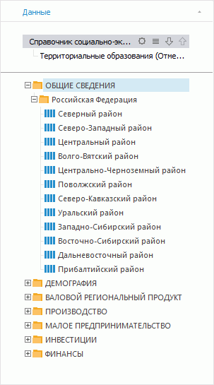
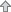
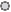
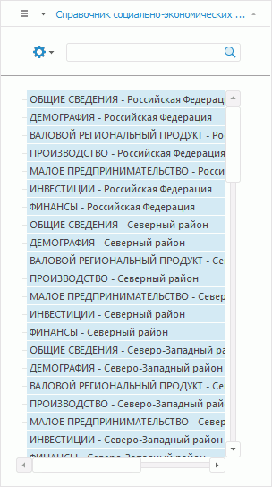

# Комбинирование измерений

Комбинирование измерений
-

# Комбинирование измерений

Комбинирование измерений объединяет несколько измерений в одно и отображает
 его элементы в виде дерева временных рядов.

Комбинированное измерение позволяет отображать элементы в виде дерева
 временных рядов, аналогично инструменту «Анализ
 временных рядов», и позволяет уменьшить размерность источника данных.
 Наименование элементов комбинированного измерения состоит из наименований
 элементов исходных измерений, разделенных тире.

Примечание.
 Комбинирование измерений доступно в инструментах «Аналитические
 панели» и «Аналитические запросы
 (OLAP)».

## Особенности работы комбинированных измерений

В качестве источника, из измерений которого может быть сформировано
 комбинированное измерение, могут выступать:

	- база данных временных рядов;

	- виртуальный куб;

	- стандартный куб.

В комбинированном измерении недоступно использование календарного и
 сценарного справочников.

Каждый лист экспресс-отчета или каждый блок аналитической панели могут
 содержать только одно комбинированное измерение.

При использовании комбинированных измерений недоступна валидация
 данных. При создании комбинированного измерения уже настроенная валидация
 будет отключена.

При создании комбинированного измерения вычислимые элементы, присутствующие
 в измерениях, будут удалены.

При создании комбинированного измерения визуализатор «Карта»
 будет отключен, если в комбинированное измерение включено измерение [объектов наблюдения](Dimension_type.htm) или измерение, содержащее
 атрибуты привязки территорий.

## Создание комбинированного измерения

Для создания комбинированного измерения нажмите на кнопку  «Комбинировать» на вкладке «Иерархия» ленты инструментов и выберите
 в раскрывающемся меню:

	- необходимые для комбинирования измерения источника данных;

	- пункт «Режим временных рядов»
	 для комбинирования всех доступных измерений источника данных.

Примечание.
 Вкладка «Иерархия» доступна, если
 в боковой панели выбрана вкладка «Отметка».

В результате выбранные измерения комбинируются в одно. При создании
 комбинированного измерения отметка будет сформирована из отметки
 исходных измерений.

Для работы с комбинированным измерением предназначены вкладки на группе
 вкладок «Отметка» боковой панели:

	- вкладка со списком элементов;

	- вкладка «Данные», содержащая
	 дерево рядов.

Наименование вкладки со списком элементов формируется из наименований
 исходных измерений, разделенных вертикальной чертой. Например: «Территории | Показатели»,
 где «Территории» и «Показатели»
 - это названия исходных измерений.

Для отмены комбинирования измерений выберите вкладку со списком элементов
 комбинированного измерения в группе вкладок «Отметка»
 на боковой панели и выполните одно из действий:

	- выполните команду  «Альтернативная
	 иерархия > Cбросить» в контекстном меню измерения;

	- выполните команду  «Альтернативная
	 иерархия > Cбросить» на вкладке «Иерархия»
	 ленты инструментов;

	- снимите отметку со всех измерений в раскрывающемся меню кнопки
	  «Комбинировать»
	 на вкладке «Иерархия» ленты
	 инструментов.

## Дерево рядов комбинированного измерения

Вкладка «Данные» представляет
 элементы комбинированного измерения в виде дерева временных рядов:

Временные ряды можно добавить в отметку визуализатора:

	- двойным нажатием на ряд или папку с рядами;

	- перетаскиванием необходимых рядов в рабочую область.

### Формирование структуры дерева

Структура дерева и наименование ряда формируются на основании цепочки
 измерений, находящейся в верхней части панели.

При создании комбинированного измерения цепочка измерений будет сформирована
 из текущей отметки используемых измерений.

Для настройки цепочки измерений и дерева рядов предназначены кнопки,
 расположенные напротив наименований измерений:

	-  
	 Подвинуть вниз/вверх. Настройка
	 иерархии измерений в дереве рядов;

	-  Меню настроек.
	 Удаление измерения из цепочки или настройка фильтрации и сортировки;

	-  Список
	 элементов. Отметка элементов, которые участвуют в формировании
	 структуры дерева. Через контекстное меню доступны стандартные команды
	 для работы с отметкой измерений.

## Список элементов комбинированного измерения

Список элементов комбинированного измерения содержит временные ряды,
 образованные цепочкой измерений с вкладки «Данные»:

Для работы с элементами комбинированного измерения обратитесь к разделу
 «[Работа с элементами
 измерения](Selection_of_the_dimension_elements.htm)».

Примечание.
 Для комбинированного измерения недоступно использование [групп
 отметки](Selection_of_the_dimension_elements.htm#group), [альтернативной иерархии](Hierarchies.htm#hierarchy),
 [схем отметки](Selection_of_the_dimension_elements.htm#schemas),
 добавление [нового вычисляемого элемента](Dimension_edit.htm#add_elem),
 [агрегирующего элемента](Dimension_edit.htm#add_agregation),
 [элемента «Промежуточный итог»
 и «Итог»](Dimension_edit.htm#total_subtotal).

См. также:

[Настройка
 измерений и отметка элементов](Dimension.htm)

		Справочная
		 система на версию 10.9
		 от 18/08/2025,
		 © ООО «ФОРСАЙТ»,
