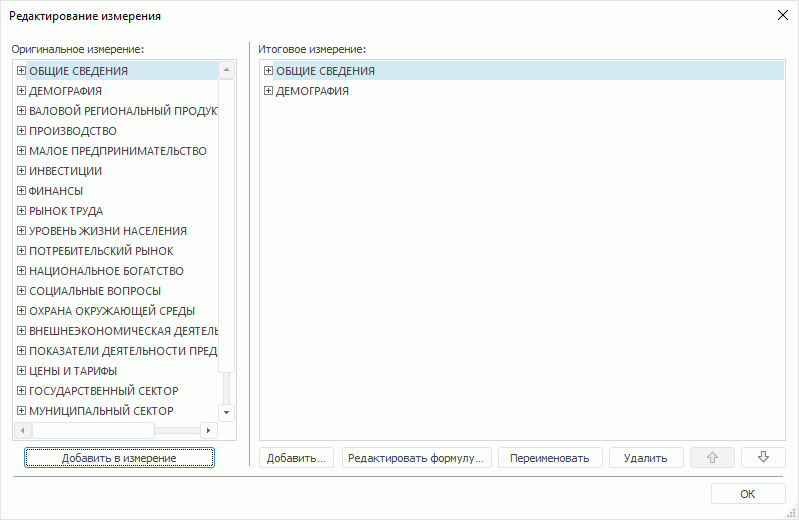

# Редактирование измерений

Редактирование измерений
-

# Редактирование измерений

Для измерений, входящих в состав источника данных, доступно редактирование:

	- [иерархии](Hierarchies.htm);

	- [списка элементов](Dimension_edit.htm#edit_list);

	- [элементов измерения](Dimension_edit.htm#edit_dim_element).

Примечание.
 После редактирования измерения оно не будет перестраиваться при смене
 параметров источника данных или управлении измерениями.

Для открытия справочника, соответствующего измерению, выполните команду
 «Исходный справочник» раскрывающегося
 меню кнопки «Редактировать» на
 вкладке ленты «Иерархия».

Примечание.
 Возможность настройки параметров исходного справочника доступна только
 в настольном приложении.

Для редактирования измерений используются:

	- группа вкладок «[Отметка](Dimension.htm)»
	 боковой панели;

	- вкладка «Иерархия» ленты инструментов;

	- окно «Редактирование измерения»,
	 которое открывается с помощью:

		- команды «Измерение >
		 Редактировать» в контекстном меню измерения;

		- нажатия на кнопку «Редактировать»,
		 расположенную в группе «Измерение»
		 на вкладке «Иерархия»
		 ленты инструментов.

В области «Оригинальное
 измерение» отображаются элементы измерения до редактирования. В
 области «Итоговое измерение» -
 список элементов после редактирования.

Примечание.
 Редактирование измерения доступно, если во всех измерениях куба определён
 [первичный
 ключ](UiNavOb.chm::/reference_book/Master_Table_reference_book/UiMd_reference_book_Master_Table_page2.htm#indexes).

## Редактирование списка измерения

Для редактирования списка измерений доступны операции:

[Добавление
 нового вычисляемого элемента](javascript:TextPopup(this))

	Для добавления в измерение нового вычисляемого элемента:

		- нажмите кнопку «Новый элемент»,
		 расположенную в группе «Элементы»
		 на вкладке «Иерархия» ленты инструментов;

		- выполните команду «Элемент
		 > Добавить новый»
		 в контекстном меню измерения или элемента измерения на вкладке
		 измерения.

	Для настройки элемента измерения откроется окно «[Редактор
	 выражения](UiNav.Chm::/GUI/ExpressionEditor.htm)». Новый элемент измерения будет
	 добавлен в измерение, вкладка которого открыта в группе вкладок «Отметка» боковой панели.

	Добавление вычисляемого элемента недоступно:

		- если используется [глобальный кеш](UiNav.chm::/02_Navigator/Cache_In_Blob.htm);

		- если в измерении [отображена
		 группа элементов](Setting_view_of_the_dimension.htm#reflection_of_group_of_elements);

		- если выполнена [детализация
		 агрегированных данных](UiAnalyticalArea.chm::/Working_with_table_data/Drill_down.htm#drill_down);

		- если источником данных является
		 куб:

			- в [табличном](UiNavObj.chm::/reference_book/Master_Table_reference_book/Master_Table.htm)
			 или [вычисляемом](UiNavObj.chm::/reference_book/Master_Calculation_reference_book/Master_Calculation.htm)
			 справочнике которого не добавлены [индексы](UiNavObj.chm::/Cube/CreateCube/Master_Standart/UiMd_Cube_CreateCube_Master_Standart_3.htm#dims_binding);

			- атрибут в справочнике которого используется в качестве
			 [альтернативной
			 иерархии](UiNavObj.chm::/reference_book/look-and-feel_Reference_book/Attributes_as_alt_hier.htm) и включен в [структуру
			 источника данных](UiReport.chm::/desktop/Reports/Parameters_DataSource.htm) регламентного отчёта как
			 дочерний элемент.

[Добавление
 агрегирующего элемента](javascript:TextPopup(this))

	Агрегирующий
	 элемент позволяет быстро создать новый элемент, объединяющий
	 другие элементы с помощью математической функции.

	Для добавления в измерение агрегирующего элемента:

		- выполните команду «Элемент»
		 в контекстном меню измерения;

		- вызовите контекстное меню для элементов заголовков столбцов
		 и/или строк таблицы в рабочей области;

		- нажмите кнопку «Новый элемент»,
		 расположенную в группе «Элемент»
		 на вкладке «Иерархия»
		 ленты инструментов;

		- выполните команду «Элемент»
		 в контекстном меню списка «Итоговое
		 измерение» в окне «Редактирование
		 измерения».

	После выполнения команды выберите один из вариантов задания формулы
	 нового элемента:

		- Объединить в новый элемент.
		 Формула нового элемента будет содержать значения выделенных элементов,
		 объединенные выбранной функцией. Все выделенные элементы станут
		 дочерними для нового элемента;

		- Добавить по отмеченным
		 с операцией. Формула нового элемента будет содержать значения
		 выделенных элементов, объединенные выбранной функцией. Положение
		 элементов, на основе которых формируется агрегирующий элемент,
		 не изменится.

	Примечание.
	 Вариант «Добавить по отмеченным с
	 операцией» доступен только в настольном приложении.

	В качестве формулы нового элемента доступны функции:

		- сумма;

		- среднее;

		- максимум;

		- минимум;

		- мода;

		- медиана;

		- дисперсия.

[Добавление
 элемента «Промежуточный итог» и «Итог»](javascript:TextPopup(this))

	При работе с элементами измерения доступны операции добавления элементов
	 «Промежуточный итог» и «Итог».

	Добавление таких элементов осуществляется следующими способами:

		- первый способ:

			- Нажмите на нижнюю часть кнопки «Новый
			 элемент», расположенной в группе «Элементы»
			 на вкладке «Иерархия» ленты инструментов.

			- В раскрывающемся меню кнопки выберите «Добавить
			 промежуточный итог» / «Добавить
			 итог».

			- Выберите метод расчета итогов.

		- второй способ:

			- Перейдите на вкладку с измерением в группе вкладок «Отметка» на боковой панели.

			- Выполните команду «Элемент
			 > Добавить промежуточный
			 итог / Добавить итог» в контекстном меню измерения
			 или элемента измерения.

			- Выберите метод расчета итогов.

	Доступные методы расчета:

		- Сумма;

		- Среднее;

		- Минимум;

		- Максимум;

		- Мода;

		- Медиана;

		- Дисперсия.

	После выбора метода расчета в текущее измерение будет добавлен новый
	 элемент измерения с наименованием: «Метод_расчета
	 (Наименование_элемета_измерения)».

[Удаление
 элемента](javascript:TextPopup(this))

	Для удаления элемента:

		- выполните команду «Элемент
		 > Удалить» в контекстном
		 меню элемента;

		- нажмите кнопку «Удалить»,
		 расположенную в группе «Элемент»
		 на вкладке «Иерархия» ленты инструментов;

		- выделите элемент в списке «Итоговое
		 измерение» окна «Редактирование
		 измерения» и нажмите кнопку «Удалить»
		 или выполните команду «Элемент
		 > Удалить» в контекстном
		 меню элемента.

	Элемент будет удален без подтверждения выполняемого действия.

	Примечание.
	 Удаление элемента календарной динамики недоступно.

[Восстановление
 элементов измерения](javascript:TextPopup(this))

	Для восстановления всех измененных и удаленных элементов измерения:

		- нажмите кнопку «Восстановить»,
		 расположенную в группе «Измерение»
		 на вкладке «Иерархия» ленты инструментов;

		- выполните команду «Измерение
		 > Восстановить» в контекстном меню элемента измерения.

Примечание.
 Добавление нового вычисляемого элемента, агрегирующего элемента, элемента
 «Промежуточный итог» и «Итог» недоступно для [комбинированного
 измерения](Dimension_combine.htm).

## Редактирование элемента измерения

Для редактирования элемента используйте команды в контекстном меню элемента,
 кнопки на вкладке «Иерархия» ленты инструментов
 и окно «Редактирование измерения».

Примечание.
 Редактирование элемента доступно, если выделен только один элемент измерения.

[Переименование
 элемента](javascript:TextPopup(this))

	Для переименования элемента выделите его в боковой панели или в
	 списке «Итоговое измерение»
	 окна «Редактирование измерения»
	 и:

		- выполните команду «Элемент
		 > Переименовать» в контекстном меню элемента;

		- нажмите кнопку «Переименовать»
		 в окне «Редактирование измерения»;

		- нажмите кнопку «Переименовать»,
		 расположенную в группе «Элемент»
		 на вкладке «Иерархия»
		 ленты инструментов.

[Редактирование
 формулы элемента](javascript:TextPopup(this))

	Для редактирования формулы элемента выделите его в боковой панели
	 или в списке «Итоговое измерение»
	 окна «Редактирование измерения»
	 и:

		- выполните команду «Редактировать
		 формулу» контекстного меню элемента;

		- нажмите кнопку «Редактировать
		 формулу» в окне «Редактирование
		 измерения»;

		- нажмите кнопку «Редактировать
		 формулу» в группе «Элемент»
		 на вкладке «Иерархия»
		 ленты инструментов.

	Для настройки выражения[
	 вычисляемого элемента](UiAnalyticalArea.chm::/Work_with_dimensions/Edited_elements.htm) измерения будет открыто окно «[Редактор
	 выражения](UiNav.Chm::/GUI/ExpressionEditor.htm)».

См. также:

[Настройка
 измерений и отметка элементов](Dimension.htm)

		Справочная
		 система на версию 10.9
		 от 18/08/2025,
		 © ООО «ФОРСАЙТ»,
