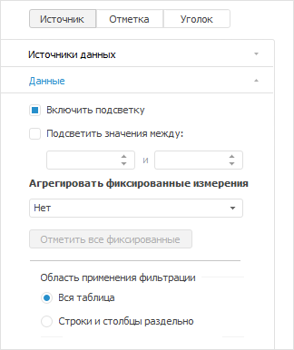
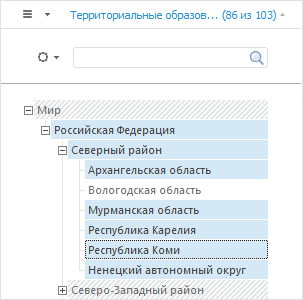

# Подсветка данных в элементах измерения

Подсветка данных в элементах измерения
-

# Подсветка данных в элементах измерения

В «Форсайт. Аналитическая платформа»
 реализована возможность включения подсветки данных для элементов измерений,
 когда в экспресс-отчете или регламентном отчете используется источник
 данных с включенным кешированием.

Подсветка данных предназначена для визуального отображения элементов
 измерений, по которым есть данные.

Для включения подсветки данных в измерениях:

	- [Включите
	 кеширование данных в источнике](UiNav.chm::/03_Objects/UiNav_Obj_BasicPropCache.htm).

	- На основе источника с кешированием создайте [экспресс-отчет](UIExpress.chm::/purpose/UiExpress_Purpose.htm)или [регламентный
	 отчет](UIReport.chm::/desktop/organizational_management/Starting.htm).

	- На вкладке «Данные»
	 группы вкладок «Источник»
	 на боковой панели установите флажок «Включить
	 подсветку»:

На вкладке доступны следующие параметры:

		- Включить подсветку.
		 Установка флага активирует подсветку элементов измерения, по которым
		 есть данные;

		- Подсветить значения между.
		 Установка флага активирует фильтрацию по данным элементов измерений,
		 на основе которых будет выведена подсветка элементов измерения.

В результате выполнения действий в группе вкладок «Отметка»
 будет включена подсветка элементов в измерениях:

В измерениях будут указаны все элементы вне зависимости наличия данных
 по ним. Элементы, в которых есть данные, выделены черным цветом, а элементы
 без данных выделены серым цветом.

Примечание.
 Если в источнике данных настроена [агрегация данных](UiNavObj.chm::/Cube/Agregation.htm),
 то родительский элемент, не содержащий данные, будет выделен черным цветом,
 при условии, что в дочернем элементе есть данные.

После включения подсветки данных по элементам будет доступна отметка
 только тех элементов, в которые содержат в себе данные. Для выбора элементов
 с данными выполните команду «Расширенная
 отметка > Отметить с данными»:

В результате будут отмечены только те элементы, в которых присутствуют
 данные. Родительские элементы отмечаются вне зависимости от того, содержатся
 ли в них данные, если данные есть в дочерних элементах.

См. также:

[Настройка
 измерений и отметка элементов](Dimension.htm)

		Справочная
		 система на версию 10.9
		 от 18/08/2025,
		 © ООО «ФОРСАЙТ»,
