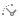
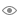
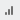

# Настройка роли измерения

Настройка роли измерения
-

# Настройка роли измерения

Для пузырьковой диаграммы, карты, пузырькового и плоского деревьев вместо
 расположения измерения задается роль измерения.

Для таблицы выбор фиксированного измерения в качестве метрики позволяет
 настроить визуальное отображение для нескольких элементов измерения, используя
 цвет и размер шрифта или заливку ячеек.

Роль измерения задается с помощью меню вкладки в группе вкладок «Отметка» боковой панели.

Доступны следующие роли измерений:

	-  Шкала времени
	 (календарное измерение). Элементы измерения используются для
	 построения временной шкалы в качестве календаря при создании вычисляемых
	 показателей;

	-  Объекты
	 наблюдения. Элементы измерения используются в качестве объектов
	 наблюдения. По умолчанию [ограничение отметки](UiExpress.chm::/FAQ/SelectionLimit.htm)
	 измерения объектов наблюдения составляет 2000 элементов и задается
	 в одном из подразделов реестра;

Примечание.
 Измерение «Объекты наблюдения»
 является обязательным для построения пузырьковой диаграммы, пузырькового
 дерева и плоского дерева. Измерение для карты дополнительно должно соответствовать
 [требованиям
 работы с картой](UiMaps.chm::/Common/Requirements.htm).

	-  Метрики.
	 Элементы измерения используются для отображения значений в виде одной
	 или нескольких метрик. Каждый визуализатор имеет свой набор метрик;

	-  Объекты
	 геолокации. Элементы измерения отображаются на [карте](uimaps.chm::/Common/Metrics.htm) в
	 виде [маркеров](uimaps.chm::/Configure/coordinate_marker.htm);

	-  Направление
	 стрелок. Элементы территориального измерения используются для
	 направления [стрелок](uimaps.chm::/Configure/Arrows.htm)
	 на [карте](uimaps.chm::/Common/Metrics.htm). Отметка
	 в территориальном измерении с ролью «Объекты
	 наблюдения» определяет начало стрелок.

Измерения, которым не присвоена роль, останутся фиксированными.

Примечание.
 Если в регламентном отчёте несколько объектов используют один срез данных,
 то у измерений среза будут одинаковые роли.

Для измерений, у которых используется вариант расположения  «[Фильтр в источнике](Dimension.htm#variant_of_location)»,
 недоступна настройка роли измерения.

## Сопоставление элемента измерения метрик и характеристики
 визуализатора

Если элементы измерения метрик управляют характеристиками визуализатора,
 то на вкладке измерения отображаются дополнительные переключатели. Набор
 переключателей зависит от типа визуализатора. Например:

Название переключателя соответствует управляемой характеристике. Если
 характеристика задана, то она отмечена маркером.

Для сопоставления элемента измерения и характеристики визуализатора:

	- Установите переключатель, соответствующий управляемой характеристике
	 визуализатора.

	- Выберите управляющий элемент измерения.

Визуализатор будет перестроен в соответствии с заданными метриками.

Элементы измерения метрик позволяют управлять следующими характеристиками:

[Для таблицы](javascript:TextPopup(this))

	Для таблицы фиксированное измерение может использоваться в качестве
	 метрики. В этом случае будет доступно отображение значений элементов
	 по [четырем
	 метрикам](UiAnalyticalArea.chm::/Work_with_dimensions/Table_metrics.htm):

		- Значение. Значение,
		 отображаемое в ячейках таблицы;

		- Цвет фона. Цвет
		 фона ячеек таблицы;

		- Цвет шрифта. Цвет
		 шрифта для значений в ячейках таблицы;

		- Размер шрифта. Размер
		 шрифта для значений в ячейках таблицы.

	Подробное описание приведено в разделе «[Настройка
	 метрик для таблицы](UiAnalyticalArea.chm::/Work_with_dimensions/Table_metrics.htm)».

[Для карты](javascript:TextPopup(this))

		- Цвет. Цвет заливки
		 территорий.

		- Объем. Высота территории.
		 Метрика доступна при включенном режиме «[3D](UiMaps.chm::/Configure/MapConfigure.htm#3d)».

		- Круговой. Отображение
		 круговых диаграмм над территориями.

		- Столбиковый. Отображение
		 столбиковых диаграмм над территориями.

		- Толщина стрелок.
		 Толщина стрелки по всей ее длине.

		- Цвет стрелок. Цвет
		 заливки стрелок.

		- Цвет маркера. Цвет
		 заливки маркеров геолокации.

	Примечание. Метрики для стрелок
	 и маркеров геолокации доступны для использования, если выполнены требования
	 к источнику данных: [требования
	 для стрелок](UiMaps.chm::/Common/Arrows_requirements.htm), [требования для
	 маркеров геолокации](UiMaps.chm::/Common/Markers_requirements.htm).

[Для диаграммы](javascript:TextPopup(this))

		- Значение. Значение,
		 по которому строится диаграмма. Метрика устанавливается по умолчанию
		 после того, как для измерения установлена роль «Метрики».
		 Особенность данной метрики в том, что на вкладке измерения отсутствует
		 дополнительный переключатель для работы с метрикой.

[Для пузырьковой
 диаграммы](javascript:TextPopup(this))

		- X. Положение пузырька
		 по оси значений Х.

		- Y. Положение пузырька
		 по оси значений Y.

		- Размер. Размер пузырьков.

		- Цвет. Цвет пузырьков.

[Для пузырькового
 и плоского деревьев](javascript:TextPopup(this))

		- Цвет. Цвет пузырьков.

		- Размер. Размер пузырьков.

## Синхронизация метрик

Между визуализаторами доступна синхронизация метрик.

Для включения синхронизации метрик выберите пункт «Синхронизировать
 метрики» раскрывающегося меню измерения  на группе
 вкладок «Отметка» боковой панели.

Синхронизируются следующие типы метрик:

	- метрика «Значение» у
	 таблицы с метриками «Цвет»
	 у карты, пузырьковой диаграммы, пузырькового и плоского деревьев;

	- метрика «Значение» у
	 диаграммы с метрикой «Значение»
	 у таблицы;

	- метрика «Размер шрифта»
	 у таблицы с метриками «Размер»
	 у пузырьковой диаграммы, пузырькового и плоского деревьев и с метрикой
	 «Объем» у карты, при включенном
	 режиме «3D».

См. также:

[Настройка
 измерений и отметка элементов](Dimension.htm)

		Справочная
		 система на версию 10.9
		 от 18/08/2025,
		 © ООО «ФОРСАЙТ»,
