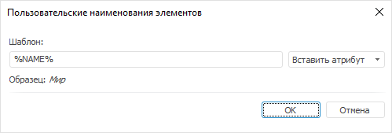
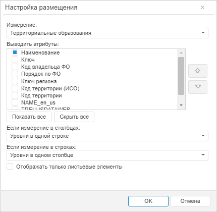
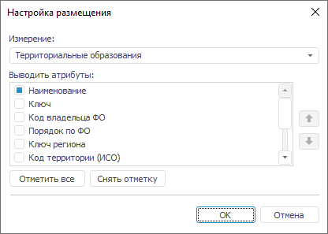

# Наименование элементов

Наименование элементов
-

# Наименование элементов

Для измерения можно определить один или несколько [атрибутов](uinavobj.chm::/reference_book/Master_RDS_reference_book/Attributes.htm),
 значения которых будут использоваться в качестве наименования элементов
 в шапке или боковике таблицы. Также настройки наименования элементов применяются
 на диаграмме.

Примечание.
 Настройка отображения наименования элементов в инструменте «Отчёты»
 в веб-приложении отличается. Для получения подробной информации обратитесь
 к разделу «[Наименование
 элементов](uireport.chm::/Web/Table/Work/Element_Names.htm)».

Для изменения отображения наименования элементов установите флажки напротив
 атрибутов в раскрывающемся списке:

	- команды «Наименования»,
	 расположенной в контекстном меню элемента измерения в шапке или боковике
	 таблицы;

	- команды «Наименования»,
	 расположенной в контекстном меню элемента измерения на боковой панели
	 «Отметка»;

	- команды «Наименования»,
	 расположенной в меню измерения 
	 на боковой панели «Отметка»;

	- кнопки «Наименования»,
	 расположенной в группе «Вид»
	 на вкладке «Иерархия» ленты
	 инструментов.

По умолчанию используется атрибут «Наименование».

## Настройка пользовательского наименования

Для настройки пользовательского наименования элементов измерения:

	- Установите переключатель «Пользовательское
	 наименование» в раскрывающемся меню кнопки/команды «Наименования».
	 После чего будет открыто окно «Пользовательские
	 наименования элементов»:

	- Задайте шаблон отображения наименования с помощью кнопки «Вставить атрибут». В раскрывающемся
	 меню кнопки «Вставить атрибут»
	 содержатся атрибуты измерения.

После выполнения действий будет отображаться заданное пользовательское
 наименование элементов измерения.

Для отключения пользовательского наименования установите переключатель
 «Атрибуты справочника» в раскрывающемся
 меню кнопки/команды «Наименования».

## Настройка размещения атрибутов

Для настройки размещения атрибутов измерения в наименовании элементов:

	- Установите переключатель «Атрибуты
	 справочника» в раскрывающемся меню кнопки/команды «Наименования».

	- Выполните команду «Настроить
	 размещение» в раскрывающемся меню кнопки/команды «Наименования».
	 После чего будет открыто окно «Настройка
	 размещения»:

	 Веб-приложение

	 Настольное
	 приложение

		

		

	- Выберите отображаемые атрибуты измерения и задайте их порядок.

	- При необходимости задайте дополнительные параметры в веб-приложении:

[Если
 измерение в столбцах/в строках](javascript:TextPopup(this))

	Выберите способ размещения измерения
	 в раскрывающемся списке:

			- Размещение из отчёта.
			 По умолчанию. Используются настройки размещения уровней, заданные
			 для отчёта;

			- Уровни в одном столбце/строке.
			 Все уровни будут размещены в одном столбце/строке, независимо
			 от заданного размещения для отчёта;

	Примечание.
	 При расположении уровней в одном столбце используются отступы.

			- Уровни в отдельные
			 столбцы/строки. Каждый уровень будет размещен в отдельный
			 столбец/строку, независимо от заданного размещения для отчёта.

[Отображать
 только листьевые элементы](javascript:TextPopup(this))

	При установке флажка «Отображать
	 только листьевые элементы» меняется отображение элементов измерения:

			- при расположении «Уровни
			 в одном столбце/строке» отображаются только те элементы,
			 которые не имеют дочерних элементов;

			- при расположении «Уровни
			 в отдельные столбцы/строки» дочерние элементы отображаются
			 с родительскими без выделения для них дополнительных
			 строк/столбцов.

	По умолчанию флажок «Отображать
	 только листьевые элементы» снят.

После выполнения действий в наименовании элементов измерения будут отображаться
 отмеченные атрибуты в заданном порядке.

См. также:

[Работа
 с элементами измерения](Selection_of_the_dimension_elements.htm) | [Настройка
 отображения измерения](Setting_view_of_the_dimension.htm)

		Справочная
		 система на версию 10.9
		 от 18/08/2025,
		 © ООО «ФОРСАЙТ»,
