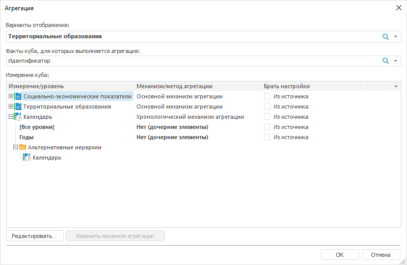
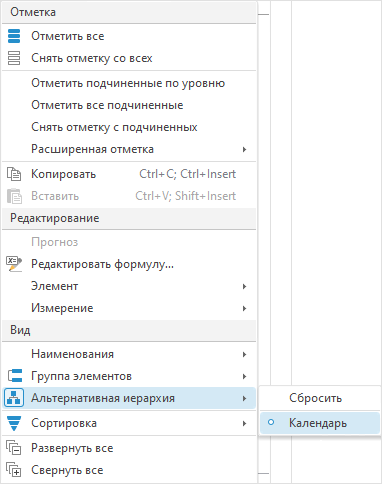

# Работа с иерархиями

Работа с иерархиями
-

# Работа с иерархиями

	Альтернативная иерархия
	 - это альтернативные правила, по которым группируются элементы в измерении.
	 Альтернативная иерархия позволяет отображать одни и те же данные с
	 разных точек зрения.

	Существуют два варианта настройки альтернативной иерархии:

		- [альтернативная
		 иерархия на основе справочников](uinavobj.chm::/reference_book/look-and-feel_Reference_book/Use_AlterHier_ForRefBook.htm);

		- [альтернативная
		 иерархия на основе атрибутов справочника](uinavobj.chm::/reference_book/look-and-feel_Reference_book/Attributes_as_alt_hier.htm).

	Примечание.
	 Для одного справочника оба варианта могут применяться одновременно.

	Пользовательская иерархия
	 - это вид альтернативной иерархии, полученной в результате редактирования
	 списка измерений и/или элемента измерения.

## Отметка альтернативной иерархии

	Альтернативная иерархия - иерархия любого другого справочника, связанная
	 с иерархией основного справочника для сопоставления элементов, или
	 пользовательская иерархия, созданная при [редактировании
	 измерений](Dimension_edit.htm) или [добавлении
	 нового вычисляемого элемента](Dimension_edit.htm#add_elem).

	При использовании альтернативной иерархии в измерении будут отображены
	 элементы альтернативного справочника, сопоставленные по индексам элементов.

	[Отметка
	 иерархии](javascript:TextPopup(this))

		Примечание.
		 Возможность доступна только в настольном приложении.

		Для отметки альтернативной иерархии:

			- Перейдите на вкладку с измерением на боковой панели.

			- Выполните команду «Расширенная
			 отметка > Отметить иерархию»:

	- в контекстном меню элемента измерения в боковой панели;

	- в меню измерения  в
	 боковой панели.

		В раскрывающемся меню выберите необходимую альтернативную иерархию.

		При применении отметки альтернативной иерархии будет снята текущая
		 отметка со всех элементов и будут отмечены элементы иерархии.

		Примечание.
		 Отметка иерархий доступна, если для текущего [справочника](UiNavObj.chm::/reference_book/UiMd_reference_book_Hierarchy.htm)
		 создана хотя бы одна альтернативная иерархия или настроена пользовательская
		 иерархия.

		Для снятия отметки с элементов альтернативной иерархии выполните
		 команду «Сбросить». Команда
		 аналогична команде «[Снять
		 отметку со всех](Selection_of_the_dimension_elements.htm#clear)».

	Примечание.
	 Использование альтернативной иерархии недоступно для [комбинированного
	 измерения](Dimension_combine.htm).

## Изменение иерархии элементов измерения

	Для изменения иерархии или порядка элементов перетащите элемент
	 в список «Итоговое измерение»
	 окна «[Редактирование
	 измерения](Dimension_edit.htm)» на новую позицию или используйте кнопки  и  для перемещения
	 элемента в рамках уровня.

## Сохранение пользовательской иерархии
	 как альтернативной

	В результате редактирования [списка
	 измерения](Dimension_edit.htm#edit_list) и/или [элемента
	 измерения](Dimension_edit.htm#edit_dim_element) иерархия справочника станет пользовательской и может
	 быть сохранена как альтернативная:

		- Перейдите на вкладку с измерением на боковой панели.

		- Перейдите на вкладку «Иерархия»
		 на ленте инструментов.

		- Выберите пункт «Сохранить
		 текущую иерархию как» в раскрывающемся меню кнопки «Альтернативная иерархия».

	После выполнения действий сохраните справочник в репозитории с помощью
	 окна «Сохранить как».

	Пользовательская иерархия будет добавлена в список [альтернативных иерархий](UiNavObj.chm::/reference_book/UiMd_reference_book_Hierarchy.htm)
	 справочника, соответствующего текущему измерению.

	Возможности работы с альтернативной иерархией для настройки отображения
	 измерения приведены в статье «[Использование
	 альтернативной иерархии](Setting_view_of_the_dimension.htm#reflection_of_alternative_hierarchy)».

	Примечание.
	 Управление измерениями не будет доступно, если применена пользовательская
	 иерархия.

## Агрегация по уровням пользовательской
	 и альтернативной иерархии

	Позволяет объединять данные элементов измерения по уровням пользовательской
	 и альтернативной иерархии. Результат агрегации дочерних элементов
	 передается в родительский элемент.

	Агрегация по уровням пользовательской и альтернативной иерархии
	 настраивается:

		- для отдельного варианта отображения куба на странице «Агрегация» мастера создания
		 [стандартного](uinavobj.chm::/Cube/CreateCube/Master_Standart/UiMd_Cube_CreateCube_Master_Standart_7.htm#alt_agr)
		 или [автоматического](uinavobj.chm::/Cube/CreateCube/Master_Auto/UiMd_Cube_CreateCube_Master_Auto_Aggreg.htm)
		 куба;

		- через окно «Агрегация».
		 Для открытия окна нажмите кнопку «Агрегация»
		 на вкладке «Иерархия».

	Настройка по уровням пользовательской и альтернативной иерархии
	 аналогична [настройке
	 агрегации по уровням измерений](UiNavObj.chm::/Cube/Agregation.htm#level).

	Окно «Агрегация»:

	

	После того, как была настроена агрегация по уровням альтернативной
	 иерархии в контекстном меню измерения «Календарь»
	 будут доступны пункты:

	

	При выборе пункта «Календарь» будет применена агрегация
	 по уровням альтернативной иерархии, заданная при настройке агрегации
	 [стандартного](uinavobj.chm::/Cube/CreateCube/Master_Standart/UiMd_Cube_CreateCube_Master_Standart_7.htm#alt_agr)
	 или [автоматического](uinavobj.chm::/Cube/CreateCube/Master_Auto/UiMd_Cube_CreateCube_Master_Auto_Aggreg.htm)
	 куба.

	При выборе пункта «Сбросить»
	 будут сброшены настройки, которые хранятся в кубе у основного измерения
	 и альтернативных иерархий. Сброс происходит у выделенного измерения.

См. также:

[Настройка
 измерений и отметка элементов](Dimension.htm)

		Справочная
		 система на версию 10.9
		 от 18/08/2025,
		 © ООО «ФОРСАЙТ»,
