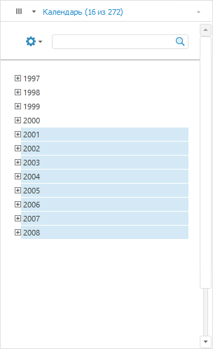
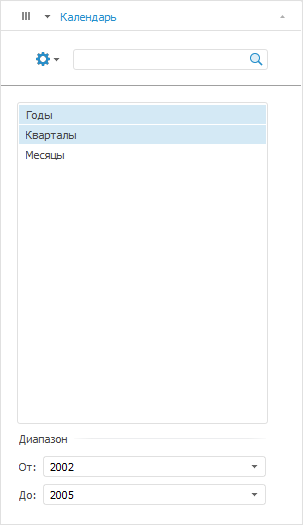
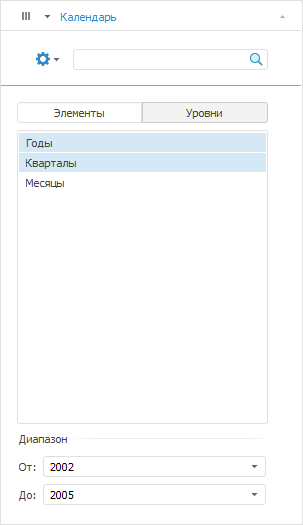

# Отметка элементов календарного измерения

Отметка элементов календарного измерения
-

# Отметка элементов календарного измерения

При работе с [отметкой
 элементов](Selection_of_the_dimension_elements.htm) календарного измерения доступен выбор режима отметки: элементы
 или уровни.

## Настройка режима отметки

Для настройки режима отметки элементов календарного измерения:

	- Нажмите кнопку  «Структура и параметры», расположенную
	 на вкладке «Данные» ленты
	 инструментов.

Примечание.
 В инструменте «Отчеты» необходимо
 выполнить команду главного меню «Сервис
 > Параметры».

	- В открывшемся окне перейдите на вкладку «[Структура источника
	 данных](UiAdhoc.chm::/Blocks/Gadgets/DS_structure.htm)».

	- Выберите вид отметки в раскрывающемся списке напротив наименования
	 календарного измерения.

Вид вкладки с календарным измерением на боковой панели зависит от выбранного
 режима отметки:

	- [Только по элементам](#elements_only);

	- [Только по уровням](#levels_only);

	- [По элементам и уровням](#elements_and_levels).

## Режим «Только по элементам»

Данный режим используется по умолчанию:

При работе с элементами доступны различные [варианты
 отметки](Selection_of_the_dimension_elements.htm#selectionvariants).

## Режим «Только по уровням»

Уровни, доступные для выбора, берутся из календарного справочника. Если
 для календарного измерения была применена [альтернативная
 иерархия](Hierarchies.htm#hierarchy), то список уровней будет сформирован на основании её уровней:

Режим «Уровни» недоступен, если:

	- календарное измерение было [зафиксировано](Dimension.htm#fixing);

Примечание.
 При переносе календарного измерения из фиксированных для отметки элементов
 измерения будет установлен режим «Только
 по элементам».

	- в справочнике нет уровней;

	- к календарному измерению применены [схемы
	 отметки](Selection_of_the_dimension_elements.htm#schemas) и [группы
	 элементов](Selection_of_the_dimension_elements.htm#group).

Для задания отметки:

[1. Отметьте
 элементы уровня](javascript:TextPopup(this))

	Для отметки элементов уровня доступны:

		- расширенная отметка элементов:

			- [отметка
			 уровня](Selection_of_the_dimension_elements.htm#level);

			- [применение
			 схемы отметки](Selection_of_the_dimension_elements.htm#schemas);

			- [отметка
			 группы](Selection_of_the_dimension_elements.htm#group);

		- редактирование списка измерения:

			- [добавление
			 агрегирующего элемента](Dimension_edit.htm#add_agregation);

			- [добавление
			 элемента «Промежуточный итог»
			 и «Итог»](Dimension_edit.htm#total_subtotal);

		- [сортировка
		 элементов измерения](Setting_view_of_the_dimension.htm#sorting_of_elements).

	На вкладке доступна множественная отметка элементов.

	При выборе уровня:

		- будут отмечены все элементы календарного измерения, соответствующие
		 данному уровню;

		- будет отмечен уровень, соответствующий первому отмеченному
		 элементу.

[2. Задайте границы
 периода](javascript:TextPopup(this))

	Примечание.
	 При задании границ периода доступны элементы только выбранных уровней.

	Значения границ периода формируются следующим образом:

		- первый отмеченный элемент соответствует началу периода;

		- последний отмеченный – концу периода.

	При этом будут отмечены соответствующие уровни, которые были в отметке.

## Режим «По элементам и уровням»

Данный режим предусматривает возможность переключения между режимами
 отметки: по элементам или по уровням:

В зависимости от установленного переключателя вид вкладки будет аналогичен
 вкладкам календарного измерения, для которых был задан режим «[Только по элементам](#elements_only)» или «[Только по уровням](#levels_only)».

См. также:

[Работа
 с элементами измерения](Selection_of_the_dimension_elements.htm)

		Справочная
		 система на версию 10.9
		 от 18/08/2025,
		 © ООО «ФОРСАЙТ»,
