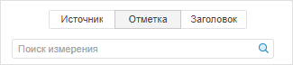
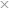
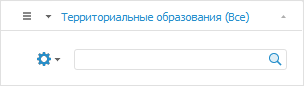
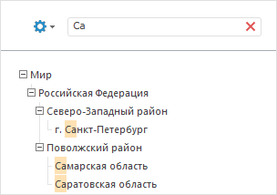
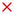
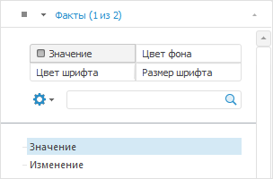
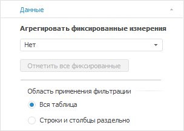
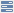

# Работа с элементами измерения

Работа с элементами измерения
-

# Работа с элементами измерения

	При работе с элементами измерения доступны [синхронизация
	 отметки](Selection_of_the_dimension_elements.htm#sync), поиск [измерения](Selection_of_the_dimension_elements.htm#search_dimension)
	 и[ элемента
	 измерения](Selection_of_the_dimension_elements.htm#search), [отметка
	 элементов измерения](Selection_of_the_dimension_elements.htm#selection), изменение отображения [наименования
	 элементов](Element_Names.htm).

## Синхронизация отметки

	Синхронизация отметки позволяет управлять отметкой измерений сразу
	 на нескольких листах.

	Настройка синхронизации зависит от используемого инструмента:

		- в инструменте «Аналитические
		 запросы (OLAP)» для синхронизации отметки присвойте измерениям
		 одинаковую группу синхронизации, используя раскрывающееся меню
		 кнопки  «Синхронизация» на вкладке «Отметка» ленты инструментов.

	Примечание.
	 Вкладка «Отметка» ленты
	 инструментов доступна при выборе группы вкладок «Отметка»
	 на боковой панели. Кнопка
	 «Синхронизация» доступна,
	 если в отчете содержится более одного листа.

	После этого изменение отметки в одном
	 из измерений группы будет приводить к установке аналогичной отметки
	 у всех остальных измерений группы.

	Для настройки текущих групп синхронизации
	 используйте окно «Настройка синхронизации».
	 Для открытия окна выберите пункт «Настроить»
	 раскрывающегося меню кнопки  «Синхронизация» на вкладке «Отметка» ленты инструментов.

		- в инструменте «Отчеты»
		 для синхронизации отметки создайте связи между срезами данных.
		 Подробное описание процесса синхронизации приведено в разделах
		 «[Синхронизация
		 измерений в срезах данных](UiReport.chm::/desktop/Source/Dim/Symc_dimensions.htm)» и «[Синхронизация
		 измерений отчета](UiReport.chm::/desktop/Source/Dim/Sync_dimentions_report.htm)»;

		- в инструменте «Аналитические
		 панели» для синхронизации отметки создайте связи между
		 блоками. Подробное описание процесса синхронизации приведено в
		 разделе: «[Настройка синхронизации измерений
		 источников данных](UiAdhoc.chm::/Blocks/Dimension_links.htm)».

	Дополнительно к синхронизации отметки можно использовать [синхронизацию
	 метрик](Dimension_type.htm#sync).

## Поиск измерения

	Примечание.
	 Доступно только в веб-приложении инструментов «Аналитические
	 запросы (OLAP)» и «Аналитические
	 панели».

	Поиск измерения производится из строки поиска, которая доступна
	 при выборе вкладки «Отметка»
	 на боковой панели:

	

	Введите в строку поиска наименование или часть наименования искомого
	 измерения. Поиск осуществляется по всем измерениям, включая частные
	 измерения.

	Поиск будет выполняться автоматически по мере ввода искомого текста.
	 В списке будут только те измерения, наименования которых содержат
	 вводимый текст.

	Для сброса результатов поиска нажмите кнопку 
	 «Очистить».

## Поиск элемента измерения

	Поиск элемента измерения производится из строки поиска, расположенной
	 в верхней части вкладки каждого измерения:

	

	В строку поиска введите искомый текст. Элементы, в которых встречается
	 заданная подстрока, будут выведены в дереве элементов с их родительскими
	 и дочерними элементами:

	

	Для очистки строки поиска нажмите кнопку .

## Отметка элементов измерения

	Отметка элементов измерения предназначена для выбора данных, содержащихся
	 в таблице, на основании которой строятся представления данных.

	При установке отметки элементов измерения в заголовке панели измерения
	 отображается количество выделенных элементов.

	Для изменения отметки измерения используйте:

		- различные [варианты
		 отметки](Selection_of_the_dimension_elements.htm#selectionvariants);

		- [альтернативные иерархии](Hierarchies.htm#hierarchy);

		- [схемы
		 отметки](Selection_of_the_dimension_elements.htm#selection_schemas);

		- [группы
		 элементов](Selection_of_the_dimension_elements.htm#selection_group);

		- [изменение
		 отметки из таблицы](UiAnalyticalArea.chm::/Working_with_table_data/Change_selection.htm).

	Изменение отметки производится с помощью:

	[мыши](javascript:TextPopup(this))

			- Щелчок на элементе приводит к инвертированию состояния
			 отметки.

			- Щелчок с удержанием клавиши SHIFT снимает отметку со
			 всех элементов и отмечает элементы (кроме свернутых), находящиеся
			 между сфокусированным элементом и элементом, на котором производится
			 щелчок.

			- Щелчок с удержанием клавиши CTRL приводит к установке
			 или снятию отметки для элемента и всех подчиненных ему элементов.

	[контекстного
	 меню измерения](javascript:TextPopup(this))

		В контекстном меню выберите вариант отметки.

	[ленты
	 инструментов](javascript:TextPopup(this))

		На вкладке «Отметка»
		 ленты инструментов выберите вариант отметки.

		Примечание.
		 Вкладка «Отметка» ленты
		 инструментов доступна при выборе группы вкладок «Отметка»
		 на боковой панели.

	[клавиатуры](javascript:TextPopup(this))

		Примечание.
		 Возможность доступна только в настольном приложении.

			- Нажатие клавиши UP/DOWN перемещает фокусную
			 рамку.

			- Нажатие клавиши RIGHT/LEFT раскрывает/сворачивает
			 иерархию элемента, на котором находится фокус.

			- Нажатие клавиши ПРОБЕЛ приводит к инвертированию
			 состояния отметки. При нажатии пробела можно удерживать клавишу
			 SHIFT или CTRL.

			- Нажатие клавиши ПРОБЕЛ с удержанием клавиши
			 CTRL приводит к инвертированию состояния отметки для элемента
			 и всех подчиненных ему элементов.

		Примечание.
		 Для списков с единичной отметкой (фиксированные измерения) перемещение
		 по элементам при помощи курсорных клавиш автоматически выделяет
		 и фокусирует элемент.

	При изменении отметки измерения все зависящие от него измерения
	 автоматически перестраиваются, после чего перестраиваются измерения,
	 зависящие от перестроенных и т.д.

	Изменение отметки в измерении, для которого настроена [синхронизация](Selection_of_the_dimension_elements.htm#sync),
	 приводит к установке аналогичной отметки у всех остальных измерений
	 группы. В инструменте «Аналитические
	 запросы (OLAP)» доступна [синхронизация
	 метрик](Dimension_type.htm#sync) между визуализаторами одного листа.

	Примечание.
	 В «Форсайт. Аналитическая платформа»
	 возможна настройка [ограничения
	 отметки](uiexpress.chm::/FAQ/SelectionLimit.htm).
	 При превышении ограничения визуализаторы не будут отображать данные,
	 вместо таблицы появится предупреждение.

### Варианты отметки

	При работе с вариантами отметки элементов измерения доступны следующие
	 операции:

	[Отметить
	 или снять отметку у элемента](javascript:TextPopup(this))

		Для отметки или снятия отметки элемента измерения щелкните по
		 нему на открытой вкладке с измерением.

	[Отметить
	 все](javascript:TextPopup(this))

		Для отметки всех элементов измерения в боковой панели откройте
		 вкладку с измерением, затем:

			- нажмите кнопку «Отметить
			 все» на вкладке «Отметка»
			 ленты инструментов;

			- выполните команду «Отметить
			 все» в контекстном меню элемента измерения в боковой
			 панели;

			- выполните команду «Отметить
			 все» в меню измерения  в боковой
			 панели.

		После выполнения одного из действий будут отмечены все элементы
		 измерения.

	[Отметить
	 с данными](javascript:TextPopup(this))

		Для отметки всех элементов измерения, по которым есть данные
		 в источнике:

			- Перейдите на вкладку с измерением на боковой панели.

			- Нажмите кнопку «Отметить
			 все с данными», расположенную
			 на вкладке «Отметка»
			 ленты инструментов.

		Примечание.
		 Возможность доступна в настольном приложении, если включено [кешировании
		 источника данных](UiNav.chm::/03_Objects/UiNav_Obj_BasicPropCache.htm).

	[Снять
	 отметку со всех](javascript:TextPopup(this))

		Для снятия отметки со всех элементов измерения в боковой панели
		 откройте вкладку с измерением, затем:

			- нажмите кнопку «Снять
			 отметку» на вкладке ленты «Отметка»;

			- выполните команду «Снять
			 отметку со всех» в контекстном меню элемента измерения
			 в боковой панели;

			- выполните команду «Снять
			 отметку со всех» в меню измерения 
			 в боковой панели.

		После выполнения одного из действий со всех элементов измерения
		 будет снята отметка.

	[Отметить
	 уровень](javascript:TextPopup(this))

		Для отметки уровня измерения:

			- Перейдите на вкладку с измерением на боковой панели.

			- Выберите уровень в раскрывающемся меню:

				- кнопки «Отметить
				 уровень» на вкладке ленты «Отметка»;

				- пункта «Расширенная
				 отметка > Отметить уровень» в контекстном меню
				 элемента измерения в боковой панели;

				- пункта «Расширенная
				 отметка > Отметить уровень» в меню измерения
				  в боковой
				 панели.

		После выполнения действий будет отмечен выбранный уровень измерения.

		Примечание.
		 Отметка уровня доступна для измерений с настроенными уровнями.

	[Отметить
	 подчиненные](javascript:TextPopup(this))

		Для отметки всех подчиненных элементов:

			- Перейдите на вкладку с измерением на боковой панели.

			- Выполните команду «Отметить
			 подчиненные по уровню» или «Отметить
			 все подчиненные»:

	- в контекстном меню элемента измерения в боковой панели;

	- в меню измерения  в
	 боковой панели.

	[Снять
	 отметку с подчиненных](javascript:TextPopup(this))

		Для снятия отметки со всех подчиненных элементов:

			- Перейдите на вкладку с измерением на боковой панели.

			- Выполните команду «Снять
			 отметку с подчиненных»:

	- в контекстном меню элемента измерения в боковой панели;

	- в меню измерения  в
	 боковой панели.

	[Копирование/вставка
	 отметки](javascript:TextPopup(this))

		Примечание.
		 Возможность доступна только в настольном приложении.

		Между измерениями регламентного отчёта, экспресс-отчёта и базы
		 данных временных рядов доступно копирование и вставка отметки
		 элементов, если измерения основаны на одном источнике данных.

		Для копирования в буфер обмена выбранной отметки элементов измерения:

			- выполните команду «Копировать»
			 в контекстном меню отметки;

			- нажмите сочетание клавиш CTRL+C или CTRL+INSERT.

		После выполнения команды выбранная отметка будет скопирована
		 в буфер обмена.

		Для вставки скопированной из буфера обмена отметки элементов
		 измерения:

			- выполните команду «Вставить»
			 контекстного меню;

			- нажмите сочетание клавиш CTRL+V, SHIFT+INSERT.

		При выполнении команды отметка из буфера обмена замещает текущую
		 отметку в измерении. Для дополнения существующей отметки выполняйте
		 команду с зажатой клавишей CTRL.

		Примечание.
		 Вставка отметки элементов измерения доступна, если в буфере обмена
		 находится отметка этого же измерения.

	[Множественная
	 отметка и агрегация в фиксированных измерениях](javascript:TextPopup(this))

		Для роли метрики «Значение»
		 реализована возможность задавать множественную отметку.

		Для множественной отметки в фиксированных измерениях перейдите
		 на вкладку «Отметка» боковой
		 панели и выберите измерение:

		

		Для агрегации фиксированных измерений:

			- в [аналитической
			 панели](UiAdhoc.chm::/UiAdhoc_Purpose.htm)
			 и [регламентном
			 отчёте](UiReport.chm::/UiReport_purpose.htm)
			 перейдите на вкладку «Данные»
			 из группы «Данные»
			 боковой панели;

			- в [экспресс-отчёте](UiExpress.chm::/purpose/UiExpress_Purpose.htm)
			 перейдите на вкладку «Данные»
			 из группы «Источник»
			 боковой панели.

		

		В раскрывающемся списке «Агрегировать
		 фиксированные измерения» выберите метод агрегации данных
		 фиксированных измерений:

			- Нет. Агрегация
			 данных не производится;

			- Сумма. По выбранным
			 элементам в фиксированных измерениях будет произведено суммирование;

			- Минимум. Из
			 выбранных элементов в фиксированных измерениях будет отображено
			 минимальное значение;

			- Максимум. Из
			 выбранных элементов в фиксированных измерениях будет отображено
			 максимальное значение;

			- Из измерений источника.
			 К данным фиксированного измерения применяется метод агрегации,
			 заданный в [настройках](UiNavObj.chm::/Cube/CreateCube/Master_Standart/UiMd_Cube_CreateCube_Master_Standart_7.htm)
			 источника данных.

		При работе с кубами ADOMD используется
		 агрегация, настроенная в соответствующих источниках ADOMD;

			- Из фактов источника.
			 В фиксированных измерениях с полной отметкой используется
			 [агрегация
			 на сервере](UiNavObj.chm::/Cube/Agregation.htm#fact) в соответствии с методами, заданными
			 для [фактов
			 источника](UiNavObj.chm::/Cube/CreateCube/Master_Standart/UiMd_Cube_CreateCube_Master_Standart_2.htm#agregation). Агрегацию из фактов источника
			 необходимо настраивать в том случае, когда в источнике для
			 одного набора измерений есть несколько записей, требующих
			 агрегации.

		Если в настройках агрегации измерения
		 куба установлен флажок «[Агрегировать
		 отмеченные элементы в измерении](uinavobj.chm::/cube/work_cube/tuning_agr/uimd_cube_work_cube_tuning_agr_basic.htm)», и для фактов на странице
		 «[Привязка фактов](UiNavobj.chm::/Cube/CreateCube/Master_Standart/UiMd_Cube_CreateCube_Master_Standart_2.htm)»
		 выбран метод агрегации, то агрегация рассчитывается на сервере
		 по отмеченным элементам в соответствии с методами, заданными для
		 фактов куба. При единичной отметке родительского элемента агрегация
		 выполняется только для его дочерних элементов. Если в отметке
		 только родительский элемент без дочерних, то данные в него не
		 будут агрегированы. Если флажок снят, то при множественной отметке
		 агрегация выполняется по всему измерению, независимо от отметки.
		 При единичной отметке родительского элемента агрегация выполняется
		 по дочерним элементам.

		Если в качестве таблицы фактов выбран
		 «[Источник
		 данных ODBC](UiNavObj.chm::/ODBC/UiDb_relational_ODBC.htm)», то в мастере стандартного куба для данного
		 источника доступна настройка расчёта [агрегации
		 на клиенте](uinavobj.chm::/Cube/CreateCube/Master_Standart/UiMd_Cube_CreateCube_Master_Standart_2.htm);

			- Среднее. По
			 выбранным элементам в фиксированных измерениях будет отображено
			 среднее значение.

		Примечание.
		 При выборе любого пункта списка, кроме «Нет»,
		 становится активной кнопка «Отметить
		 все фиксированные», при нажатии на которую будут отмечены
		 все элементы в фиксированных измерениях.

### Отметка элементов календарного измерения

	При работе с отметкой элементов календарного измерения доступен
	 выбор режима отметки: элементы или уровни. Подробное описание настройки
	 режима отметки приведено в статье «[Отметка
	 элементов календарного измерения](Selection_of_the_CalendarDimension_elements.htm)».

### Использование схемы отметки

	[Схема отметки](UiNavObj.chm::/reference_book/look-and-feel_Reference_book/UiMd_reference_book_look-and-feel_Scheme.htm)
	 - это объект репозитория, используемый в справочниках для автоматизации
	 выделения элементов по заданным правилам.

	Схема отметки будет применяться автоматически, пока не будет отключена.

	[Создание
	 схемы отметки по отмеченным элементам](javascript:TextPopup(this))

		Для создания схемы отметки измерения:

			- Перейдите на вкладку с измерением на боковой панели.

			- Выберите пункт «Создать
			 схему по отмеченным элементам» в раскрывающемся меню:

				- кнопки «Схема отметки»,
				 расположенной на вкладке «Отметка»
				 ленты инструментов;

				- «Расширенная отметка
				 > Применить схему отметки» в контекстном меню
				 элемента измерения в боковой панели;

				- «Расширенная отметка
				 > Применить схему отметки» меню измерения  в боковой панели.

		К элементам измерения будет применена созданная схема отметки.

		Примечание.
		 Если в измерении присутствует вычисляемый элемент, задана альтернативная
		 либо пользовательская иерархия, то создание схемы отметки недоступно.

	[Применение
	 схемы отметки](javascript:TextPopup(this))

		Для применения схемы отметки измерения:

			- Перейдите на вкладку с измерением на боковой панели.

			- Выберите схему отметки в раскрывающемся меню:

				- кнопки «Схема отметки»,
				 расположенной на вкладке «Отметка»
				 ленты инструментов;

				- «Расширенная отметка
				 > Применить схему отметки» в контекстном меню
				 элемента измерения в боковой панели;

				- «Расширенная отметка
				 > Применить схему отметки» меню измерения  в боковой панели.

		Для применения выбранной схемы при открытии отчета установите
		 флажок «При открытии отчета»,
		 для применения выбранной схемы при перестроении измерения установите
		 флажок «При перестроении измерения».
		 Можно установить оба флажка одновременно, в этом случае схема
		 будет применяться и при открытии отчета, и при перестроении измерения.

		Если схема отметки установлена, то изменение отметки отдельных
		 элементов недоступно. Для отключения применения схемы отметки
		 выберите пункт «Сбросить».

		При применении схемы отметки на боковой панели у измерения появится
		 пиктограмма .

	[Редактирование
	 схемы отметки](javascript:TextPopup(this))

		Примечание.
		 Возможность доступна только в настольном приложении.

		Для редактирования схемы отметки:

			- Перейдите на вкладку с измерением на боковой панели.

			- Выберите пункт «Редактировать»
			 в раскрывающемся меню:

				- кнопки «Схема
				 отметки», расположенной на вкладке «Отметка»
				 ленты инструментов;

				- «Расширенная отметка
				 > Применить схему отметки» в контекстном меню
				 элемента измерения в боковой панели;

				- «Расширенная отметка
				 > Применить схему отметки» меню измерения  в боковой панели.

		В открывшемся окне «[Схемы отметки](UiNavObj.chm::/reference_book/look-and-feel_Reference_book/UiMd_reference_book_look-and-feel_Scheme.htm)»
		 добавьте примитивы схемы отметки, в соответствии с которыми будет
		 осуществляться отметка элементов.

	Примечание.
	 Использование схемы отметки недоступно для [комбинированного
	 измерения](Dimension_combine.htm).

### Использование группы элементов

	[Группа элементов](UiNavObj.chm::/reference_book/look-and-feel_Reference_book/UiMd_reference_book_look-and-feel_Group.htm)
	 - это объект репозитория, используемый в справочниках для ограничения
	 списка доступных элементов.

	[Создание
	 группы элементов по отмеченным элементам](javascript:TextPopup(this))

		Для создания группы элементов измерения:

			- Перейдите на вкладку с измерением на боковой панели.

			- Выберите пункт «Создать
			 группу по отмеченным элементам» в раскрывающемся меню:

				- кнопки «Отметить
				 группу», расположенной на вкладке «Отметка»
				 ленты инструментов;

				- «Расширенная отметка
				 > Отметить группу» в контекстном меню элемента
				 измерения в боковой панели;

				- «Расширенная отметка
				 > Отметить группу» меню измерения  в боковой панели.

		В измерении будут отмечены только те элементы, которые входят
		 в созданную группу.

		Примечание.
		 Если в измерении присутствует вычислимый элемент, задана альтернативная
		 либо пользовательская иерархия, то создание группы элементов недоступно.

	[Отметка
	 группы элементов](javascript:TextPopup(this))

		Для отметки группы элементов измерения:

			- Перейдите на вкладку с измерением на боковой панели.

			- Выберите группу элементов в раскрывающемся меню:

				- кнопки «Отметить
				 группу», расположенной на вкладке «Отметка»
				 ленты инструментов;

				- «Расширенная отметка
				 > Отметить группу» в контекстном меню элемента
				 измерения в боковой панели;

				- «Расширенная отметка
				 > Отметить группу» меню измерения  в боковой панели.

		Применение отметки «Группа
		 элементов» снимет отметку со всех элементов и отметит группу.

		Пункт «Сбросить» аналогичен
		 команде «Снять отметку со всех».

	[Редактирование
	 группы элементов](javascript:TextPopup(this))

		Примечание.
		 Возможность доступна только в настольном приложении.

		Для редактирования группы элементов:

			- Перейдите на вкладку с измерением на боковой панели.

			- Выберите пункт «Редактировать»
			 в раскрывающемся меню:

				- кнопки «Отметить
				 группу», расположенной на вкладке «Отметка»
				 ленты инструментов;

				- «Расширенная отметка
				 > Отметить группу» в контекстном меню элемента
				 измерения в боковой панели;

				- «Расширенная отметка
				 > Отметить группу» меню измерения  в боковой панели.

		В открывшемся окне «[Группы элементов](UiNavObj.chm::/reference_book/look-and-feel_Reference_book/UiMd_reference_book_look-and-feel_Group.htm)»
		 добавьте примитивы группы элементов, в соответствии с которыми
		 будет сформирован набор элементов.

	Примечание.
	 Использование группы элементов недоступно для [комбинированного
	 измерения](Dimension_combine.htm).

### Особенности отметки элементов измерения

	Продукт «Форсайт. Аналитическая платформа»
	 позволяет настроить репозиторий так, что измерения, в которых снята
	 отметка, будут рассматриваться в качестве измерений с полностью установленной
	 отметкой. Таким образом, визуализаторы будут строиться по полной отметке
	 измерения, несмотря на то, что отметка в измерении будет полностью
	 снята.

	Для того, чтобы рассматривать пустую отметку измерений как полную,
	 установите флажок «Рассматривать
	 пустую отметку как полную» на вкладке «[Поведение](UiNav.chm::/02_Navigator/Repo_Default.htm#behavior)»
	 в диалоге «Параметры».

	Примечание.
	 Данное поведение не влияет на фиксированные измерения метрик.

См. также:

[Настройка
 измерений и отметка элементов](Dimension.htm)

		Справочная
		 система на версию 10.9
		 от 18/08/2025,
		 © ООО «ФОРСАЙТ»,
