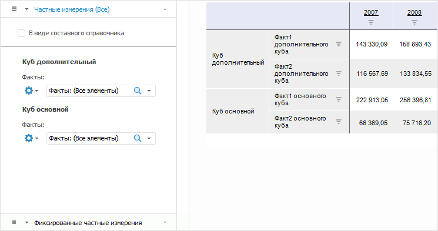
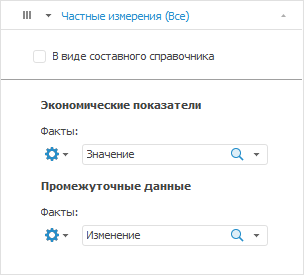
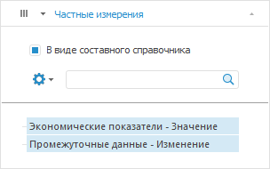
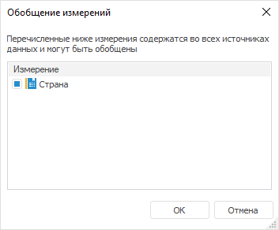

# Использование частных измерений

Использование частных измерений
-

# Использование частных измерений

Частные измерения - это уникальные
 измерения источника данных, которыми обладает только один из источников
 данных на листе отчёта.

Работа с частными измерениями доступна в [регламентных отчётах](UIReport.chm::/UiReport_purpose.htm),
 [экспресс-отчётах](UIExpress.chm::/purpose/UiExpress_Purpose.htm)
 и визуализаторах [аналитических панелей](UIAdhoc.chm::/UiAdhoc_Purpose.htm),
 созданных по нескольким источникам.

Для создания экспресс-отчёта по
 нескольким источникам обратитесь к статье «[Создание
 отчёта по нескольким источникам](UIExpress.chm::/ChangeNote/UiExpress_Tabl_ChangeNote_PrivDim.htm)».

Для создания визуализатора аналитической
 панели по нескольким источникам обратитесь к статье «[Выбор
 и настройка источника данных визуализатора](UiAdhoc.chm::/Blocks/Gadgets/Panels/Select_DataSource.htm#show_data)».

Для создания регламентного отчёта с несколькими источниками создайте
 [форму
 ввода](DataEntryForms.chm::/DataEntryForms_Purpose.htm), содержащую в [структуре
 показателей](DataEntryForms.chm::/Desktop/Table/Factors_Structure.htm) более одного куба. Автоматически сформированный
 регламентный отчёт будет доступен в списке объектов [навигатора](GetStarted.chm::/Interface/Interface_Navigator.htm)
 при переходе к форме ввода через дерево объектов.

Например, у источников данных отчёта есть по одному уникальному измерению,
 которое содержит факты куба. Расположив частные измерения в столбцах,
 мы получим отчёт с чётким разделением данных по источнику:

Примечание.
 Измерения фактов куба всегда являются частными измерениями.

[Отображение/скрытие
 наименований источников данных в таблице](javascript:TextPopup(this))

	Для отображения/скрытия наименования источников данных в таблице
	 используйте диалог «Структура и параметры».

	Для вызова диалога нажмите кнопку  «Структура
	 и параметры» на вкладке «Данные»
	 на ленте инструментов. На вкладке диалога установите/снимите флажки
	 напротив источников, наименования которых требуется отобразить/скрыть.
	 В результате в таблице наименования источников будут отображены/скрыты.

	Для получения подробной информации
	 обратитесь к статье «[Настройка
	 структуры источника данных](UIExpress.chm::/purpose/DS_structure.htm)».

При работе с частными измерениями используются вкладки «Частные
 измерения» и «Фиксированные частные
 измерения» на группе вкладок «Отметка»
 боковой панели.

Работа с элементами частных измерений аналогична работе с элементами
 [общих измерений](Dimension.htm), за исключением особенностей,
 описанных ниже.

[Фиксация частного
 измерения](javascript:TextPopup(this))

	Для перемещения выбранного частного измерения в фиксированные:

		- Нажмите кнопку 
		 «Настройки».

		- В раскрывшемся меню кнопки выберите «В
		 фиксированных частных».

	Измерение будет зафиксировано. Для работы с ним будет отображена
	 вкладка «Фиксированные частные измерения».
	 Работа с данной вкладкой аналогична работе со вкладкой «Частные
	 измерения».

	Примечание.
	 Если [не выбран вариант
	 агрегации](Selection_of_the_dimension_elements.htm), то после фиксации измерения доступна отметка только
	 одного элемента измерения.

[Снятие фиксации
 частного измерения](javascript:TextPopup(this))

	Для работы с зафиксированными частными измерениями перейдите на
	 вкладку «Фиксированные частные измерения».

	Для перемещения выбранного фиксированного частного измерения обратно
	 в частные измерения:

		- Нажмите кнопку 
		 «Настройки».

		- В раскрывшемся меню кнопки выберите «В
		 частных».

	С измерения будет снята фиксация. Для работы со свободными частными
	 измерениями используйте вкладку «Частные
	 измерения».

[Создание составного
 измерения](javascript:TextPopup(this))

	Составное измерение - измерение,
	 состоящее из элементов, отмеченных в частных измерениях.

	Для создания составного измерения на вкладке «Частные
	 измерения» или «Фиксированные
	 частные измерения» боковой панели установите флажок «В виде составного справочника».

	Внешний вид вкладки «Частные измерения»
	 до преобразования:

	

	Частные измерения в виде одного составного измерения:

	

	Составное измерение представляет собой дерево, состоящее из отмеченных
	 элементов частных измерений. Для составного измерения доступно [изменение отметки](Selection_of_the_dimension_elements.htm),
	 поиск и сортировка.

[Удаление составного
 измерения](javascript:TextPopup(this))

	Для удаления составного измерения снимите флажок «В
	 виде составного справочника».

	На вкладке «Частные измерения» или
	 «Фиксированные частные измерения»
	 боковой панели будет отображён список частных измерений.

[Перенос
 измерения из общих в частные](javascript:TextPopup(this))

	Частное измерение может быть создано на основе общего измерения.

	Примечание.
	 Возможность доступна, если источники данных содержат несколько общих
	 измерений.

	Для создания частного измерения на основе общего:

		- Нажмите кнопку с пиктограммой ( «По столбцам», 
		 «По строкам» или
		  «Фиксированные»),
		 расположенную слева от наименования измерения.

		- В раскрывшемся меню кнопки выберите пункт «В
		 частных измерениях».

	Выбранное измерение будет преобразовано в частное и перемещено на
	 вкладку «Частные измерения».

[Перенос
 измерения из частных в общие](javascript:TextPopup(this))

	Частное измерение может быть перенесено в список общих. Для этого:

		- Нажмите кнопку 
		 «Настройки».

		- В раскрывшемся меню кнопки выберите пункт «В
		 общих».

	Выбранное измерение будет преобразовано в общее и перемещено на
	 отдельную вкладку.

	При переносе частного измерения в общие оно размещается в том же
	 положении ( «По
	 столбцам»,  «По строкам» или 
	 «Фиксированные»), в котором
	 размещены частные измерения.

[Обобщение измерений](javascript:TextPopup(this))

	Обобщение - исключение общего
	 измерения из частных измерений.

	Примечание.
	 Возможность доступна, если какое-либо общее измерение было преобразовано
	 в частное измерение.

	Для обобщения измерений:

		- Нажмите кнопку с пиктограммой ( «По столбцам», 
		 «По строкам» или
		  «Фиксированные»),
		 расположенную слева от наименования вкладки «Частные
		 измерения».

		- В раскрывшемся меню кнопки выберите пункт «В
		 общих измерениях».

	Будет открыто окно со списком измерений, которые могут быть преобразованы
	 в общие. Например:

	

	Установите флажок напротив измерения, которое нужно перенести, и
	 нажмите кнопку «ОK».

[Изменение порядка
 частных измерений](javascript:TextPopup(this))

	Для задания порядка отображения частных измерений:

		- переместите выбранное частное измерение в необходимую позицию,
		 используя механизм Drag&Drop;

		- используйте команды меню 
		 «Настройки» частного измерения:
		 «Вверх», «Вниз»
		 или «Поменять местами с».

Примечание.
 В частном измерении невозможно добавить [вычисляемый
 элемент](Dimension_edit.htm#add_elem).

См. также:

[Настройка
 измерений и отметка элементов](Dimension.htm) | [Создание
 отчёта по нескольким источникам](UIExpress.chm::/ChangeNote/UiExpress_Tabl_ChangeNote_PrivDim.htm)

		Справочная
		 система на версию 10.9
		 от 18/08/2025,
		 © ООО «ФОРСАЙТ»,
