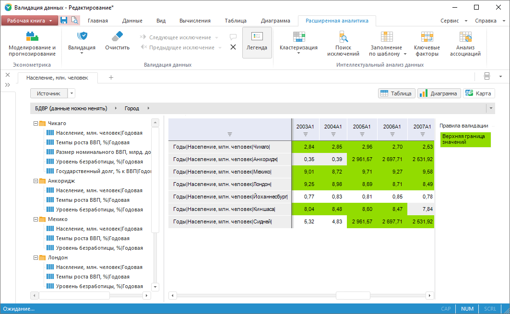
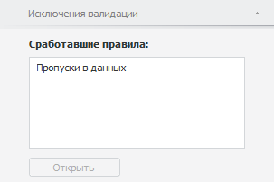
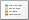
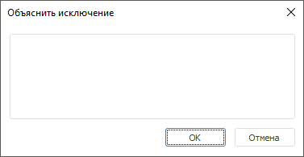

# Работа с результатами валидации

Работа с результатами валидации
-

# Работа с результатами валидации

В процессе [выполнения](UiDw.chm::/Workbook/Data_validation.htm#vrule_exec)
 правила валидации выявляются исключения. Исключения - это наблюдения или
 временные ряды, не соответствующие условиям правила валидации.

После выполнения правила валидации:

	- исключения отображаются в области выполнения валидации, если
	 правило валидации выполнялось в экспресс-отчёте, аналитической панели,
	 регламентном отчёте, на текущем листе рабочей книги или в текущей
	 рабочей книги;

	- исключения выгружаются на новый лист, если правило валидации
	 выполнялось в текущей БД временных рядов рабочей книги. Ряды, в которых
	 содержатся исключения, доступны в [дереве рядов](UiDw.chm::/Purpose/UiDw_Purpose_Object.htm)
	 нового листа. Дополнительно исключения сохраняются в виде дочернего
	 объекта для правила валидации и доступны на вкладке боковой панели
	 «[Правила валидации](UiDw.chm::/Workbook/Data_validation.htm)». Формат наименования объекта: Запуск <дата и время запуска>.
	 Например: Запуск 01.03.2018 15:45:00.

[Стиль оформления исключений](Data_Validation_Types.htm#style)
 зависит от настроек правила валидации.

[Пример
 результатов валидации](javascript:TextPopup(this))

	

Для работы с исключениями валидации предназначены вкладки:

	- «Расширенная аналитика»
	 на ленте инструментов;

	- «Исключения валидации»
	 на боковой панели.

[Для отображения
 вкладки](javascript:TextPopup(this))

		- Убедитесь, что боковая панель отображается.

		- Выделите наблюдение в [таблице данных](UiDw.chm::/Workbook/UiDw_Series.htm).

		- Для просмотра исключений временного ряда, содержащего наблюдение,
		 установите переключатель «Ряд»
		 на боковой панели, для просмотра исключений наблюдения - переключатель
		 «Наблюдение».

		- Перейдите на вкладку «Исключения
		 валидации»:

	

## Операции с правилами валидации

[Просмотр и
 редактирование параметров правила валидации](javascript:TextPopup(this))

	Для открытия правила валидации на просмотр и редактирование дважды
	 щелкните по [легенде валидации](#validation_legend).

	Будет открыто окно «[Правило
	 валидации](Data_Validation_Types.htm)».

	Совет. Для открытия
	 правила валидации можно использовать вкладку «[Правила
	 валидации](UiDw.chm::/Workbook/Data_validation.htm#vrule_edit)» на боковой панели.

[Отображение/скрытие
 легенды валидации](javascript:TextPopup(this))

	Легенда предназначена для
	 демонстрации стиля оформления исключений в правилах валидации.

	Для отображения легенды нажмите кнопку  «Легенда» на вкладке «Расширенная
	 аналитика» ленты инструментов. Легенда содержит стили оформления
	 исключений и названия только тех правил, которые выявили исключения.

	Для скрытия легенды переведите кнопку  «Легенда» в ненажатое состояние.

## Операции с исключениями

[Просмотр правил,
 выявивших исключение](javascript:TextPopup(this))

		- Выделите ряд/наблюдение с исключением.

		- Перейдите на вкладку боковой панели «Исключения
		 валидации».

	На вкладке отображаются все правила, выявившие исключение ряда/наблюдения.

	Для просмотра и редактирования параметров правила выделите его и
	 нажмите кнопку «Открыть».
	 Будет открыт диалог «[Правило
	 валидации](Data_Validation_Types.htm)».

[Перемещение
 по исключениям](javascript:TextPopup(this))

	Для быстрого перемещения между исключениями в таблице данных используйте
	 кнопки на вкладке «Расширенная аналитика»
	 ленты инструментов:

		- . Выделяет предыдущее исключение;

		- . Выделяет следующее исключение;

		- . Выделяет первое исключение;

		- . Выделяет последнее исключение.

	Перемещение выполняется относительно текущей выделенной ячейки.

[Очистка
 результатов валидации](javascript:TextPopup(this))

	Для очистки результатов валидации нажмите кнопку  «Очистить» на вкладке «Расширенная аналитика» ленты инструментов.

	Список запущенных валидаций и их результатов будет очищен.

	Вкладки «Расширенная аналитика»
	 на ленте инструментов и «Исключения
	 валидации» на боковой панели будут недоступны.

## Работа с объяснениями исключений

[Объяснение
 исключений](javascript:TextPopup(this))

	Каждое исключение может быть объяснено пользователем. Для объяснения
	 исключения:

		- Выделите исключение в таблице данных.

		- Нажмите кнопку  «Объяснить» на вкладке «Расширенная аналитика» ленты
		 инструментов. Будет открыто окно «Объяснить
		 исключение»:

	

		- Введите текст объяснения.

	В ячейке с объясненным исключением будет отображен красный уголок.

[Просмотр объяснений
 исключений](javascript:TextPopup(this))

	Для просмотра текста объяснения наведите указатель мыши на ячейку.
	 Объяснение будет отображено в виде всплывающей подсказки.

[Скрытие
 объясненных исключений](javascript:TextPopup(this))

	Для скрытия объясненных исключений нажмите кнопку  «Скрыть объясненные исключения» на
	 вкладке «Расширенная аналитика»
	 ленты инструментов.

	Исключения, для которых дано объяснение, будут скрыты, т.е. ячейки
	 будут оформлены стандартным стилем. Красный уголок, информирующий
	 о наличии объяснения, будет оставлен.

[Удаление объяснения
 для исключений](javascript:TextPopup(this))

		- Выделите объясненное исключение в таблице данных.

		- Нажмите кнопку  «Объяснить» на вкладке «Расширенная аналитика» ленты
		 инструментов. Будет открыт диалог «Объяснить
		 исключение».

		- Удалите текст объяснения.

	Объяснение будет удалено.

Операции, доступные только при валидации данных в текущей БД временных
 рядов:

[Повторный просмотр
 результатов валидации](javascript:TextPopup(this))

	Для повторного просмотра результатов валидации выделите результат
	 валидации на вкладке боковой панели «[Правила
	 валидации](UiDw.chm::/Workbook/Data_validation.htm)». Затем:

		- выполните команду «Открыть»
		 в контекстном меню;

		- дважды щёлкните по результатам.

	Лист с результатами валидации будет добавлен в текущую рабочую книгу.

[Фильтрация
 результатов по уровню важности](javascript:TextPopup(this))

	Фильтрация применяется к дереву рядов и доступна, если:

		- Выполнялась группа правил валидации.

		- Для правил, входящих в группу, был установлен различный
		 [уровень важности](Data_Validation_Types.htm#importance).

	Для фильтрации результатов используйте группу кнопок, расположенных
	 в правом верхнем углу рабочей книги:

	

	Кнопки расположены слева направо по степени возрастания важности:
	 крайняя левая кнопка - минимальная важность, крайняя правая - максимальная.

	Для отображения только рядов, выявленных правилом определенного
	 уровня важности, нажмите кнопку, которая соответствует требуемому
	 уровню важности.

	Для отображения всех рядов, выявленных группой правил валидации,
	 переведите все кнопки в ненажатое состояние.

[Удаление
 результатов валидации](javascript:TextPopup(this))

	Для удаления результатов валидации выделите результат валидации
	 на вкладке «[Правила валидации](UiDw.chm::/Workbook/Data_validation.htm)» боковой панели. Затем:

		- нажмите кнопку «Удалить»;

		- выполните команду «Удалить»
		 в контекстном меню;

		- нажмите сочетание клавиш CTRL+DELETE. Возможность доступна
		 только в настольном приложении.

	Будет запрошено подтверждение выполняемого действия.

См. также:

[Настройка
 правила валидации](Data_Validation_Types.htm)

		Справочная
		 система на версию 10.9
		 от 18/08/2025,
		 © ООО «ФОРСАЙТ»,
