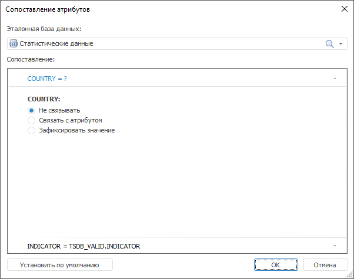

# Сопоставление атрибутов

Сопоставление атрибутов
-

# Сопоставление атрибутов

Диалог предназначен для задания соответствия атрибутов сравниваемой
 БД атрибутам эталонной БД.

[Для отображения
 редактора выражения](javascript:TextPopup(this))

		- [Создайте
		 правило валидации](UiDw.chm::/Workbook/Data_validation.htm#vrule_create) типа «Сравнение
		 с базой данных временных рядов» или [откройте
		 для редактирования](UiDw.chm::/Workbook/Data_validation.htm#vrule_edit)  существующее правило.

		- Нажмите кнопку «Сопоставление
		 атрибутов».

Задайте параметры сопоставления атрибутов:

	- Эталонная база данных.
	 Выберите БД временных рядов, с которой будет выполняться сравнение.
	 По умолчанию выбрана БД, указанная в диалоге настройки правила валидации
	 «[Сравнение
	 с базой данных временных рядов](Validation_types/Cross-Database_comparison.htm)»;

	- Сопоставление. В области
	 содержатся вкладки, соответствующие атрибутам эталонной БД. Наименование
	 вкладок зависит от типа сопоставления.

	Задайте сопоставление для каждого атрибута эталонной БД. Используйте
	 переключатели:

	-

		- Не связывать. Атрибут
		 не участвует в сравнении.

		Формат наименования вкладки: <идентификатор
		 атрибута эталонной БД> = ?;

		- Связать с атрибутом.
		 Атрибут эталонной БД соответствует атрибуту в исходной БД. Выберите
		 требуемый атрибут в списке обязательных атрибутов исходной БД,
		 доступном после установки переключателя.

		Формат наименования вкладки: <идентификатор
		 атрибута эталонной БД> = <идентификатор сравниваемой БД>.<идентификатор
		 атрибута>;

		- Зафиксировать значение.
		 Сравнение выполняется по заданному значению атрибута. Укажите
		 требуемое значение в списке значений атрибута, доступном после
		 установки переключателя.

		Формат наименования вкладки: <идентификатор
		 атрибута эталонной БД> = <значение атрибута>.

Примечание.
 Если идентификатор атрибута в эталонной БД совпадает с идентификатором
 атрибута в исходной БД, то для таких атрибутов автоматически будет установлено
 соответствие типа «Связать с атрибутом».

Для восстановления связей атрибутов, созданных автоматически, нажмите
 кнопку «Установить по умолчанию».

См. также:

[Настройка
 правила валидации](Data_Validation_Types.htm) | [Сравнение
 с базой данных временных рядов](Validation_types/Cross-Database_comparison.htm)

		Справочная
		 система на версию 10.9
		 от 18/08/2025,
		 © ООО «ФОРСАЙТ»,
