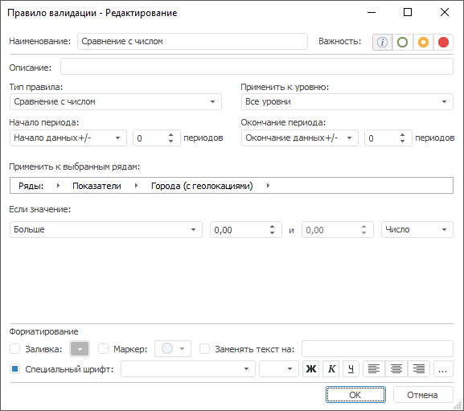
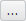

# Настройка правила валидации

Настройка правила валидации
-

# Настройка правила валидации

Для настройки параметров правила валидации используйте диалог «Правило валидации». Диалог отображается
 при [создании](UiDw.chm::/Workbook/Data_validation.htm#vrule_create)
 нового или [редактировании](UiDw.chm::/Workbook/Data_validation.htm#vrule_edit)
 существующего правила валидации.

Вид диалога и набор параметров различается в зависимости от типа правила
 валидации. Например:

Общие настройки, выполняемые для всех правил валидации:

[Редактирование
 наименования и описания](javascript:TextPopup(this))

	Используйте поля «Наименование»
	 и «Описание».

	Примечание.
	 Возможность доступна, если правило создается или редактируется с помощью
	 вкладки «[Правила валидации](UiDw.chm::/Workbook/Data_validation.htm)» на боковой панели.

[Выбор
 типа валидации](javascript:TextPopup(this))

	Используйте раскрывающийся список «Тип
	 правила». Доступные типы:

		- [Пропуски
		 в данных](Validation_types/Missing_data.htm). Выявляет пропущенные значения в данных;

		- [Пропуски
		 в метаданных](Validation_types/Missing_metadata.htm). Выявляет пропущенные значения в метаданных;

		- [Сравнение версий данных](Validation_types/Cross-Version_data_comparison.htm). Сравнивает
		 текущую и указанную версии значений временных рядов. Актуально,
		 если ряды хранятся в [версионной](UiNavObj.chm::/TimeSeriesDatabase/TS_Attributes.htm)
		 БД временных рядов;

		- [Сравнение уровней динамики](Validation_types/Cross-Frequency_comparison.htm).
		 Сравнивает значения по различным уровням календарной динамики;

		- [Сравнение
		 с числом](Validation_types/Level_analysis.htm). Сравнивает значения с заданным числом;

		- [Анализ
		 темпа роста](Validation_types/Growth_rate_analysis.htm). Анализирует темп роста значений;

		- [Сравнение
		 отношения наблюдений](Validation_types/Ratio.htm). Сравнивает отношение значений временных
		 рядов или данных стандартного куба со значениями указанного ряда
		 или измерения по заданным параметрам;

		- [Сравнение
		 трендов](Validation_types/Trend_analysis.htm). Сравнивает тренд временных рядов или данных стандартного
		 куба с трендом указанного ряда или измерения;

		- [Сравнение
		 по выражению](Validation_types/Custom_analysis.htm). Сравнивает временные ряды или данные стандартного
		 куба с выражением, заданным пользователем;

		- [Анализ
		 статистических выбросов](Validation_types/Statistical_outlier.htm). Выявляет статистические выбросы в
		 данных;

		- [Анализ
		 корреляционной зависимости](Validation_types/Correlation_analysis.htm). Выявляет корреляционную зависимость
		 между временными рядами или данными стандартного куба и заданным
		 рядом или измерением;

		- [Сравнение версий метаданных](Validation_types/Cross-Version_metadata_comparison.htm).
		 Сравнивает текущую и указанную версии метаданных временных рядов.
		 Актуально, если ряды хранятся в [версионной](UiNavObj.chm::/TimeSeriesDatabase/TS_Attributes.htm)
		 БД временных рядов;

		- [Анализ
		 отклонений в компонентах](Validation_types/Component_mismatch.htm). Сравнивает отклонения между результирующим
		 рядом и исходными рядами, на основе которых был получен результирующий
		 ряд;

		- [Сравнение с базой данных
		 временных рядов](Validation_types/Cross-Database_comparison.htm). Сравнивает значения временных рядов
		 со значениями в указанной БД временных рядов.

[Установка
 уровня важности](javascript:TextPopup(this))

	Установите требуемый переключатель в группе «Важность».
	 Переключатели расположены слева направо по степени возрастания важности.
	 Таким образом, крайний левый переключатель - минимальная важность,
	 крайний правый - максимальная.

	В дальнейшем уровень важности используется для фильтрации [результатов
	 выполнения](Calculation_result.htm) группы валидации в текущей БД временных рядов или наблюдений
	 стандартного куба.

[Выбор
 календарной динамики проверяемых данных](javascript:TextPopup(this))

	Укажите календарную динамику проверяемых данных в раскрывающемся
	 списке «Применить к уровню».

	Совет. Для выполнения
	 валидации данных по всем календарным уровням временных рядов или календарного
	 измерения стандартного куба выберите значение «Все
	 уровни» в раскрывающемся списке «Применить
	 к уровню». Возможность доступна для всех правил валидации кроме
	 «[Сравнение
	 уровней динамики](Validation_types/Cross-Frequency_comparison.htm)».

[Настройка
 периода расчёта валидации](javascript:TextPopup(this))

	Используйте поле «Начало периода»
	 для задания даты начала и поле «Окончание
	 периода» для задания даты окончания валидации данных. Укажите
	 способ расчета даты начала/окончания периода:

		- Точная дата. Укажите
		 дату в соответствующем редакторе дат;

		- Начало/окончание данных
		 +/-. Дата равна первой/последней фактической дате входного
		 ряда плюс число периодов, указанных в соответствующем редакторе
		 чисел;

		- Сегодня +/-. Дата
		 равна текущей дате плюс число периодов, указанных в соответствующем
		 редакторе чисел.

[Ограничение
 проверяемых данных](javascript:TextPopup(this))

	Для расчёта правила валидации только на заданных рядах создайте
	 фильтр. Для этого используйте цепочку навигации «Применить
	 к выбранным рядам».

	С помощью цепочки навигации укажите ряды, для которых будет рассчитываться
	 правило валидации. Принципы работы с цепочкой навигации в диалоге
	 «Правило валидации» аналогичны
	 принципам работы с цепочкой навигации в [дереве рядов](UiDw.chm::/Purpose/UiDw_Purpose_Object.htm).

	Валидация будет рассчитана только для указанных рядов.

	Примечание.
	 Если в инструментах «Аналитические
	 запросы (OLAP)», «Отчеты»,
	 «Аналитические панели» для
	 валидации не задан фильтр, то она будет рассчитана по отметке измерений
	 в отчете. Если фильтр задан, то валидация рассчитывается по пересечению
	 отметок измерения отчета и фильтра.

[Настройка
 стиля оформления исключений](javascript:TextPopup(this))

	Настройка стиля предназначена для визуального выделения наблюдений,
	 не соответствующих условиям правила валидации ([исключений](Calculation_result.htm)).

	Для настройки стиля используйте элементы группы «Форматирование».
	 Доступны следующие варианты оформления исключений:

		- Заливка
		 фона. Для заливки фона ячеек, содержащих исключения, установите
		 флажок «Заливка» и выберите
		 требуемый цвет заливки в раскрывающейся палитре цветов;

		- Отображение
		 маркера. Для отображения маркера в ячейках, содержащих
		 исключения, установите флажок «Маркер»
		 и выберите требуемый маркер в раскрывающемся меню;

		- Замена
		 текста. Для замены текста в ячейках, содержащих исключения,
		 на какой-либо текст установите флажок «Заменять
		 текст на» и введите требуемый текст;

	Примечание.
	 Замена текста доступна только в настольном приложении.

		- Применение
		 особого шрифта. Для выделения текста ячеек, содержащих
		 исключения, особым шрифтом задайте его параметры.

	Примечание.
	 В настольном приложении для настройки параметров шрифта установите
	 флажок «Специальный шрифт».

	Параметры шрифта:

			- Шрифт. Выберите
			 один из шрифтов, установленных в операционной системе;

			- Размер шрифта.
			 Установите требуемый размер шрифта. Размер задаётся в пунктах,
			 и его можно выбрать из раскрывающегося списка или ввести вручную.
			 Диапазон допустимых значений: [1, 72];

			- Начертание текста.
			 Нажмите кнопки, задающие начертание шрифта:

				- Ж. Полужирное
				 начертание;

				- К.
				 Курсивное начертание;

				- Ч.
				 Подчеркивание текста.

	При нажатой кнопке будет использоваться
	 соответствующий стиль начертания. Доступно использование нескольких
	 стилей одновременно, например, нажатие кнопок «Ж»
	 и «К»
	 даёт полужирное курсивное начертание;

			- Цвет шрифта.
			 Выберите цвет шрифта в раскрывающейся палитре цветов. Параметр
			 доступен только в веб-приложении;

			- Выравнивание текста
			 в ячейке. Задайте выравнивание текста относительно
			 ячейки:

				- .
				 По левому краю. Используется по умолчанию;

				- .
				 По центру;

				- .
				 По правому краю;

				- .
				 По ширине. Параметр доступен только в веб-приложении;

	Примечание.
	 В настольном приложении доступна настройка дополнительных параметров
	 стиля для исключений. Нажмите кнопку . Будет отображен
	 диалог «Параметры оформления для
	 валидации» для настройки [шрифта](UiNav.chm::/GUI/Format/UiReport_Table_Attribute_Type.htm),
	 [заливки](UiNav.chm::/GUI/Format/UiReport_Table_Attribute_View.htm),
	 [выравнивания](UiNav.chm::/GUI/Format/UiReport_Table_Attribute_Arrange.htm)
	 и [границ](UiNav.chm::/GUI/Format/UiReport_Table_Attribute_Border.htm)
	 ячеек с исключениями.

См. также:

[Работа
 с результатами валидации](Calculation_result.htm)

		Справочная
		 система на версию 10.9
		 от 18/08/2025,
		 © ООО «ФОРСАЙТ»,
