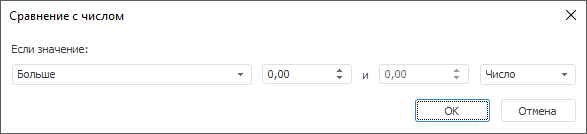

# Сравнение с числом: быстрая валидация данных

Сравнение с числом: быстрая валидация данных
-

# Сравнение с числом

Сравнивает значения временных рядов с заданным числом.

Примечание.
 Готовое правило валидации доступно только из инструмента «Анализ
 временных рядов».

[Для выполнения
 готового правила валидации](javascript:TextPopup(this))

		- Перейдите на вкладку «Расширенная
		 аналитика» на ленте инструментов.

		- Выполните команду «Сравнение
		 с числом» в раскрывающемся меню кнопки  Валидация».

Задайте условие сравнения значений временных рядов. Используйте группу
 параметров «Если значение». Укажите
 следующие параметры:

Для настройки правила:

	- Задайте параметры сравнения. Используйте оператор и операнды
	 сравнения. Количество доступных операндов зависит от выбранного оператора.
	 Доступные операторы:

		- Больше;

		- Меньше;

		- Все значения в диапазоне;

		- Все значения, не входящие в
		 диапазон;

		- Больше или равно;

		- Меньше или равно;

		- Равно;

		- Не равно.

	- Задайте шкалу для операндов в условии
	 сравнения:

		- Число.
		 Абсолютная шкала;

		- Процент. Процентная
		 шкала.

См. также:

[Настройка
 правила валидации](../Data_Validation_Types.htm)

		Справочная
		 система на версию 10.9
		 от 18/08/2025,
		 © ООО «ФОРСАЙТ»,
