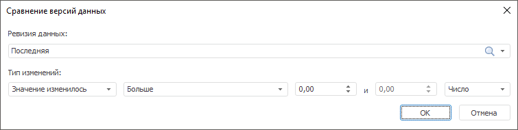

# Сравнение версий данных: быстрая валидация данных

Сравнение версий данных: быстрая валидация данных
-

# Сравнение версий данных

Сравнивает текущую и указанную версии значений временных рядов. Применение
 правила имеет смысл, если ряды хранятся в [версионной](UiNavObj.chm::/TimeSeriesDatabase/TS_Attributes.htm)
 БД временных рядов.

Примечание.
 Готовое правило валидации доступно только из инструмента «Анализ
 временных рядов».

[Для выполнения
 готового правила валидации](javascript:TextPopup(this))

		- Перейдите на вкладку «Расширенная
		 аналитика» на ленте инструментов.

		- Выполните команду «Сравнение
		 версий данных» в раскрывающемся меню кнопки  «Валидация».

Для настройки правила:

	- Укажите ревизию, с данными которой будут сравниваться текущие
	 данные. Используйте раскрывающийся список «Ревизия
	 данных», содержащий все ревизии в текущей БД временных рядов.

	- Задайте динамику изменения наблюдений временных рядов между
	 ревизиями. Используйте группу параметров «Тип
	 изменений»:

		- укажите, каким образом изменились значения наблюдений:

			- Значение изменилось;

			- Значение увеличилось;

			- Значение уменьшилось;

			- Добавление значения;

			- Удаление значения;

			- Значение не изменилось;

		- задайте параметры сравнения. Используйте оператор и операнды
		 сравнения. Количество доступных операндов зависит от выбранного
		 оператора. Доступные операторы:

			- Больше;

			- Меньше;

			- Все значения в диапазоне;

			- Все значения, не входящие в диапазон;

			- Больше или равно;

			- Меньше или равно;

			- Равно;

			- Не равно;

		- задайте шкалу для операндов в условии сравнения:

			- Число. Абсолютная
			 шкала;

			- Процент. Процентная
			 шкала.

См. также:

[Настройка
 правила валидации](../Data_Validation_Types.htm)

		Справочная
		 система на версию 10.9
		 от 18/08/2025,
		 © ООО «ФОРСАЙТ»,
