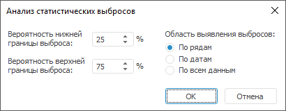

# Анализ статистических выбросов: быстрая валидация данных

Анализ статистических выбросов: быстрая валидация данных
-

# Анализ статистических выбросов

Выявляет статистические выбросы в данных.

Примечание.
 Готовое правило валидации доступно только из инструмента «Анализ
 временных рядов».

[Для выполнения
 готового правила валидации](javascript:TextPopup(this))

		- Перейдите на вкладку «Расширенная
		 аналитика» на ленте инструментов.

		- Выполните команду «Анализ
		 статистических выбросов» в раскрывающемся меню кнопки  Валидация».

Для настройки правила:

	- Задайте вероятность, с которой будут рассчитаны нижняя и верхняя
	 [процентили](Lib.chm::/05_Statistics/Quantile.htm)
	 выборки данных. Выбросами будут считаться значения, которые меньше
	 нижней [процентили](Lib.chm::/05_Statistics/Quantile.htm)
	 и больше верхней. Используйте поля: «Вероятность
	 нижней границы выброса» и «Вероятность
	 верхней границы выброса».

Примечание.
 Значение вероятности нижней границы выброса не может быть больше, чем
 значение вероятности верхней границы выброса.

	- Задайте область выявления выбросов:

		- По рядам. Правило
		 проходит по всем рядам и выявляет статистические выбросы для каждого
		 ряда по отдельности;

		- По датам. Правило
		 проходит по всем точкам периода выполнения и выявляет статистические
		 выбросы на определённую дату по всем рядам;

		- По всем данным.
		 Правило проходит по всем рядам и по всем точкам периода выполнения
		 и выявляет статистические выбросы по всей совокупности данных.

См. также:

[Настройка
 правила валидации](../Data_Validation_Types.htm)

		Справочная
		 система на версию 10.9
		 от 18/08/2025,
		 © ООО «ФОРСАЙТ»,
