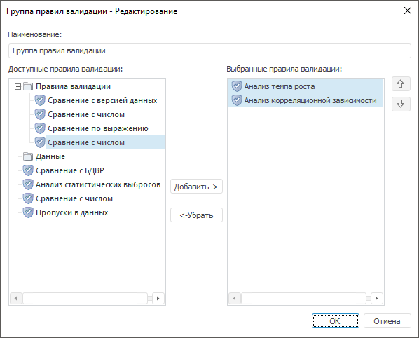
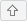

# Настройка группы правил валидации

Настройка группы правил валидации
-

# Настройка группы правил валидации

Группа правил валидации - это несколько правил валидации, объединенных
 в группу для последовательного выполнения. Для работы с группой правил
 валидации предназначен диалог «Редактирование».

[Для отображения
 диалога](javascript:TextPopup(this))

		- Убедитесь, что боковая панель отображается.

		- Установите переключатель:

			- Источник. Переключатель
			 в экспресс-отчёте;

			- Данные. Переключатель
			 в аналитической панели;

			- Документ. Переключатель
			 в регламентном отчёте.

		- Перейдите на вкладку «Правила
		 валидации».

		- [Создайте](UiDw.chm::/Workbook/Data_validation.htm#vgroup_create)
		 новую группу правил или [отредактируйте](UiDw.chm::/Workbook/Data_validation.htm#vgroup_edit)
		 существующую.

	Совет. Для открытия
	 диалога «Редактирование» из
	 навигатора объектов выделите группу правил валидации и дважды по ней
	 щелкните или выполните команду «Редактировать»
	 в контекстном меню группы.

Полное наименование диалога формируется в формате: <Наименование
 группы> - Редактирование:

В списке «Доступные правила валидации»
 отображаются все правила валидации, доступные для объединения в группу.
 В списке «Выбранные правила валидации»
 отображаются правила валидации, которые уже объединены в группу.

[Для добавления
 правил в группу](javascript:TextPopup(this))

	Выделите правила в списке «Доступные
	 правила валидации». Затем:

		- нажмите кнопку «Добавить»;

		- перетащите правила в список «Выбранные
		 правила валидации». Возможность доступна только в настольном
		 приложении.

	Выбранные правила будут добавлены в группу.

[Для удаления
 правил из группы](javascript:TextPopup(this))

	Выделите правила в списке «Выбранные
	 правила валидации». Затем:

		- нажмите кнопку «Удалить»;

		- перетащите правила в список «Доступные
		 правила валидации». Возможность доступна только в настольном
		 приложении.

	Выбранные правила будут удалены из группы.

[Для изменения
 порядка правил в группе](javascript:TextPopup(this))

	Выделите правило в списке «Выбранные
	 правила валидации» и используйте кнопки:

		- .
		 Перемещает правило на одну позицию вверх;

		- .
		 Перемещает правило на одну позицию вниз.

	Порядок правил в группе будет изменен.

[Для переименования
 группы](javascript:TextPopup(this))

	Используйте поле «Наименование».
	 Введите требуемое наименование группы правил валидации.

См. также:

[Настройка
 правила валидации](Data_Validation_Types.htm)

		Справочная
		 система на версию 10.9
		 от 18/08/2025,
		 © ООО «ФОРСАЙТ»,
