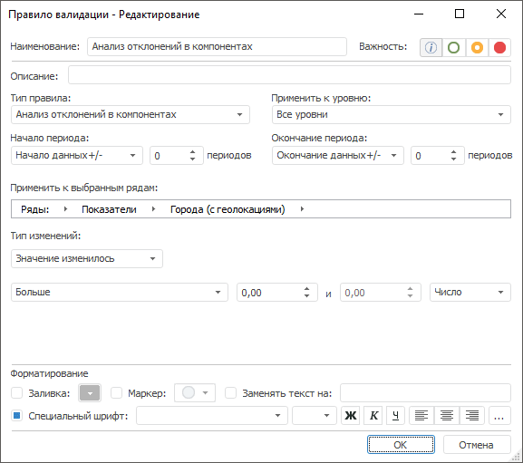

# Анализ отклонений в компонентах: Правило валидации

Анализ отклонений в компонентах: Правило валидации
-

# Анализ отклонений в компонентах

Правило сравнивает отклонения между результирующим рядом и исходными
 рядами, на основе которых был получен результирующий ряд.

Примечание.
 Правило валидации доступно, если источником данных является база данных
 временных рядов.

Есть результирующий ряд T,
 который был рассчитан по формуле с зависимостями, например, T
 = Tx + Ty,
 где Tx и Ty
 - исходные ряды, на основе которых получился результирующий ряд. Если
 в каком-либо из исходных рядов изменились данные (например, Tx),
 то изменится результирующий ряд и будет равен T'
 = T'x
 +Ty. Данный тип валидации выполняет
 повторный расчет формулы и выявляет изменения, между рассчитанными значениями
 и сохранёнными значениями результирующего ряда T,
 то есть сравнивает T и Т'.

Примечание.
 Расчет формулы ряда выполняется в рамках задачи моделирования. Для сохранения
 зависимостей необходимо рассчитать задачу с опцией [MsCalculationHistorySet.Dependencies](KeMs.chm::/Enums/MsCalculationHistorySet.htm).

Для настройки правила:

	- Задайте [общие параметры](../Data_Validation_Types.htm)
	 правила.

	- Задайте динамику изменения значений временного ряда. Используйте
	 группу параметров «Тип изменений»:

	-

		- укажите, каким образом изменились
		 значения наблюдений:

		-

			- Значение изменилось;

			- Значение увеличилось;

			- Значение уменьшилось;

			- Добавление значения;

			- Удаление значения;

			- Значение не изменилось;

		- задайте параметры сравнения.
		 Используйте оператор и операнды сравнения. Количество доступных
		 операндов зависит от выбранного оператора. Доступные операторы:

		-

			- Больше;

			- Меньше;

			- Все значения в диапазоне;

			- Все значения, не входящие в диапазон;

			- Больше или равно;

			- Меньше или равно;

			- Равно;

			- Не равно;

		- задайте шкалу для операндов
		 в условии сравнения:

		-

			- Число.
			 Абсолютная шкала;

			- Процент. Процентная
			 шкала.

См. также:

[Настройка
 правила валидации](../Data_Validation_Types.htm)

		Справочная
		 система на версию 10.9
		 от 18/08/2025,
		 © ООО «ФОРСАЙТ»,
